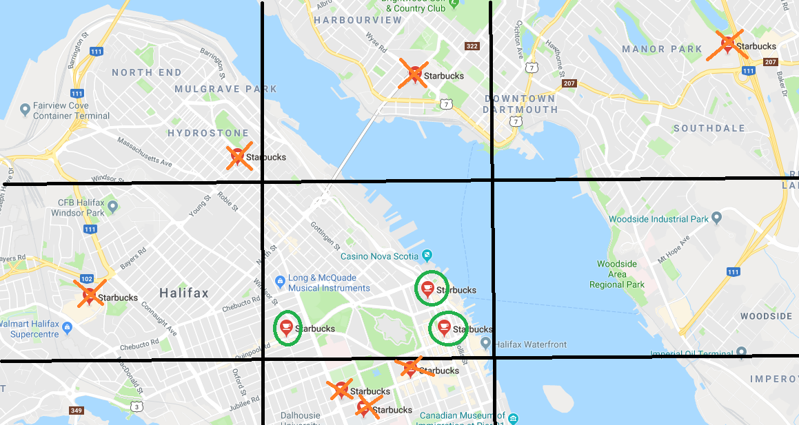

********************
Density of Starbucks
********************

* **Worth**: 10%
* **DUE**: TBD, 2022 at 11:55pm; submitted on MOODLE.

Task
====

You will write a program that will calculate the density of *Starbucks* locations within a specified area based on real
data of Starbucks locations (as of 2018). You will have to work with some existing code that is provided to you, and you
will need to write your own functions to ultimately complete the assignment.
You will

* Use a provided function to load data into your program
* Write a function to convert latitude/longitude units from degrees, minutes, and seconds to decimal
* Write a function to calculate the surface area of a sphere as defined by latitudes and longitudes
* Write a function to count the number of starbucks contained within an area defined by latitudes and longitudes
* Write a function to calculate the density of Starbucks within an area

.. warning::
   
    You should **not** expect to be able to sit down and just start coding a solution. Programming does not work like
    that. Expect this assignment to take hours. Expect to get things wrong, and then, expect to get them wrong again ---
    this is normal.

Provided Files
==============

You are provided with

* A notebook file called :download:`asn1.ipynp <asn1.ipynb>` containing the starting point of the assignment

    * This file is to be uploaded to `Google Colab <https://colab.research.google.com/>`_
    * Alternatively, if you prefer to complete the assignment with an IDE on your own computer, you may download and use the :download:`asn1.py <asn1.py>` file

* The data file called :download:`starbucks2018.csv <starbucks2018.csv>` containing latitude and longitude pairs of Starbucks locations

.. warning::

    Do not alter the function details in the provided .ipynb/.py files

        * Do not change the name of the functions
        * Do not remove the function description
        * Do not remove or add to the parameter list

Part 0 --- Read the Assignment
==============================

Read the assignment description in its entirety before starting.

Part 1 --- Uploading Files to Colab
===================================

After downloading the notebook file above, you will need to upload it to Colab to get started. See the below image to
help find how to do this. I recommend saving a copy of this notebook file to your Google drive and then work with that
one. You don't have to, but you will have to re-upload the project every time you want to work on it.

.. image:: uploadColab.png

Additionally, you will need to upload the Starbucks location data file to Colab. The way you upload a data file like
this is different from uploading the notebook file. See the below image for an example of how to upload this file.
Unfortunately, you must re-upload this data file every time you open your Colab project. Not a big deal, but something
you will need to remember.

.. image:: uploadStarbucks.png

Part 2 --- Read Over Loading Function
=====================================

The function that loads the data, ``load_starbucks_data``, is already provided for you. It contains ideas we have yet to
discuss in class, but it shouldn't be too difficult to get an intuition about what exactly it is doing if you look over
it and play with it a little.

Get used to looking at code that is not yours, using unfamiliar ideas, and trying to figure out what existing code does.
This is not a trivial thing, but as a programmer, it is something you will end up spending a lot of time doing.

.. warning::

    For the loading function to work, the .csv file **must** be in the same directory as your Python script. This means
    in your Colab project (see Part 1). If it is not, this function will **not** work and you will see an error message
    like ``No such file or directory: 'starbucks2018.csv'``.

Part 3 --- Degrees to Decimal
=============================

Humans like to express `latitudes <http://en.wikipedia.org/wiki/Latitude>`_ and
`longitudes <http://en.wikipedia.org/wiki/Longitude>`_ in degrees, minutes, and seconds. You *could* work with those
units in Python, but your computations (and, hence, code) will be much cleaner and easier to follow if you convert the
data into the single unit "degrees", using decimals of a degree to represent "arcminutes" (1/60th of a degree) and
"arcseconds" (1/60th of a arcminute).

Complete the function ``convert_degrees_to_decimal`` such that it converts the provided degrees, arcminutes, and
arcseconds to decimal. The parameters are a latitude/longitude in degrees, arcminutes, and arcseonds. The function
should return the same latitude/longitude as a single value in decimal degrees (a single value of type ``float``).

If you are not familiar with the conversion, check `Wikipedia <http://en.wikipedia.org/wiki/Arcminute>`_.

If you had a look at the data file, you will have noticed that the data is already stored as a decimal. This means you
do not actually need to use this function to convert the data from the Starbucks location file.

Part 4 --- Subtended Area
=========================

Since we want to calculate the *density* of starbucks, we need to consider the units used. A reasonable measure would be
*Starbucks per square kilometers*. In order to compute this, we must first calculate the area of the "square" defined by
two latitude and two longitudes. You are to complete the function ``subtended_area`` that takes four parameters. Two
latitudes defining the top and bottom of the "square" and two longitudes defining the sides of the square. The function
will return the area of the "square" in kilometers squared (:math:`km^{2}`).

However, in reality, since it is a sphere that the surface area is being calculated on, the latitude and longitudes do
not actually define a square. This means that the simple :math:`length * height` will not work. Instead we need to
calculate it with the following equation.

:math:`\frac{\pi}{180} \cdot R^{2} \cdot \lvert sin(lat_{1}) - sin(lat_{2}) \rvert \cdot \lvert lon_{1} - lon_{2} \rvert`

In our case we will use :math:`R = 6371` for Earth, which is stored in the provided file as the constant
``EARTH_RADIUS``.

.. warning::

    Does Python's trig functions (eg., ``math.sin``) expect parameters in *degrees* or *radians*?
    `Read the relevant documentation to find out <https://docs.python.org/3/library/math.html#math.sin>`_.

Part 5 --- Counting Starbucks
=============================

Part 6 --- Calculate Starbucks Density
======================================

Part 7 --- Using Your Function
==============================

Part 8 --- Testing
==================

Some Hints
==========

* Work on one method at a time
* Get each method working perfectly before you go on to the next one
* Test each method as you write it
    * This is a really nice thing about programming; you can call your methods and see what result gets returned
    * Mentally test before you even write --- what does this method do? What problem is it solving?

* If you need help, ask
    * Drop by office hours

Some Marking Details
====================

What to Submit to Moodle
========================

Have a peek at the data-loading function
========================================

This data in the .csv file is fortunately already in decimal format so you will not need to  convert it with ``convert_to_decimal()``, however, you still need to do part 1 and make sure  it works properly even though you might not actually use ``convert_to_decimal()`` for the below parts!!!!!!

   
Complete the function that counts the number of Starbucks in a region
=====================================================================

Counting up the number of Starbucks in a given area. The function ``num_starbucks()`` is already set up to *loop* over every Starbucks location in a *list*. All you have to do is remember to pass in the list. Have a look a the loop. Even if we haven't formally discussed this structure in class yet, it should be pretty clear what it's doing.

.. note::

    Fortunately, the data coming in is **already in decimal format**, so there is no need to actually  convert these values with the ``convert_to_decimal`` function.

Your work is in the body of the loop. Each time through the loop we'll be considering a new Starbucks location. The existing code will put the current location's latitude in ``loc_lat`` and longitude in ``loc_lon``. Your job is to figure out if this location falls in the area between the lat/long pairs defining your region. If this location is within the box defined by the lats and longs then it is in our defined region and we need to count it. 

You need to keep track of how many Starbucks there are in the region and then return that
value.

If the existing code is scaring you, think about it this way:

* There exists a robot that needs to be programmed
* The robot will receive a new Starbucks location, one after the other, until there are no more locations. **(already coded for us)**
* Robot will take the location, and ``IF`` the location is within the rectangle we care about, we count it, otherwise, ignore it. **(we need to code this bit)**

Finally
=======

Finally, fill in a convenience function ``starbucks_per_kmsq()`` which, given subtending lat/long pairs, returns the density of Starbucks. 

TODO:

* Use ``load_asn1_data()`` to load the locations and store them in a variable.
* Compute the number of Starbucks in the region
* Compute the size (area) of the region
* Divide number of Starbucks by area to get density
* return density

Now try it!
===========

Try your code. Try small regions and big regions. What area has the highest Starbucks density you can find? The lowest? Make sure to print them out. 

What to submit to Moodle
========================

Submit your work on Moodle. 

* Your version of ``asn1.py``. Do **not** submit the .ipynb file. To get the asn1.py file from Colab, see the image below. 

	* Make sure your **NAME** and **STUDENT NUMBER** appear in a comment at the top of the program.
	* List anyone you worked with in the comments, too

* A text file describing the areas you found with the highest, and lowest, Starbucks densities and a short description of how you found them.  
	* Don't worry about finding the HIGHEST or LOWEST density, just try a few and pick your highest and lowest. 

**VERIFY THAT YOUR SUBMISSION TO MOODLE WORKED!**
**IF YOU SUBMIT INCORRECTLY, YOU WILL GET A 0**

.. image:: downloadPy.png

Some hints
==========

* Work on one function at a time. 
* Get each function *working perfectly* before you go on to the next one. 
* *Test* each function as you write it. 
	* This is a really nice thing about programming: you can call your functions and see what result gets returned. Does it seem correct?
* If you need help, *ask*! Drop by my office hours. 

Some marking details
====================

.. warning::
	Just because your program produces the correct output, that does not necessarily mean that you will get perfect, or even that your program is correct.

Below is a list of both *quantitative* and *qualitative* things we will look for:
 
* Correctness?
* Did you follow instructions?
* Comments?
* Variable Names?
* Style?
* Did you do just weird things that make no sense?

General FAQ:
============

* Does my text file have enough details?
	* Probably. The shorter the better. I really just want to see that you played around a little.
* I don't know how to do *X*.
	* OK, go to `google.ca <https://www.google.ca>`_ and type in *X*.
* It’s not working, therefore Python is broken!
	* Probably not; you’re very likely doing something wrong
* My thing keeps telling me ``No such file or directory: 'starbucks.csv'``
	* Then the starbucks file probably isn't where python is looking.
* But density will grow larger the smaller I make the area (aren't I so smart).
	* Congratulations, you understand basic arithmetic. 
* Is my area a high/low enough density?
	* I really don't care how high/low it is. Just try a few things and see what you get.    
* But I never used the one function!!!!1!
	* Fine, but write the code anyways and make sure it works.
* But the degrees values don't specify a cardinal direction!
	* Make use of changing +/- if you need to change hemispheres.  
* Wtf do the functions do that you gave me?
	* Read the descriptions. Try figuring it out. This is actually part of the assignment learning objectives. 
* Some of the code in the functions you gave us look like magic.
	* At this point it may seem that way, but by the end of the semester, they will lose their magic 
* Do I have enough comments?
	* I don't know, maybe? If you're looking at code and have to ask if you should comment it... just comment it. That said, don't write me a book.
* I know you told me to do it this way, but I did it another way, and I think my way is better.
	* Your way may be better, but I don’t care. Do it the way I told you.
* Can I work with my friend?
	* Yes. In fact, you should!
* If our code/functions are identical, you won't really call this cheating, would you? I mean, you said we could work together!
    * I will absolutely try to nail you for cheating. I am letting you work together. Don't push it. All-in-all, it's going to be hard to *cheat* unless you are deliberately trying to. 
* I know I cheated, I know I know I was cheating, but I’m reeeeaaaaaaaaallllllly sorry [that I got caught]. Can we just ignore it this time?
	* Lol, no
* If I submit it at 11:56pm, you’ll still mark it, right? I mean, commmmon!
	* No. 11:55pm and earlier is on time. Anything after 11:55pm is late. Anything late is not marked. It’s rather simple really.
* Moodle was totally broken, it’s not my fault it’s late.
	* Nice try.
* I accidentally submitted the wrong code. Here is the right code, but it’s late. But you can see that I submitted the wrong code on time! You’ll still accept it, right?
	* Do you think I was born yesterday? No.
* Will I really get 0 if I do the submission wrong? Like, what if I submit the .ipynb instead of the .py?
	* Yes, you'll really get a **ZERO**. 

