***********
Tic-Tac-Toe
***********

* **Worth**: 10%
* **Due**: November 21, 2022 at 11:55pm; submitted on MOODLE
* **Files**: :download:`asn3.ipynb <asn3.ipynb>`/:download:`asn3.py <asn3.py>`

Task
====

The time has come to make one of the best video games of all time --- Xtreme tic-tac-toe. It's effectively
`tic-tac-toe <https://en.wikipedia.org/wiki/Tic-tac-toe>`_ except the game sizes can differ. Your task is to implement
the game, from the ground up, entirely.

You will

* Write functions to setup the initial game board
* Read and validate moves from players
* Apply moves to the game board and check for winning conditions
* Render and display the game board
* Implement the *game loop*

Provided Files
==============

You are provided with

* A notebook file called :download:`asn3.ipynp <asn3.ipynb>` containing the starting point of the assignment

    * This file is to be uploaded to `Google Colab <https://colab.research.google.com/>`_
    * This notebook contains the function definition lines with docstrings and ``assert`` tests
    * The notebook also includes a special if statement ``if __name__ == "__main__":`` at the end

        * This is included to help with marking and unit tests
        * More details on this line are provided below

    * Alternatively, if you prefer to complete the assignment with an IDE on your own computer, you may download and use the :download:`asn3.py <asn3.py>` file

.. warning::

    Do not alter the function details in the provided .ipynb/.py files

        * Do not change the name of the functions
        * Do not remove the function description
        * Do not remove or add to the parameter list

Part 0 --- Read the Assignment
==============================

Read the assignment description in its entirety before starting.

Part 1 --- Uploading Files to Colab
===================================

After downloading the notebook file above, you will need to upload it to Colab to get started. See the respective
section from assignment 1 for an example on how to do this. I recommend saving a copy of this notebook file to your
Google drive and then work with that one. You don't have to, but you will have to re-upload the project every time you
want to work on it.

Part 2 --- Setup Game
=====================

The tic-tac-toe game board is to be represented as lists of lists of strings where the strings may be a ``" "`` (space),
an ``"X"``, or an ``"O"``. For example, an empty 3x3 game board would be
``[[" ", " ", " "], [" ", " ", " "], [" ", " ", " "]]``; however, one can think of this list of lists as a
two-dimensional matrix

    ``[[" ", " ", " "],``

    ``[" ", " ", " "],``

    ``[" ", " ", " "]]``

where the first index would be the row and the second is the column. With this configuration, the top left corner of the
game board would be at index ``0, 0``. In this example, if the list of list was referenced by a variable named
``board``, then ``board[1][2]`` would be the last element in the middle row.

A 3x3 board was shown in the above example, but this is Xtreme tic-tac-toe, which means the game can be of arbitrary
size. Thus, we may have game boards that are 3x3, or 4x4, or 999x999. If the game board was specified to be 4x4, we need
a list of 4 lists that contain 4 strings ---
``[[' ', ' ', ' ', ' '], [' ', ' ', ' ', ' '], [' ', ' ', ' ', ' '], [' ', ' ', ' ', ' ']]``, or as a matrix

    ``[[' ', ' ', ' ', ' '],``

    ``[' ', ' ', ' ', ' '],``

    ``[' ', ' ', ' ', ' '],``

    ``[' ', ' ', ' ', ' ']]``

Write a function ``setup_game`` that takes an integer representing the desired board size as a parameter and returns the
appropriate list of lists of strings representing the game board.

Remember, we need to ensure our lists are in fact separate lists and not simply aliases to the same single list. If we
specified a game board size of ``3``, we need a list containing three references to three separate lists, not three
references to the same single list.

Part 3 --- Parse Move
=====================

All moves a player makes will be entered as a string in the form ``"x, y"``, where ``x`` is the column and ``y`` is the
row. However, the game needs the move to be two separate integers in order to effectively use the information.

Write a function ``parse_move`` that takes a move string as a parameter and returns a tuple of the integers representing
the ``x`` and ``y`` coordinates of the move. For example, calling ``parse_move("2, 1")`` would result in the tuple
``(2, 1)`` being returned.

Part 4 --- Validate Move
========================

Player moves are considered valid if (a) the specified game board cell/location is unoccupied (contains a ``" "``
(space) character) and (b) is within the game board.

Write a function ``is_move_valid`` that takes a move tuple and the current game board as a parameter and returns a
boolean indicating if the provided move is valid --- ``True`` if it is valid, ``False`` otherwise.

For example, consider the current game board being ``board = [["X", " ", " "], [" ", " ", "O"], [" ", " ", " "]]``.

* ``is_move_valid((2, 2), board)`` returns ``True``
* ``is_move_valid((2, 1), board)`` returns ``False`` since ``(2, 1)`` already contains an ``"O"``
* ``is_move_valid((-2, 1), board)``returns ``False`` since the move location does not exist on the provided game board

.. note::

    When thinking of the game board like a matrix, there is no rule indicating which index of a list of lists is the row
    and which is the column. In other words, there is no rule saying that the indexing is ``board[row][column]`` or
    ``board[column][row]``. However, for this assignment, we will have the first index be the row and the second be the
    column.

    Since we like to follow the conventional cartesian coordinate system of ``x`` specifying the horizontal positioning
    --- the column --- and ``y`` specifies the vertical positioning --- the row, we must be mindful of how we use these
    values to index the board. By following this convention, it would mean that one needs to index the board with ``y``
    first to specify the row and then once the row is selected, the ``x`` value is used to indicate which column in the
    row the cell/location is. In other worse, the correct indexing would be ``board[y][x]``.

Part 5 --- Apply Move
=====================

Once a move is provided, parsed, and validated, the move can then be applied.

Write a function ``apply_move`` that takes an already validated move tuple, the current game board, and a string of the
current player's symbol (``"X"`` or ``"O"``), and returns a new game board with the player's move applied. For example,
if one called ``apply_move((0, 1), [["X", " ", " "], [" ", " ", "O"], [" ", " ", " "]], "X")``, the function would
return the new list of lists of strings ``[["X", "X", " "], [" ", " ", "O"], [" ", " ", " "]]``.

This function should **not** have any side effect --- the game board passed as a parameter to the function should
**not** be altered in any way. Instead, a copy of the game board is to be created that is then modified and returned by
the function. Be warned, however, that one needs to be careful how they perform the copy --- when we have a list of
lists, we *really* have a list of *references* to other lists; we need to ensure we are making copies of the internal
lists and not just the outside list. If we perform a copy naively, we may accidentally make a copy of the list with
copies of the references --- this is called a "shallow copy". Refer to the following images to see the difference
between a "shallow" copy and a "deep" copy in this context.

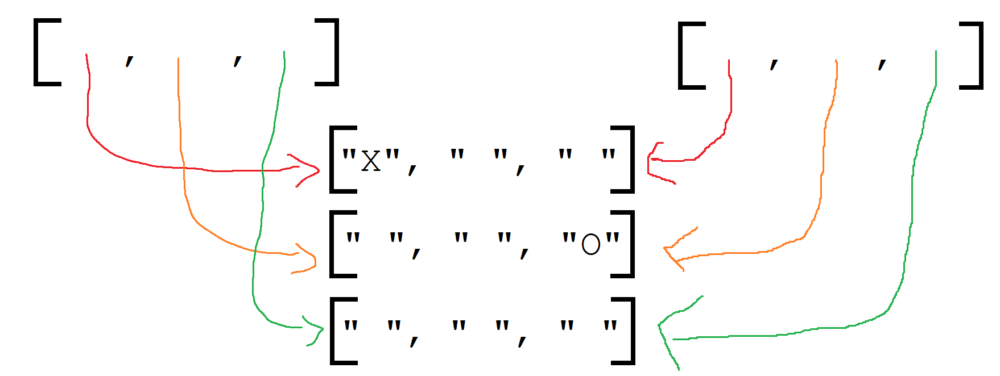

    Example of a "shallow copy" --- only the references to the internal lists were copied. The actual internal lists
    were never copied.

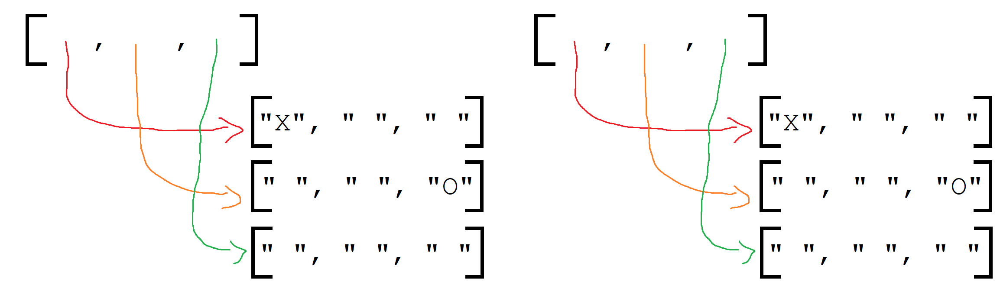

    Example of a "deep copy" --- copies of the internal lists were made.

Part 6 --- Check For Winner
===========================

Check Row & Column
------------------

Check Diagonals
---------------

Checking All Directions
-----------------------

Part 7 --- Rendering the Game Board
===================================

Render Cell
-----------

Render Row
----------

Render Board
------------

Part 8 --- Putting it Together
==============================

Part 9 --- Testing
==================

To help ensure that your program is correct, run the provided assertion tests. Each function is followed by a series of
commented out assertion tests that will help you test your code. When you are ready to test your functions, simply make
them not comments (remove the ``#``) to include them in your running program. There is no guarantee that if your code
passes all the tests that you will be correct, but it certainly helps provide peace of mind that things are working as
they should.

There are no assertion tests for the final game loop, so you will need to run the game in order to get a sense of if it
is working or not. When testing by playing, actively try to break the game.

Realistically you should have been running tests after you complete each of the above parts, but this part is here to
remind you. Remember, we are lucky that we get to test our solutions for correctness ourselves; you don't need to wait
for the marker to return your assignment before you have an idea of if it works correctly.

Some Hints
==========

* Work on one function at a time
* Get each function working perfectly before you go on to the next one
* Test each function as you write it
    * This is a really nice thing about programming; you can call your functions and see what result gets returned
    * Mentally test before you even write --- what does this function do? What problem is it solving?

* If you need help, ask
    * Drop by office hours

Some Marking Details
====================

.. warning::
    Just because your program produces the correct output, that does not necessarily mean that you will get perfect, or
    even that your program is correct.

Below is a list of both *quantitative* and *qualitative* things we will look for:

* Correctness?
* Did you follow instructions?
* Comments?
* Variable Names?
* Style?
* Did you do just weird things that make no sense?

What to Submit to Moodle
========================

* Make sure your **NAME** and **STUDENT NUMBER** appear in a comment at the top of the program
* Submit your version of ``asn3.py`` to Moodle
    * Do **not** submit the .ipynb file
    * To get the ``asn3.py`` file from Colab, see the example image in Assignment 1

.. warning::

    Verify that your submission to Moodle worked. If you submit incorrectly, you will get a 0.

Assignment FAQ
==============

* :doc:`See the general FAQ </assignments/faq>`

Coding, Part I
==============

5. The game is gonna' look pretty ugly if we don't format the output nicely. Sure we could just keep printing the game out like the above picture, but gamers these days want awesome graphics. Write a function ``game_print(cur)`` that will print out the current game board ``cur``. Check out the below image to see how I want things formatted. In the below example, it assumes that the whole game board is empty EXCEPT for the position (0,0), which has an 'X' in it. I do want yours to work with any game board passed though (also, be aware that the game board can be any sized square too). I am expecting your output to be formatted to match what I've shown you **exactly**.

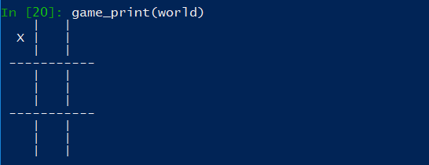

In case you want the actual text, here it is:

   .. code-block:: python
   
         |   |
       X |   |
         |   |
      -----------
         |   |
         |   |
         |   |
      -----------
         |   |
         |   |
         |   |

.. warning::

   ``game_print(cur)`` will be one of the harder functions of the assignment. I'm warning you, it will be painful. Get ready to fiddle with the code in this function A LOT!

6. **IGNORE THIS** Write a function ``game_clear()`` that will clear out the console. Basically, when you call this function, I want all the text on the screen to go away. Chances are you have no idea how to do this, but that's OK, check out *Hanno Behrens'* answer `here <https://www.quora.com/Is-there-a-Clear-screen-function-in-Python>`_. **IGNORE THIS**
 
.. warning::

   Before moving on, are you sure that:

      * All of the functions work properly?
	     * Did you test them thoroughly?
		    * Seriously?
      * They will work with arbitrarily sized game boards.  

Coding, Part II
===============

The above got a lot of the scaffolding out of the way, but the game is still not playable or smart enough to know if anyone won. Part II will get us closer to our goal. 

7. Video game players are notoriously annoying when it comes to trying to exploit the coded rules of the game, so to be safe, we need to do some input validation. We won't be going crazy with the validating, but we will do some. Write a function ``is_move_valid(cur, move)`` that will check if the ``move`` is a valid move for the board ``cur``. The function will return a boolean: True if the move is valid, False otherwise. A move will be considered invalid if it is already taken or if it is not on the game board, eg: given a 3x3 board, (-1,-1), and (1123,4) would be invalid. If the move is not invalid, then it is valid. 

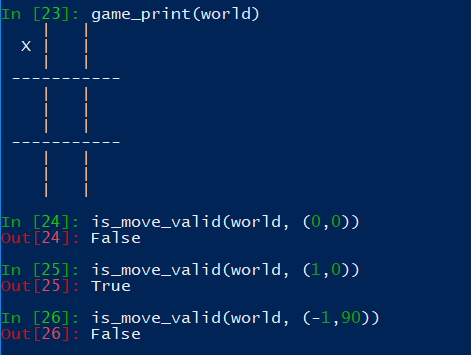

**The next 5 functions go together**

We want to have some functions that will check to see if a given player has won. There are a few ways a player can win: a) gets a row; b) gets a column; or c) gets a diagonal. We will write some functions to check these specific cases and then we will write one big function that makes use of the smaller ones. 

8. Write a function ``check_row(cur, row, player)`` that will return True if the ``player`` has won a given ``row``, or return False otherwise. Notice that this function will only check a given row and not all rows. See the below image for an example. 

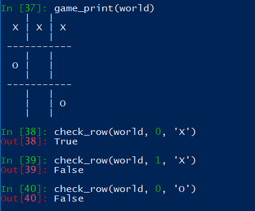

9. Write a function ``check_column(cur, col, player)`` that, similar to above, checks to see if the ``player`` has won a given ``col``. 

10. Write a function ``check_down_diag(cur, player)`` that will check if the ``player`` has won the diagonal starting in the top left and ending in the bottom right. Note that we do not need to specify a row/col here as a function parameter. 

11. Write another function ``check_up_diag(cur, player)`` that's basically the same as #10, but checks the other diagonal (bottom left to top right). 

12. Write a function ``has_player_won(cur, player)`` that will return True if the ``player`` has won in any way on the board ``cur`` (see above) and False otherwise. This function **must** make use of functions 8 -- 11. 

.. warning::

   Before moving on:

      * Are all of the functions work properly?
      * Are you sure they're working properly?
      * They will work with arbitrarily sized game boards?  
      * By the way, did you verify that your functions are working properly?
	  
	  
Coding, Part III
================

Now it's time to put all of the above together to actually make the game be a game. 

13. Write a function ``tic_tac_toe()`` that will set up the game, and perform the execution of X-treme tic-tac-toe. 

Below is some pseudocode for this function. 

   .. code-block:: python
   
      get game size
      set up the game
	  
      set a game over flag to False
      initialize a move counter

      while the game is not over
         clear the console
         print the current game
         print the move counter
         figure out who the current player is. 
         ask for a move until it's valid. If it's not valid, tell them and ask again. 
         apply the move
         increment move counter
         see if the player won

      clear console     # do not need to do this
      print game	  
      If someone won, print out who won and 'gg'
      If no won won, say no one won. 

To get a feel for how things should work, here are some pictures...
	  
Here is a picture of me entering the game size

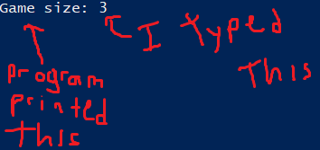

Here are 2 pictures to show a before and after X makes their first move in (1,2)

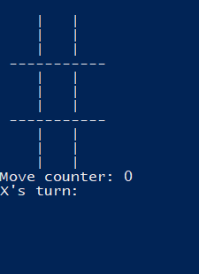

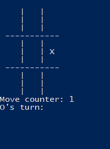
	
Here is a picture of a player entering an invalid move. 	

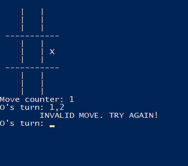
	  
	  
	  
Some things to note:
   * X always goes first
   * The game can end in a draw
   * We will probably want a game over flag to know when to stop looping to get inputs
   * X will always win a game that's smaller than 3x3 (think about why that is) 

Below are some more pictures.

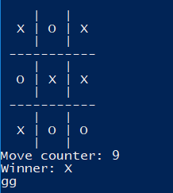

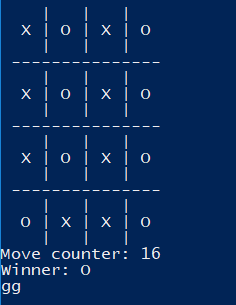

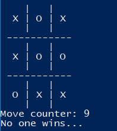

What to submit
==============

* Your version of ``asn3.py``. Also, please **DO NOT** change the name of this file. Leave it alone. 

  * Make sure your **NAME** and **STUDENT NUMBER** appear in a comment at the top of the program.
  * Make sure it's *commented* and has *function headers*!!
  * Use proper variable names
