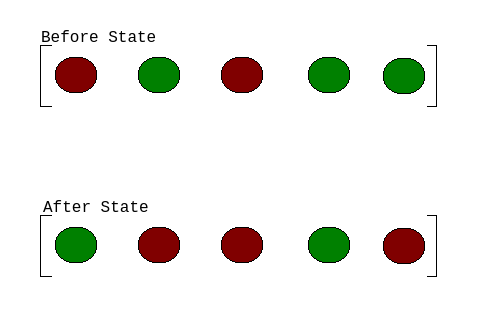

*****************
Zombie Infections
*****************

* **Worth**: 10%
* **Due**: October 31, 2022, at 11:55pm; submitted on MOODLE
* **Files**: :download:`asn2.ipynb <asn2.ipynb>`/:download:`asn2.py <asn2.py>`

.. note::

    For this assignment, you will need to use special Python packages (networkx, matplotlib). The good news is that if
    you are using Colab you do not need to do anything special. If, however, you are using a local Python interpreter,
    you may need to install the packages yourself.

Task
====

If you can simulate something accurately, it becomes possible to study the simulation without having to actually
implement the real thing. You will write a program to simulate a zombie apocalypse scenario on a randomly generated
network of cities. Additionally, you will be using your simulation to analyze the spread of the zombie apocalypse
throughout your network of cities.

You will

* Write a function to check if a city is infected
* Write a function to find a given city's neighbouring cities
* Write functions to infect and cure specific cities
* Write a function to count the number of cities currently infected
* Write functions to simulate the spread of the zombie apocalypse
* Run simulations of the zombie apocalypse
* Analyze the results of your simulations

Provided Files
==============

You are provided with

* A notebook file called :download:`asn2.ipynp <asn2.ipynb>` containing the starting point of the assignment

    * This file is to be uploaded to `Google Colab <https://colab.research.google.com/>`_
    * Alternatively, if you prefer to complete the assignment with an IDE on your own computer, you may download and use the :download:`asn2.py <asn2.py>` file

.. warning::

    Do not alter the function details in the provided .ipynb/.py files

        * Do not change the name of the functions
        * Do not remove the function description
        * Do not remove or add to the parameter list

Part 0 --- Read the Assignment
==============================

Read the assignment description in its entirety before starting.

City Data Structure
-------------------

Every *city* in the simulation is represented as a list ``[name, infected, [neighbours]]``.

* ``name`` is a string with the name of the city
* ``infected`` is a ``bool`` --- ``True`` if the city is infected with zombies, ``False`` otherwise
* ``[neighbours]`` is a *list* containing the city numbers (indexes) of the cities connected to this city

For example, a city named ``"City 0`` that is not infected and three neighbours: cities with indices ``3``, ``6``, and
``7``, would be represented as ``["City 0", False, [3, 6, 7]]``.

The *world* is made up of multiple cities, which are also stored in a list. Therefore, a world with cities 0, 1, 2, ...
would be represented as ``[city0, city1, city2, ...]``, where ``city0`` would be a stand in for a whole city data
structure. If we were to expand out the city data structures in the above example, we could visualize the data as
``[["City 0", False, [3, 6, 7]], ["City 1", False, [0, 6, 8, 9]], ["City 2", False, [3, 6]], ...]``

Part 1 --- Uploading Files to Colab
===================================

After downloading the notebook file above, you will need to upload it to Colab to get started. See the respective
section from assignment 1 for an example on how to do this. I recommend saving a copy of this notebook file to your
Google drive and then work with that one. You don't have to, but you will have to re-upload the project every time you
want to work on it.

Part 2 --- Read Over Provided Code
==================================

There are many functions already completed within the assignment 2 notebook file. These functions provide important
functionality for the assignment. They contains ideas that you are likely not familiar with, but do spend some time going
over the code to see if you can get a high-level idea of what each is doing.

Get used to looking at code that is not yours, using unfamiliar ideas, and trying to figure out what existing code does.
This is not a trivial thing, but as a programmer, it is something you will end up spending a lot of time doing.

You will notice that each of the provided functions has corresponding assert tests, but some are commented with a
"eyeball test" note. For these functions, there is no way to easily test the function with an assertion, so in order to
test it, one would need to visually inspect the result to verify correctness. These tests are commented out by default,
but if you are interested, feel free uncommenting them to see what happens.

Part 3 --- Check if a City is Infected
======================================

As discussed above, each city is represented as a list of three elements --- the name of the city, the infection status
of the city, and a list of neighbours the city is connected to.

Write a function ``is_infected`` that checks if a given city is infected or not. This function will take a city (list)
as a parameter and return ``True`` if the city is infected, and ``False`` otherwise.

Part 4 --- Get a City's Neighbours
==================================

Write a function ``get_neighbours`` that retrieves the neighbours of a given city. The function will take a city (list)
as a parameter and ``return`` a list containing all the neighbouring cities.

Part 5 --- Infecting and Curing a City
======================================

Write functions to ``infect`` a city and ``cure`` a city. For ``infect``, your function will take a city as a parameter
and return a *copy* of the city with the infection status set to ``True``. Similarly for ``cure``, the function will
take the city being cured as a parameter and will return a *copy* of the city with the infection status set to
``False``.

The simplest way to make a copy is to make a new city based on the information of the city being infected/cured and then
setting the city's infection status accordingly.

The motivation for making a copy and not just modifying the current city's infection status value is to make our data
*immutable*. By doing so, it keeps things easier to reason about and helps eliminate many potential problems within your programs.

Part 6 --- How Many Cities are Infected
=======================================

Write a function ``number_of_cities_infected`` that takes a world (list of cities) as a parameter and counts the number
of cities within the world that are infected. This function will return the final count when it completes. In other
words, it will look at *each* city within the world, check *if* it is infected, and if it is, it adds one to the running
total of infected cities. After each city has been investigated, the function returns the value of the running total of
infected cities.

Write another function, ``is_world_completely_infected``, that takes a world (list of cities) as a parameter and returns
``True`` if the whole world is infected (all cities are infected), and ``False`` otherwise. In other words,
*if the number of cities infected* is equal to the number of cities in the world, then the whole world is considered
infected.

Part 7 --- Simulation Step
==========================

Write a function ``simulation_step`` that simulates a single iteration of the zombie apocalypse. The function will take
the world (list of cities) as a parameter, along with spread and cure probabilities as parameters. The function will
return a copy of the world after performing a step of the simulation.

The parameter ``spread_probability`` is a floating point values between 0 -- 1 representing the percent probability that
a given infected city will spread the disease to one of its neighbours in the current simulation step. The parameter
``cure_probability`` is the percent probability that a given infected city will cure *itself* in the current simulation
step. 

The overall idea of simulating a step requires that each city in the world is investigated and checked if it will spread
the disease to a neighbouring city and/or cure itself. Details are provided below and, given the complexity of this
function, pseudocode is provided at the end of this section to help with the writing of your function.

To perform a simulation step properly, one must consider that the world has a *before* state, which is the state of the
world before the simulation step occurs, and an *after* state, which is the state of the world after the simulation
step. To do this easily, a copy of the before state can be made (see the provided ``copy_world`` function) such that
your program has two versions of the world for the execution of the step of the simulation. Information for the
simulation step is retrieved from the *before* state, and all changes to the world will be put into the *after* state.

Consider the below image as an example. In the *before state*, cities 0 and 2 are infected, and cities 1, 3, and 4 are
not infected. If during the simulation step city 0 were to become cured, and cities 1 and 4 become infected, the changes
are made to the *after* state while the *before* state is left alone, unchanged. Again, note that *before state* and
*after state* are two separate world (two separate lists of cities).

The simulation of a step requires checking if a city will either spread the disease or cure itself. This is where the
``spread_probability`` and ``cure_probability`` values come in. These parameters will have some value between 0 -- 1
--- the closer to 0, the less likely we want the event is to occur, and the closer to 1, the more likely. To achieve
this functionality, we can make use of Python's ``random`` library, namely, the
`random function <https://docs.python.org/3/library/random.html#random.random>`_ . This function will return some value
between 0 and 1 from a uniform distribution. Therefore, calling this function will provide some arbitrary value between
0 -- 1, and by checking if that value is, for example ``< cure_probability``, we can implement the probabilistic
occurrences of the events we want. For example, if ``cure_probability`` was set to ``0.80`` (80%), and since
``random`` is equally likely to select all values between 0 -- 1, ``random`` will produce a value less than ``0.80``
80% of the time.

When it comes to randomly selecting a neighbour to infect, the ``random`` library provides many functions that may work
effectively. I suggest investigating the
`choice function <https://docs.python.org/3/library/random.html#random.choice>`_ as you may find it to be the simplest
to get working for your needs.

Finally, for the purposes of our simulation, we want to make sure city 0 is always infected. There are a few ways one
could implement this, but perhaps the simplest is to just update city 0 to infected in the after state before the
function finishes. That way, if city 0 was cured during the simulation step, it is reset to infected, and if city 0
happened to not get cured, there is no harm in setting it to infected anyways.

    ``Make a copy of the world for the after state``

    ``For each city in the before state:``

        ``If the city is infected``

            ``If the city is infecting a neighbouring city based on the probability value``

                ``Select a random neighbour``

                ``Infect the selected neighbour in the after state``

            ``If the city is curing itself based on the probability value``

                ``Cure the city in the after state``

    ``Ensure city 0 is always infected``

    ``Return after state``

Part 8 --- Simulate Infections Disease Scenario
===============================================

Write a function ``simulate_infections_disease`` that simulates a full infections disease scenario. The function will
have a world (list of cities) and the spread and cure probabilities as parameters. The function also has an optional
parameter for setting a cutoff for the simulation (more on this below). The function will return a list of the number of
cities infected at each step of the simulation.

The purpose of this function is to just run the simulation step repeatedly until it is the end of the world (all cities
infected). In other words, loop the simulation step while the world is not completely infected. This will require the
use of ``simulation_step`` and ``is_world_completely_infected``. Remember, the function ``simulation_step`` takes the
before state of the world as an argument and returns the after state --- be sure to be keeping track of the most recent
world state in your loop.

The total number of cities infected at each step of the simulation is to be recorded and returned after the whole
simulation is complete. These values can simply be stored in a list, and after each step of the simulation the current
number of cities infected can be appended to the list. For this, make use of the ``number_of_cities_infected`` function.

Before the simulation starts looping through steps, city 0 needs to be set to infected, and the number of cities at time
step 0 needs to be recorded in the list too. This means that the function should start with some simple setup work.

Lastly, there is a special optional ``cutoff`` parameter for the function. Since it is possible that the spread and cure
probabilities are set such that the loop may run excessively long, the `cutoff`` value is used to ensure that the
simulation will stop in some reasonable time. Since a list is used to keep track of the number of infected cities after
each simulation step, the length of that list can be used to know how many times the loop ran (since the list grows by 1
every time the loop runs). In other words, a way to check how many times the loop has run would be
``len(infected_count) < cutoff + 1``, where ``infected_count`` is the list of the number of infected cities at each time
step. Note the use of the ``+ 1`` on ``cutoff``, which is there since the list should start the loop with size 1 since
we include the number of cities infected before the simulation starts (which is just city 0 being infected).

Below is some pseudocode to help with writing the function.

    ``Create empty list to keep track of the number of infected cities at each time step``

    ``Infect city 0``

    ``Update list of number of infected cities``

    ``While it is not the end of the world and we are not beyond the cutoff``

        ``Run a simulation step``

        ``Count the number of cities currently infected and update the list of the number of infected cities``

    ``Return the list of the number of infected cities at each step of the simulation``

Part 9 --- Using Your Code and Plotting
=======================================

Call the ``simulate_infections_disease`` function a few times and make use of the provided
``draw_number_of_cities_infected`` function to visualize the results. Be sure to try varying parameter values,
especially for the spread and cure probabilities.

Typically, when analyzing a stochastic simulation of something, we run the simulation many times in order to get an idea
of how things work *in general*. Run the full simulation 100 times and, in a list, keep track of the number of
iterations each of the 100 simulations took to finish (remember, the ``simulate_infections_disease`` returns a list
whose length minus one would be the number of steps the simulation took). Visualize the distribution of steps of the
infections disease scenario with the provided ``draw_distribution`` function. Like before, be sure to run try varying
values for the spread and cure probabilities.

    ``Make a world``

    ``Make an empty list to keep track of the length of each simulation``

    ``For some number of loops (100ish)``

        ``Run a whole simulation``

        ``Update the list of the lengths of simulations``

After getting a sense of the results, do a short writeup in a txt/word file explaining your results. Also save some of
the relevant figures (plots) to reference in your writeup. Questions to consider:

    #. Fix the cure probability to zero. How does varying the spread probability affect the runtimes?

    #. Fix the cure probability to ``0.5``. How does varying the spread probability affect the runtimes?

    #. Fix the spread probability to ``0.5``. How does varying the cure probability affect the runtimes?

Note, a single plot of the number of infected cities over a single run of the simulation is not too convincing. Showing
the distribution of results over many simulations will provide a much more convincing argument.

Part 10 --- Testing
===================

To help ensure that your program is correct, run the provided assertion tests. Each function is followed by a series of
commented out assertion tests that will help you test your code. In addition to the assertion tests there are some
"eyeball tests" that require you to run and investigate yourself to confirm that the result *looks* correct. These tests
are needed due to the limitations of the assertion tests. When you are ready to test your functions, simply make them
not comments (remove the ``#``) to include them in your running program. There is no guarantee that if your code passes
all the tests that you will be correct, but it certainly helps provide peace of mind that things are working as they
should.

Realistically you should have been running tests after you complete each of the above parts, but this part is here to
remind you. Remember, we are lucky that we get to test our solutions for correctness ourselves; you don't need to wait
for the marker to return your assignment before you have an idea of if it works correctly.

Some Hints
==========

* Work on one function at a time
* Get each function working perfectly before you go on to the next one
* Test each function as you write it

    * This is a really nice thing about programming; you can call your functions and see what result gets returned
    * Mentally test before you even write --- what does this function do? What problem is it solving?

* If you need help, ask

    * Drop by office hours

Some Marking Details
====================

.. warning::
    Just because your program produces the correct output, that does not necessarily mean that you will get perfect, or
    even that your program is correct.

Below is a list of both *quantitative* and *qualitative* things we will look for:

* Correctness?
* Did you follow instructions?
* Comments?
* Variable Names?
* Style?
* Did you do just weird things that make no sense?

What to Submit to Moodle
========================

* Make sure your **NAME** and **STUDENT NUMBER** appear in a comment at the top of the program
* Submit your version of ``asn2.py`` to Moodle

    * Do **not** submit the .ipynb file
    * To get the ``asn2.py`` file from Colab, see the example image in Assignment 1

* A text/word file answering the analysis questions and providing *data* to back up your answers

    * Include images in your submission

.. warning::

    Verify that your submission to Moodle worked. If you submit incorrectly, you will get a 0.

Assignment FAQ
==============

* :doc:`See the general FAQ </assignments/faq>`

* My plots and figures look different every time I run the program

    * This is expected
    * The world configuration will be random every time
    * When a city spreads the infection is random
    * Which city the infection spreads to is random
    * When a city is cured is random

* My drawing isn't updating for each step

    * Depending on your programming environment, this may be because it's running so fast

* My program seems to be running forever

    * This could be because of a bug in your code
    * Could be the probabilities for spreading and curing are set in such a way that the simulation has yet to end
    * For example, with a high cure probability, it may be difficult for the infection to take over the whole world

* Did I provide enough detail in my text file?

    * Probably
    * The shorter the better
    * The marker just wants to see that you played around a little and found answers to the questions

