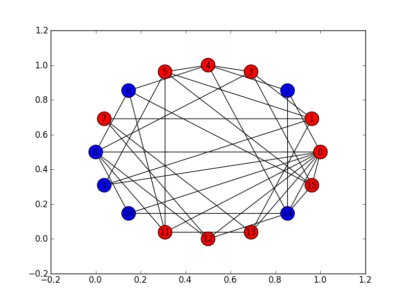
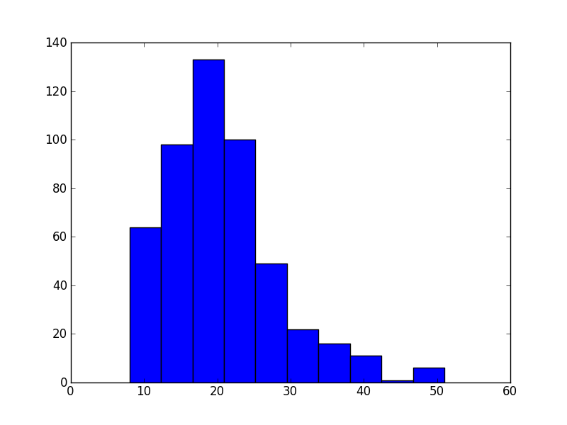

*****************
Zombie Infections
*****************

* **Worth**: 10%
* **Due**: TBD 2022, at 11:55pm; submitted on MOODLE
* **Files**: :download:`asn2.ipynb <asn2.ipynb>`/:download:`asn2.py <asn2.py>`


.. note::

    For this assignment, you will need to use special Python packages (networkx, matplotlib). The good news is that if
    you are using Colab you do not need to do anything special. If, however, you are using a local Python interpreter,
    you may need to install the packages yourself.


Task
====

If you can simulate something accurately, it becomes possible to study the simulation without having to actually
implement the real thing. You will write a program to simulate a zombie apocalypse scenario on a randomly generated
network of cities. Additionally, you will be using your simulation to analyze the spread of the zombie apocalypse
throughout your network of cities.

You will

* Write a function to check if a city is infected
* Write a function to find a given city's neighbouring cities
* Write functions to infect and cure specific cities
* Write a function to count the number of cities currently infected
* Write functions to simulate the spread of the zombie apocalypse
* Run simulations of the zombie apocalypse
* Analyze the results of your simulations


Provided Files
==============

You are provided with

* A notebook file called :download:`asn2.ipynp <asn2.ipynb>` containing the starting point of the assignment

    * This file is to be uploaded to `Google Colab <https://colab.research.google.com/>`_
    * Alternatively, if you prefer to complete the assignment with an IDE on your own computer, you may download and use the :download:`asn2.py <asn2.py>` file

.. warning::

    Do not alter the function details in the provided .ipynb/.py files

        * Do not change the name of the functions
        * Do not remove the function description
        * Do not remove or add to the parameter list


Part 0 --- Read the Assignment
==============================

Read the assignment description in its entirety before starting.


City Data Structure
-------------------

Every *city* in the simulation is represented as a list ````[name, infected, [neighbours]]``.

* ``name`` is a string with the name of the city
* ``infected`` is a ``bool`` --- ``True`` if the city is infected with zombies, ``False`` otherwise
* ``[neighbours]`` is a *list* containing the city numbers (indexes) of the cities connected to this city

For example, a city named ``"City 0`` that is not infected and three neighbours: cities with indices ``3``, ``6``, and
``7``, would be represented as ``["City 0", False, [3, 6, 7]]``.

The *world* is made up of multiple cities, which are also stored in a list. Therefore, a world with cities 0, 1, 2, ...
would be represented as ``[city0, city1, city2, ...]``, where ``city0`` would be a stand in for a whole city data
structure. If we were to expand out the city data structures in the above example, we could visualize the data as
``[["City 0", False, [3, 6, 7]], ["City 1", False, [0, 6, 8, 9]], ["City 2", False, [3, 6]], ...]``


Part 1 --- Uploading Files to Colab
===================================

After downloading the notebook file above, you will need to upload it to Colab to get started. See the respective
section from assignment 1 for an example on how to do this. I recommend saving a copy of this notebook file to your
Google drive and then work with that one. You don't have to, but you will have to re-upload the project every time you
want to work on it.


Part 2 --- Read Over Provided Code
==================================

There are many functions already completed within the assignment 2 notebook file. These functions provide important
functionality for the assignment. They contains ideas that you are likely not familiar with, but do spend some time going
over the code to see if you can get a high-level idea of what each is doing.

Get used to looking at code that is not yours, using unfamiliar ideas, and trying to figure out what existing code does.
This is not a trivial thing, but as a programmer, it is something you will end up spending a lot of time doing.

You will notice that each of the provided functions has corresponding assert tests, but some are commented with a
"eyeball test" note. For these functions, there is no way to easily test the function with an assertion, so in order to
test it, one would need to visually inspect the result to verify correctness. These tests are commented out by default,
but if you are interested, feel free uncommenting them to see what happens.


Part 3 --- Check if a City is Infected
======================================

As discussed above, each city is represented as a list of three elements --- the name of the city, the infection status
of the city, and a list of neighbours the city is connected to.

Write a function ``is_infected`` that checks if a given city is infected or not. This function will take a city (list)
as a parameter and return ``True`` if the city is infected, and ``False`` otherwise.


Part 4 --- Get a City's Neighbours
==================================

Write a function ``get_neighbours`` that retrieves the neighbours of a given city. The function will take a city (list)
as a parameter and ``return`` a list containing all the neighbouring cities.


Part 5 --- Infecting and Curing a City
======================================


Part 6 --- How Many Cities are Infected
=======================================

* Both ``number_of_cities_infected`` and ``is_world_completely_infected`` here


Part 7 --- Simulation Step
==========================


Part 8 --- Simulate Infections Disease Scenario
===============================================


Part 9 --- Using Your Code and Plotting
=======================================


Part 10 --- Testing
===================


Some Hints
==========

* Work on one function at a time
* Get each function working perfectly before you go on to the next one
* Test each function as you write it
    * This is a really nice thing about programming; you can call your functions and see what result gets returned
    * Mentally test before you even write --- what does this function do? What problem is it solving?

* If you need help, ask
    * Drop by office hours


Some Marking Details
====================

.. warning::
    Just because your program produces the correct output, that does not necessarily mean that you will get perfect, or
    even that your program is correct.

Below is a list of both *quantitative* and *qualitative* things we will look for:

* Correctness?
* Did you follow instructions?
* Comments?
* Variable Names?
* Style?
* Did you do just weird things that make no sense?


What to Submit to Moodle
========================

* Make sure your **NAME** and **STUDENT NUMBER** appear in a comment at the top of the program
* Submit your version of ``asn2.py`` to Moodle
    * Do **not** submit the .ipynb file
    * To get the ``asn2.py`` file from Colab, see the example image in Assignment 1

* A text/word file answering the analysis questions and providing *data* to back up your answers
    * Include images in your submission


.. warning::

    Verify that your submission to Moodle worked. If you submit incorrectly, you will get a 0.


General FAQ:
============

* My drawing looks different every time!
   * It should, it's random every time.

* My drawing isn't updating for each step!
   * This might be happening because it's running so fast.

* My program runs but seems to be running forever.
   * Maybe your probabilities are set in such a way that it just has not ended yet.

* My histogram looks different from yours!
   * I know, it should, it's stochastic.

* My histogram looks different every time!
   * I know... it should... it's still stochastic...

* Does my text file have enough details?
	* Probably. The shorter the better. I really just want to see that you played around a little.

* Is my area a high/low enough density?
	* I really don't care how high/low it is. Just try a few things and see what you get.

* I don't know how to do *X*.
	* OK, go to `google.ca <https://www.google.ca>`_ and type in *X*.

* It’s not working, therefore Python is broken!
	* Probably not; you’re very likely doing something wrong

* My thing keeps telling me ``No such file or directory: 'starbucks2018.csv'``
	* Then the starbucks file probably isn't where python is looking.

* But density will grow larger the smaller I make the area.
	* Correct, you understand basic arithmetic.

* But I never used the one function!!!!1!
	* Fine, but write the code anyways and make sure it works.

* But the degrees values don't specify a cardinal direction!
	* Make use of changing +/- if you need to change hemispheres.

* Wtf do the functions do that you gave me?
	* Read the descriptions. Try figuring it out. This is actually part of the assignment learning objectives.

* Some of the code in the functions you gave us look like magic.
	* At this point it may seem that way, but by the end of the semester, they will lose their magic.

* Do I have enough comments?
	* I don't know, maybe? If the code is too complex to understand simply by looking at it, add a comment.

* I know you told me to do it this way, but I did it another way, and I think my way is better.
	* Your way may be better, but I don’t care. Do it the way I told you.

* Can I work with my friend?
	* No.

* I know I cheated, I know I know I was cheating, but I’m reeeeaaaaaaaaallllllly sorry [that I got caught]. Can we just ignore it this time?
	* Lol, no.

* If I submit it at 11:56pm, you’ll still mark it, right? I mean, commmmon!
	* No. 11:55pm and earlier is on time. Anything after 11:55pm is late. Anything late is not marked. It’s rather simple really.

* Moodle was totally broken, it’s not my fault it’s late.
	* Nice try.

* I accidentally submitted the wrong code. Here is the right code, but it’s late. But you can see that I submitted the wrong code on time! You’ll still accept it, right?
	* Do you think I was born yesterday? No.

* Will I really get 0 if I do the submission wrong? Like, what if I submit the .ipynb instead of the .py?
	* Yes, you'll really get a **ZERO**.


   
Coding, Part I
==============

Write the following functions:

1. ``zombify(cities, cityno)``. This function takes your list of cities as the parameter ``cities`` and an integer ``cityno`` specifying which city in the list should be infected. So, to infect city 2, you might use the function like this:
   
   .. code-block:: python
   
      my_world = set_up_cities()
      zombify(my_world, 2)
	  
   
   **Hint 1:** Which index held the infected boolean?

   **Hint 2:** If the above hint made no sense to you, you didn't read *Data structures you need to know about* section carefully enough. 
 
2. ``cure(cities, cityno)``. The opposite of ``zombify``. Clear the infection flag for the city.  
   
3. ``sim_step(cities, p_spread, p_cure)``. This is the most important function in the assignment. This function will execute a single *time step* of your simulation. Depending on how fast you want to think of your zombies spreading, that time step could be a day, an hour, a week, whatever. When modelling a real zombie outbreak, you'd determine the size of your time step from the empirical data. Here is some English-language "pseudocode" for function. You'll have to turn it into Python::
   
    for each city in cities (enumerate?):
        if the city is infected and random.random() < p_spread:
            choose a victim city (at random -- hint: random.randint, random.randrange, or maybe random.choice) from the list of this city's neighbours
            infect the victim city!
        
        if the city is infected and random.random() < p_cure:
            cure the city!
         
    Make sure that city 0 *always* has zombies. It can't be cured. 
   
   So, what's going on there? Well, ``random.random()`` isn't so much pseudocode as actual Python code. It generates a random number between 0 and 1 every time you call it. Think of it like rolling dice. The parameter ``p_spread`` is the *probability of the zombie plague spreading* and the parameter ``p_cure`` is the probability of the plague being cured. For starters use values of 0.5 for ``p_spread`` and 0.0 for ``p_cure`` while you're getting things working. We'll play with these later. (Note: a value of 0.0 means it will never happen, and a value of 1.0 will mean that it always happens.)   
   
   To help explain the whole *probability* bit better, imagine you had a 10 sided die and a probability to spread of 0.8 (80%). So, think about it this way... we have an 8/10 chance to spread (80%). So if we roll the die and a 2 pops up, we will spread. We roll again, and a 7 pops up, we spread. Roll and a 1 pops up, we spread. Roll and a 9 pops up, we do **not** spread. That's what we're doing here. But instead of a die, we have ``random.random()``.   
   
   .. warning::
   
      Imagine we have:
	  
         ``a_city = ['cityX', False, [0, 6, 8, 9]]``
		 
      Let's say we pick a random neighbour from the list of neighbours. Notice that we have 4 neighbours here. So let's take the neighbour in index 2, which is 8. The neighbour is city 8, not 2! Make sure you understand this. This consistently messes people up year over year. 

Once you've done this, you now have a working zombie apocalypse simulator! So spend some time testing it. Something like this: 
   
   .. code-block:: python   
   
      my_world = set_up_cities()
      zombify(my_world, 0)
      draw_world(my_world)
      sim_step(my_world, 0.5, 0)
      draw_world(my_world)
      sim_step(my_world, 0.5, 0)
      draw_world(my_world)
      sim_step(my_world, 0.5, 0)
   
The function ``draw_world`` is one that's already written for you. It graphically displays the state of your world. Cities are red circles if they have zombies and blue circles if they're clean. If zombies can travel between two cities, there is a line drawn between the cities. If you update this display after each ``sim_step`` you can watch your zombies spread! It'll look something like this:



If you get tired of typing ``sim_step`` for every single step... you could always automate the process with a function that calls ``sim_step`` in a loop!

Once you're convinced that your zombie simulator works, move on to Part 2. If your simulator isn't working yet **GET IT WORKING BEFORE PROCEEDING**.

Working now? Good. Make sure it's *commented* and has *function headers*. Make sure you've got good variable names too. 


   


Coding, Part II
===============

As fun as it is to watch our zombies spread, we'd like to gather some hard data on the results of our
simulations. In particular, top government officials want to know how long it will take for the world
to end in the event of a zombie apocalypse. 

Write the following functions:   
  
4. ``is_end_of_world(cities)``. Loop through all the cities in the list ``cities``. If *all* of them are infected, return ``True`` (it's been nice knowing you). Otherwise, return ``False``.  

5. ``time_to_end_of_world(p_spread, p_cure)``. Run a simulation, for specific values of ``p_spread`` and ``p_cure`` and count how long it takes the world to end (which you can now test with ``is_end_of_world``, of course). Some pseudocode for you::
   
      set up a new list of cities (``world = set_up_cities()``)
      zombify city 0
      
      initialize an end-of-world counter
      while the world hasn't ended:
         sim_step(world,p_spread,p_cure)
         increment the end-of-world counter
    
      return the value of the end-of-world counter

   Now, to run an experiment to see how long it takes the world to end, all we have to do is call ``time_to_end_of_world(0.5, 0)``
   
   .. warning::
      Be careful with what values you select for ``p_spread`` and ``p_cure``. This simulation works on probabilities. If you have a high probability to spread, do you think the simulation will take a long time? What if you had a low probability? Will it take longer?. How would the cure probability impact the runtimes?
   
      Long story short. Careful. If you set cure too high and spread too low, you might be twiddling your thumbs for **A LONG** time. 

We've got a problem. Our simulation is *stochastic* (random): we are making use of random numbers to determine outcomes. We can't just run our simulation once and count the number of steps until every city is infected. If you don't believe me, just try it. Call the ``time_to_end_of_world`` function a few times. Do you get different values? Wildly different? Yeah, that's what I thought. WTF do you do now?

We have to run our simulation *many times* to sample the space of possible outcomes. In essence, simulation is a lot like experimentation; we have to do multiple experiments to get some statistical confidence in our answer.

So, write another function:

6. ``end_world_many_times(n,p_spread, p_cure)``. This function should initialize a *list* of results and then use a loop to run ``time_to_end_of_world(p_spread, p_cure)`` a total of ``n`` times. After each simulation, add the time it took for the world to end to the list. Return a list of ``n`` "times to the end of the world". Some pseudocode for you::

    create an empty list
    while we have not done n simulations
        run one simulation of time_to_end_of_world
        append result to the list
	  
    return the list

All set? Make sure it's got good variable names, is *commented*, and has *function headers*. Then go on to the analysis.
  
Analysis
========

Now we get to play with our simulator to answer burning public health questions about zombie outbreaks. Play with the values of ``p_spread`` and ``p_cure``. How does changing those values change the "time to the end of the world"? Answer the following specific questions, and provide evidence from your simulation to support your answer: 

1. Fix the value of ``p_cure`` at zero. How does varying the value of ``p_spread`` affect the time to the end of world?

2. Fix the value of ``p_cure`` at 0.05. How does varying the value of ``p_spread`` affect the time to the end of world?

3. Fix the value of ``p_spread`` at 0.5. How does varying the value of ``p_cure`` affect the time to the end of world?  

4. Pick three pairs of ``p_spread`` , ``p_cure`` values that you think are interesting. Run 500 simulations for them (e.g, `end_world_many_times(500, your_value, your_value)``. What does the *distribution* of times to the end of the world look like? If you've taken a stats course: is it normal (Gaussian)? (If you haven't taken stats, just ignore the Gaussian bit). Call the function I gave you called ``draw_pretty_histogram(times)`` with a list of times to the end of the world. Cool eh!

   Here's a sample histogram of times to the end of the world for ``p_spread = 0.5`` and ``p_cure = 0.0``:




