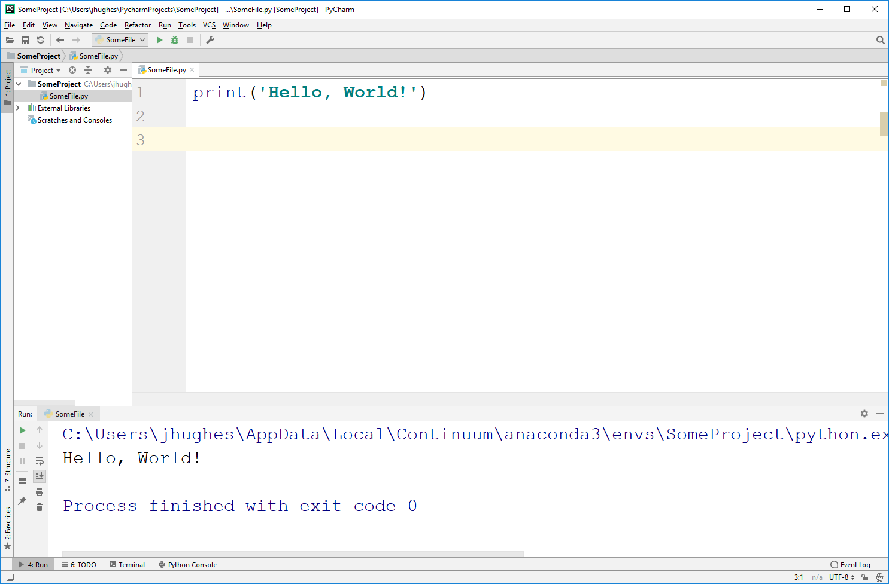

***************************
Getting set up for CSCI 161
***************************

Colab
=====

There are a few ways to get setup to start programming in Python. By far the **easiest** and **recommended** way for
CSCI 161 is to use `Google Colab <https://colab.research.google.com/notebooks/welcome.ipynb>`_.

There are a number of reasons this is the best choice for us, including being simple to setup (I'm betting everyone
already has a Google account). Further, it automatically backs everything up for you with Google Drive. Another big
reason is this style of programming, called *notebook*, is quite nice for note-taking.

If you do not have a Google account, then it is easy to make one. If you are uncomfortable making a Google account, then
no worries, either use the options below or make a Google account just for Colab.

Interpreter on Your Computer
============================

Colab is awesome, however it does have one major downside --- you **must** be connected to the internet for it to work.
Although we'll still primarily use Colab, it is recommended to also install Python on your computer. You'll pickup how
to use both Colab and your local interpreter throughout the course.

To download Python onto your computer, visit the `Python download page <https://www.python.org/downloads/>`_, download
it, and install. If you go this route, you will also want an *Integrated Development Environment*, which is discussed
below.

Integrated Development Environment
==================================

An Integrated Development Environment (IDE) is a special programs that can make it easier to write code. However, I do
not recommend using one at the start of the course as it can be overwhelming. Although IDEs do absolutely make a
programmers life easier, at this stage of learning it will likely impeded your learning.

A popular IDE many use is called *PyCharm*. You can obtain the community or education edition for free from *JetBrains*.
`Visit their download website to obtain the software <https://www.jetbrains.com/pycharm/download/>`_.

Note, I will not be providing IT support for IDEs (or really any IT support in general). 

