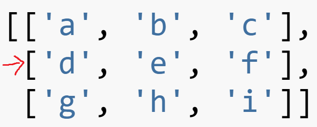
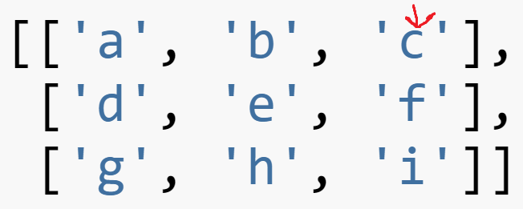
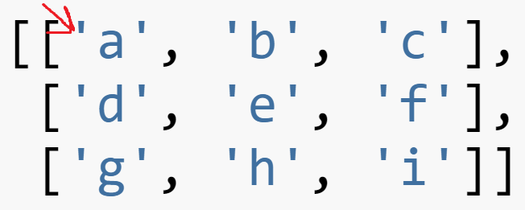
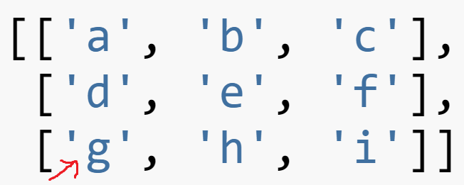
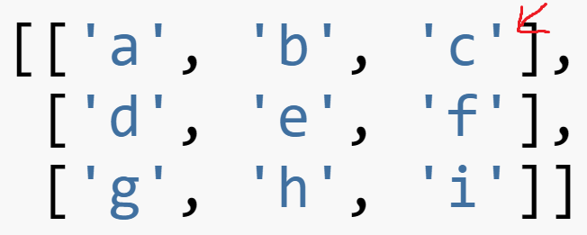
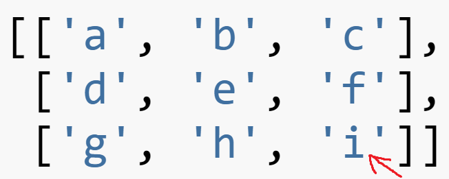

********
2D Lists
********

* Feel free to use your laptop if you have it
* Ensure I have recorded your completion --- failure to do so will result in a grade of 0
* I strongly encourage you to work with others in the lab

    * When you get stuck, do me a favour and ask those sitting around you for help
    * I want people to get used to working together in the labs
    * Peer teaching and peer learning is super effective

.. note::

    To obtain full marks for the lab, you must:

        #. Have completed the pre-lab exercises
        #. Have been working on the lab content
        #. Demonstrate competency in the topics

Pre Lab Exercises
=================

.. warning::

    You must have completed the specified exercises prior to the start of the lab. If you have not come to lab prepared,
    you will be asked to leave and you will obtain a grade of 0 for the lab.

* For all exercises

    * Do **not** make a ``vector.py`` file, just use Colab like you have been
    * Use ``assert`` to test instead of their ``test`` function

#. `Chapter 11 exercise(s) <http://openbookproject.net/thinkcs/python/english3e/lists.html#exercises>`_

    * 5
    * 6
    * 7

Before Kattis
=============

**Before you do ANYTHING, take out a scrap piece of paper.** 

**Note, do not work on the assignments during labs. If you do, you will be asked to leave and will be given a zero for the lab.**

Let's say we have this code:

.. code-block:: python
   
   twoD = [['a', 'b', 'c'],
           ['d', 'e', 'f'],
           ['g', 'h', 'i']]
		

.. warning::
   
   Above is a 3x3 matrix. YOUR CODE SHOULD WORK ON ANY SIZED MATRIX THOUGH. 4x4, 5x23, 23098x198272973!!! 
   
   Long story short, this is **bad**; do **not** do this:
   
   .. code-block:: python
   
      def printRow(mat, row):
         print(mat[row][0])
         print(mat[row][1])
         print(mat[row][2])
   

   
**1**

Write a function ``printRow(mat, row)`` that will print out all the contents in a 2D matrix ``mat`` from a given row ``row``.

ex:

>>> printRow(twoD, 1)
d
e
f

**2**

Write a function ``printCol(mat, col)`` that will print out all the contents in a 2D matrix ``mat`` from a given col ``col``.

ex:

>>> printCol(twoD, 2)
c
f
i

**3**

Write a function ``printDownRight(mat)`` that will print out all the contents in a 2D matrix ``mat`` along the diagonal starting at the top left and ending at the bottom right.

ex:

>>> printDownRight(twoD)
a
e
i

**4**

Write a function ``printUpRight(mat)`` that will print out all the contents in a 2D matrix ``mat`` along the diagonal starting at the bottom right and ending at the top right.

ex:

>>> printUpRight(twoD)
g
e
c

**5**

Write a function ``printDownLeft(mat)`` that will work similarly to above, but starting in the top right. 

**6**

Write a function ``printUpLeft(mat)`` that will work similarly to above, but starting in the bottom right.

**7**

What happens if you were to use this list now?

.. code-block:: python

   uhoh = [['a', 'b', 'c', 'w'],
           ['d', 'e', 'f', 'x'],
           ['g', 'h', 'i', 'y'],
           ['j', 'k', 'l', 'z']]
		   

All of your functions should still work as expected (see example below). If they do not, FIX THEM!!!!

>>> printCol(uhoh, 2)
c
f
i
l

>>> printUpRight(uhoh)
j
h
f
w

Kattis Problems
===============

Grab a scrap piece of paper to start scratching your ideas down on paper. The problems are getting tricky enough where this really is becoming a requirement. 

1. https://open.kattis.com/problems/bijele
2. https://open.kattis.com/problems/cold
3. https://open.kattis.com/problems/nastyhacks
4. https://open.kattis.com/problems/grassseed
5. https://open.kattis.com/problems/pet
6. https://open.kattis.com/problems/batterup
7. https://open.kattis.com/problems/aboveaverage
8. https://open.kattis.com/problems/icpcawards
9. https://open.kattis.com/problems/quickbrownfox
10. https://open.kattis.com/problems/nodup
11. https://open.kattis.com/problems/conundrum
12. https://open.kattis.com/problems/bela
13. https://open.kattis.com/problems/kornislav

If you finish the lab, go back and work on incomplete problems from previous labs. 

If you have somehow finished everything so far, go check out `LeetCode <https://leetcode.com/problemset/all/>`_. Sort the problems by *Acceptance* (click the table header) and start seeing if you can solve some of these problems. 

**ENSURE WE HAVE RECORDED YOUR COMPLETION. FAILURE TO DO SO WILL RESULT IN A GRADE OF 0!**
