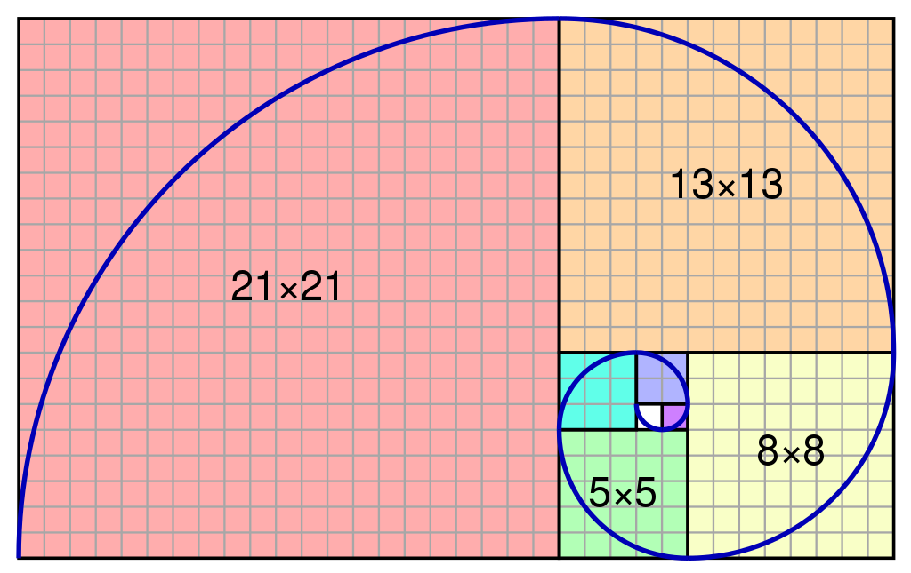

*******
Lab #12
*******

Part 1
======

.. Warning:: 
    For these Qs in **Part 1**, you will be working out the ideas on paper and **not** the computer. Also, I strongly suggest you work together in small groups.

1. Convince yourself that the below code is right. Try a few examples as input and execute the code line by line and write it out on paper. Look for patterns and/or just make observations about what you see. Even if it seems obvious or trivial, make note of them as they are often the most important things. **A lot** of CS is just looking for patterns.

.. code-block:: python
    :linenos:
    
    def fact(n):
        if n == 1:
            return 1
        else:
            return n * fact(n-1)
    

2. When thinking about computational complexity, we basically ask how many times some code is run. For example, with a linear search we're typically going to have a loop and we ask ourselves "how many times does the code in the loop run?". Assuming we have `n` things, it will be `O(n)`. Here we have no loop, but take a moment and think about how much work is being done; how many times will the function get called?
    
3. Can you come up with an algorithm to do this *not* recursively? You don't have to actually implement it (but you can if you want). Just come up with the general idea and convince each other that it's right.

4. See if you can derive/find the **recursive** function based on the input and outputs below:

``f(0) = 0``

``f(1) = 1``

``f(2) = 1``

``f(3) = 2``

``f(4) = 3``

``f(5) = 5``

``f(6) = 8``

``f(7) = 13``

``f(8) = 21``

``f(9) = 34``

What is ``f(x)``?

Part 2
======

Go work through the course content for :doc:`Topic 18 </topics/topic18/data-visualization>` and :doc:`Topic 19 </topics/topic19/machine-learning>`.

**ENSURE WE HAVE RECORDED YOUR COMPLETION. FAILURE TO DO SO WILL RESULT IN A GRADE OF 0!**
