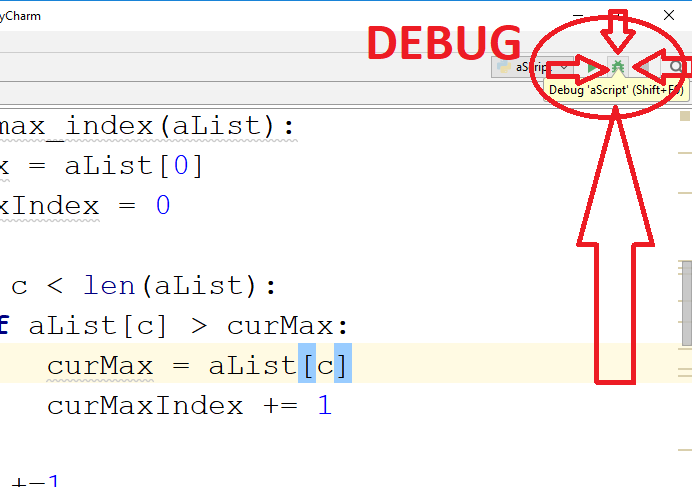
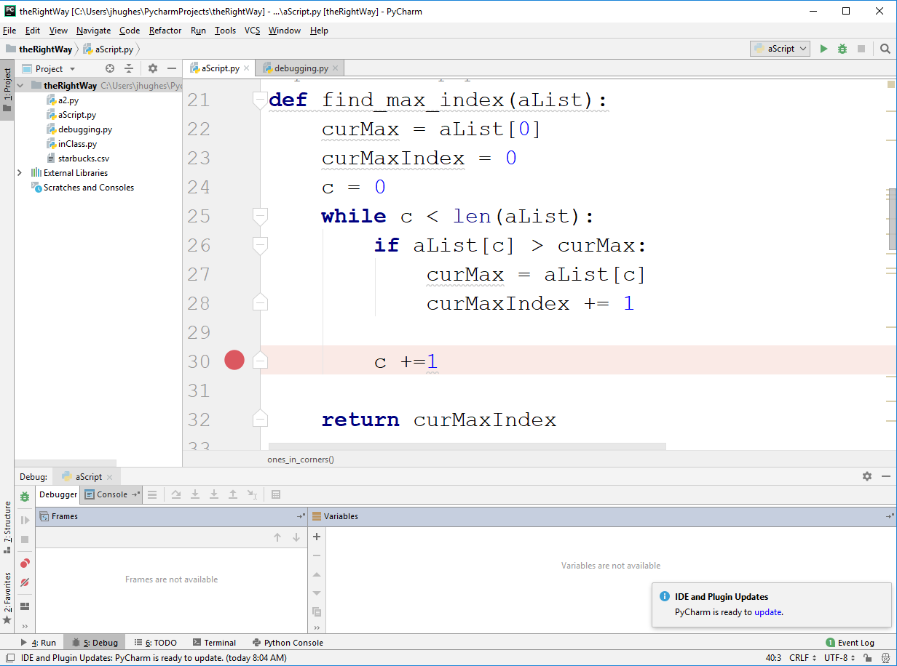
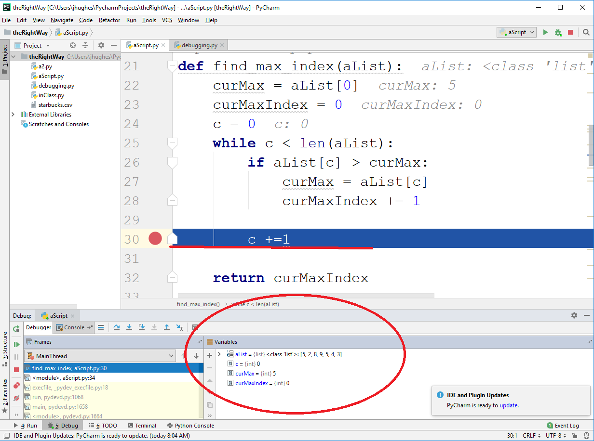
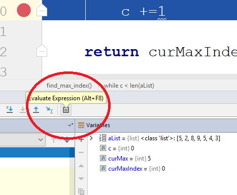
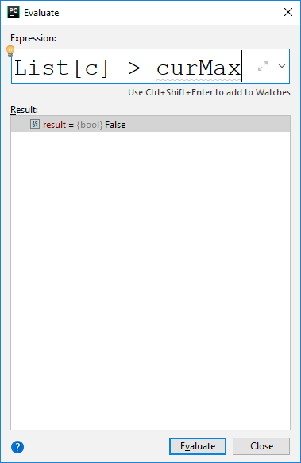
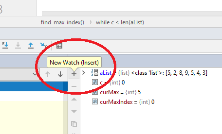
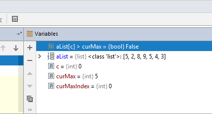
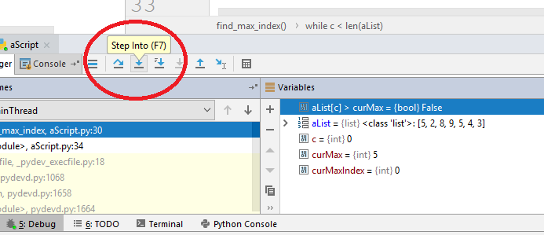
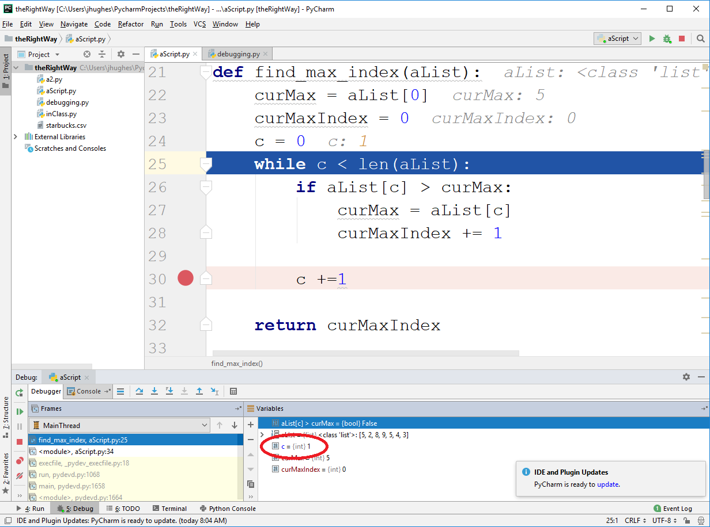
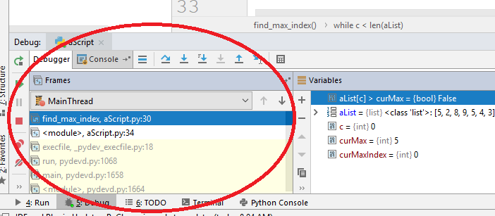

************
The Debugger
************

Now it's time...
================

* To follow along with this class you will need to have PyCharm installed. 
* You should be familiar enough with Python and everything to be able to take advantage of PyCharm without it throwing you off too much
* Don't worry though. If you finish this lecture and realize you hate PyCharm, then that's OK. Keep doing what you're doing. 

* A lot of IDE's have GUI debuggers
* A debugger is a powerful tool that lets us to a lot of cool tings
    * Watch variables
    * Watch expressions
    * Break points
    * Step through code one line at a time
    * ... 
    * ...
   
* There are a lot of debuggers out there, and they all work a little differently
* I will focus on the PyCharm one here, but most of what I'm saying can be done in most debuggers in one way or another.

Break Points
============

    Some Broken Code::
   
        def find_max_index(a_list):
            cur_max = a_list[0]
            cur_max_index = 0

            c = 0
            while c < len(a_list):
                if a_list[c] > cur_max:
                    cur_max = a_list[c]
                    cur_max_index += 1
                c += 1
        
            return cur_max_index

* In your IDE, click just to the right of a line number on a line of code you're interested in.

* Now, hit the debug button in the top right.

* WOAH!
* What just happened!?

1. The debugger started executing the script
2. It carried on as if everything was normal
3. It hit the break point and **STOPPED**

* Now the program is frozen waiting on us

Watching Variables
==================

* Check out the bottom of the screen in the previous picture.
* It's telling us what the current value of ``a_list``, ``c``, ``cur_max``, and ``cur_max_index`` are. 
    * I hope you all see how this is a **REALLY BIG DEAL**
* In other words, the program was running, hit the break point, it stopped, and now it's telling us what the variable's contents are at this time.
* You'll also see how PyCharm has thrown in some like comment things in the code too. 

Evaluating Expressions on the fly
=================================

* We can even ask questions to Python at this time
* Click the little calculator button

* Now I can ask a question like this based on what the current values of the variables

Adding expressions to the watch list
====================================

* Even more cool, instead of just asking a question once, we can add the expression to the watch list
* Click the ``+`` button

* Type in your question

* WOW!
* Now it's added to our watch list
* But, what's so great about the watch list?

Stepping through code one line at a time
========================================

* Press the *step into* button and see what happens.

* In this particular example, the code will go back to the top of the loop
* Also notice that the value of ``c`` changed!
    * Why? Because the line of code ``c += 1`` makes it

* We can now tell tell Python to run one line at a time. 
* We can also see how the variables change in the watch list as we step through the code

* There are other buttons line *step into*:
    * *Step Over*: Imagine the next line of code was a function call. Step into would then step into the function and carry on inside that function. Step over will allow us to run the function's code, but carry on one line at at time after the function call. 
    * *Step Out* allows us to exit the function we're currently stepping through, but stop immediately after the function finishes. 
    * *Step Into My Code*: Step into sometimes will take us into functions we didn't write (like print). This option makes sure we skip those things. 
   
* I blitzed through the above ideas and did a bad job explaining them. Just... for now... know they're a thing. The only way to learn them is to try them out. 

The Call Stack
==============

* Over on the left hand side we see the *call stack*
* Long story short, the thing at the top is where the code currently is
    * In the below example, we can see that we're in a function called ``find_max_index``.
* The thing below that will be the code that called the function we're currently in
    * In the below example, it's just the script
* Let's not get toooo bogged down by this right now. 

The Debugger Is Awesome
=======================

* I really do hope you realize how amazing this tool is and that you start to make use of it. 
* This is only the tip of the iceberg. There is A LOT we can do with a debugger. 
* The only way to get good at using it is by using it and exploring. See what you can do!

   
For next class
==============
     
* Read `chapter 13 of the text <http://openbookproject.net/thinkcs/python/english3e/files.html>`_  
* Read `chapter 19 of the text <http://openbookproject.net/thinkcs/python/english3e/exceptions.html>`_  
