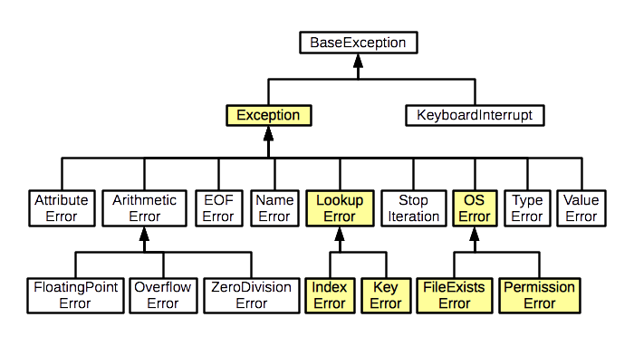

**********
Exceptions
**********

* You have all seen various exceptions in Python

.. code-block:: python

    int('hello')
    ValueError: invalid literal for int() with base 10: 'hello'

* In the above example, when we tried to convert the string ``hello"`` to an integer, Python *raised* an exception

.. code-block:: python

    a = ['a', 'e', 'i', 'o', 'u']
    print(a[11])
    IndexError: list index out of range

* In the above example, when we tried to access the 11th thing in the list containing only 5 things, Python *raised* an exception

* Both ``ValueError`` and ``indexError`` are exceptions, but there are many more kinds of exceptions

* Consider how, like the ``print`` function, someone had to write the code for converting strings to integers and indexing elements form a list
* If I am the one writing the code for converting strings to integers, what should I make my code do if someone asks my code to convert the string ``"hello"`` to an integer?

    * Obviously there is no single obvious and natural way to convert the string ``"hello"`` to an integer
    * Should my code simply ignore the request and carry on like nothing ever happened?
    * Should my code crash the whole program?
    * Maybe some user entered some input wrong?
    * Maybe the issue is with some text file that was read?
    * ...

* The trouble is, if I am writing the code for converting strings to integers, I cannot possibly know what you --- the individual trying to use my code at some point in the future --- want to do in these exceptional situations
* What I can do however is *raise* an exception, which then communicates to the programmer using my code that *they* have to specify what *they* want to do when the exceptional situation arises

* Consider the example below on dividing by zero

.. code-block:: python
    :linenos:

    def divide(a,b):
        if b == 0:
            raise ZeroDivisionError("Wait, that's illegal")
        else:
            return a/b

* Obviously we're going to have an issue if we try to divide a number by zero
* But what should happen if someone tries to?
* That's entirely up to the programmer making use of the ``divide`` function
* All I need to do is communicate to them that something exceptional happened by ``rais``\int an exception

    * The function first checks if ``b`` is ``0``
    * If ``b`` is ``0``, then the exception is ``raise``\ed
    * If it is not, then the function carries on as it should

Catching Exceptions
===================

* Exceptions are not necessarily errors. They are *exceptional situations*.
* Let's consider ``divide`` above
    * Although you could think about any other thing you've tried to do before that returned an exception, like converting 'hello' to an int, or indexing something that does not exist.

* Pretend I wrote this divide function in 1999 and now everyone today is using my super awesome function. 
* You come along today and call ``divide(9,0)``

1. I can't divide 9 by 0. That's a no-no.
2. What should *I* do about it in 1999?
3. Well... you're writing a program right now trying to use this function to do something
4. How could I know how to handle this situation in YOUR program?
5. How about this... How about I write some code in my 1999 code that says "SOMETHING EXCEPTIONAL HAPPENED" that lets YOU know that something is off.
6. Then YOU can handle these exceptional situations however YOU want. 

    * Crash?
    * Carry on?
    * Try again?
    * Call the user a moron?
   
So here's the rule, let's say I'm going to use a function that might throw an exception.

1. I will ``try`` to run the code that may or may not ``raise`` an exception
2. The code will run normally ``except`` if the exception is raised. 

.. code-block:: python

    def my_code():
        try: 
            function_that_can_raise_exception()
        except SomeError:
            code
            that
            will
            handle 
            situation
        code
        that
        runs
        regardless
	  
* The code in the ``except`` area only runs if an exception happens
* If no exception happens, then the code is skipped
* It's kinda' like ``if`` statements, but for exceptions

Divide Example
--------------

* Let's look at a couple of examples of people using ``divide``
   
Jane example

* Jane wants us to set the result to NaN (not a number) if we try to divide by zero.

.. code-block:: python

    def jane_code(a,b):
        try: 
            rez = divide(a,b)
        except ZeroDivisionError:
            rez = float('NaN')
        print(rez)

* What's happening?
    * If we call ``divide`` and nothing funny happens ``rez`` becomes the result
    * If an exception is thrown, ``divide`` never finishes doing its thing and we set ``rez`` to ``NaN``. 
    * Then, either way, we print out ``rez``

   
Bob example

* Bob just wants to have his program keep asking the user for input until it can divide the numbers

.. code-block:: python

    def bob_code():
        while True:
            data = input().split()
            a = int(data[0])
            b = int(data[1])
            try: 
                rez = divide(a,b)
                break
            except ZeroDivisionError:
                print('Bad input for divide (divided by 0), try again')
			
        print('Im outside the loop')
	  
	  
	  
Tim example

* `Tim is programming a piece of medical equipment that gives radiation therapy to people, and if the calculation goes wrong, we need the equipment to stop immediately otherwise we might give someone radiation poisoning <https://en.wikipedia.org/wiki/Therac-25>`_.

.. code-block:: python

    def tim_code(a,b):
        try: 
            rez = divide(a,b)
        except ZeroDivisionError:
            exit()	# Immediately stop!
        print('I am going to give you radiation therapy now.')

Sally example

* `Sally is writing code for a helicopter. If the calculation does not work, we still want the program to run and keep us in the air <https://en.wikipedia.org/wiki/1994_Scotland_RAF_Chinook_crash>`_.

.. code-block:: python

    def sally_code(a,b):
        try: 
            rez = divide(a,b)
        except ZeroDivisionError:
            print('Error in calc. I will stay in the air though. ')
        print('Keep Flying')

Exception Types
===============

* There are A LOT of types of exceptions/errors out there
* We can even make our own (outside the scope of this class though)
* There is even a hierarchy 
    * `I stole this pic from here <https://o7planning.org/en/11421/python-exception-handling-tutorial>`_ 

Exceptional vs Error
==================== 
	
* I'm not gonna' get too far into this, but long story short, there are some exceptions that are exceptional situations, and some that are just plane errors on the programmer's part. 
* Things like ``IndexError: list index out of range`` are probably errors you made
* Things like ``FileNotFoundError:`` are probably issues with the how the code was used (trying to open a file that does not exist), and not really an *error*

	
Why do we care about exceptions?
================================

* It allows programmers to pass info around and communicate through TiMe
* It allows us to deal with exceptional situations effectively
* It gives us a nice logical division between normal code and exceptional code

For Next Class
==============

* Read `Chapter 15 of the text <http://openbookproject.net/thinkcs/python/english3e/classes_and_objects_I.html>`_

