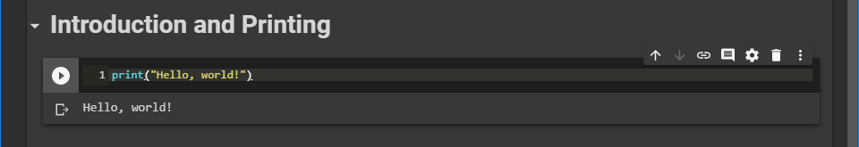

***********************
Introduction and Output
***********************

What Will I Learn?
==================

* The short version:
    * How to write computer programs
    * How to write programs to solve problems
    * A little bit of how computers work
    * A little bit about what on earth computer science is

* The long version:
    * :doc:`Read the outline </outline/outline>`

.. admonition:: Activity

    Where have you encountered computer programs before?

    Can anyone name an area of Science where they think having computer programming skill would be a bad thing? How
    about Social Science? Humanities? Art? Talk with your neighbours.

What Prerequisites Do I Need?
=============================

* Curiosity

Why Are The Course Notes A Website?
===================================

* You're going to learn to write programs in Python
* Most Python documentation is made with something called Sphinx
* These course notes are made with Sphinx
* The idea: get used to reading and learning from something in this format
    * `Here's an example <https://docs.python.org/3/library/math.html>`_

There Are Two Sections?
=======================

* Yes
* Section 11 is taught by Dr. Hughes
* Section 12 is taught by Dr. Delamer

How Will This Class Work?
=========================

* This class is going to be run somewhat differently from other courses you may have experienced at university 
* I have a number of activities throughout the topics that we will take time to work on
    * They also help with breaking up the monotony of listening to a lecture for an hour straight

* At the end of each topic there are linked suggested readings you should work through to get practice
    * The only way to learn this stuff is through practice
    * You can watch every YouTube video on how to play piano that exists, but you still won't know how to play piano unless you practice

.. admonition:: Activity

   Have a chat with the people sitting around you: 

   * What are their majors?    
   * Why did you come to StFX?
   * Why are they taking this class?   
   * What do you hope to learn? 
   * How do you think you will use what you learn in the future?
   
   
What Should I Bring To Class
============================

* Curiosity
* Readiness to do stuff, rather than just listen
* A laptop and/or pen and paper
    * Taking notes is still important even though the content is online
    * If you can bring a laptop, I strongly recommend it as there will be opportunity for you to program during activities

Is This Class Easy?
===================

The quick answer is, it depends...

.. admonition:: Quick Activity

   * Who here knows how to use a hammer?
   * Who knows how to use a screwdriver?
   * Who knows how to use a saw?
   * ...
   * ...
   * Who here knows how to build a house?

* Each of the things you will learn are perhaps simple on their own, but using them together to achieve something is challenging
* These topics really are going to be shockingly different from what you are probably used to
    * Very few classes can prepare you for the way of thinking that will be required for this class
* Unfortunately, intro to computer science classes do often have an unusually high fail rate
* The best way to set yourself up for success is
    * Practice
    * Read
    * Stay on top of the content

So I Should Be Terrified?
=========================

* No
* It's entirely doable **if you put in the effort**
* Waring though --- the class is dense and very accumulative, do not fall behind

* The good news is, you get to make mistakes
    * In fact, expect to make **a lot** of mistakes
* You get to see if what you did works or not
* Most of this class will be you beating your head against your keyboard until you get it right
* Not many classes or disciplines give you this luxury

* I really can't stress this enough
    * Most of the time when you're *working* on the course material you will be getting things wrong
    * The majority of programming is actually *debugging*
    * Get used to making mistakes
        * This is a good thing
        * This is normal

I Need help!
============

* Knowing the challenges students face, we have provided many resources to help you succeed
    * `Google <https://www.youtube.com/watch?v=e9C_cgL2150>`_
    * YouTube videos
    * Email
    * `Google <https://www.youtube.com/watch?v=e9C_cgL2150>`_
    * Office hours
    * `Google <https://www.youtube.com/watch?v=e9C_cgL2150>`_
    * Labs
    * `Google <https://www.youtube.com/watch?v=e9C_cgL2150>`_

Google?
-------

* When a programmer isn't debugging, they're Googling their problems 
    * This is so common that it's a meme

* I am going to tell you to "Google It" very often in this course
    * This is intentional

* Independent learning is one of the most important things you will learn
* Further, it will be your go to tool when you're programming in the future 
* `Get used to "Googling it" <https://www.youtube.com/watch?v=e9C_cgL2150>`_

Can I Write A Program Now?
==========================

* If you have gone through :doc:`get set up for CSCI 161 </getting-set/getting-set>`, then yes
* Go to Google Colab and make your "Hello, world!" program 
    * `"Hello, world!" <http://en.wikipedia.org/wiki/Hello_world_program>`_ is traditionally the first program one writes in a new language

.. code-block:: python
    :linenos:

    print("Hello, world!")

* You're now officially a computer programmer

   
Videos
======

* `Be sure to check out these YouTube videos! <https://www.youtube.com/channel/UCIruexBZJaawh_9WF_vjTPg>`_
* **WARNING:** 
   * These videos are not a substitute for lecture or the course notes. They are supplementary. 
   * These videos were **NOT** created for this course, but a similar class, so they'll probably be handy
   * These videos are using the local interpreter. You will not see any Colab in them. They will still be super useful though. 
   * These videos were made for Python 2 (but that won't really matter for you. Most you'll have to deal with is adding brackets to the print statements.)

   
.. `Check out this video. <https://www.youtube.com/watch?v=EzBHGSMdwjg/>`_

.. raw:: html

	<iframe width="560" height="315" src="https://www.youtube.com/embed/MHwfXIl7O4U" frameborder="0" allowfullscreen></iframe>  

.. raw:: html

	<iframe width="560" height="315" src="https://www.youtube.com/embed/lN6uUAQcKgY" frameborder="0" allowfullscreen></iframe>  

For next week
=============

* `Read chapter 1 of the text <http://openbookproject.net/thinkcs/python/english3e/way_of_the_program.html>`_
* Read sections 2.1-2.5 of `chapter 2 of the text <http://openbookproject.net/thinkcs/python/english3e/variables_expressions_statements.html>`_
* Get your computer at home :doc:`set up for CS 161 </getting-set/getting-set>`

