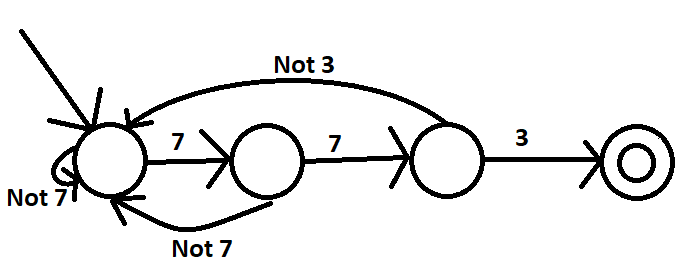
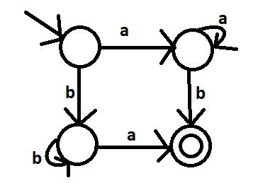
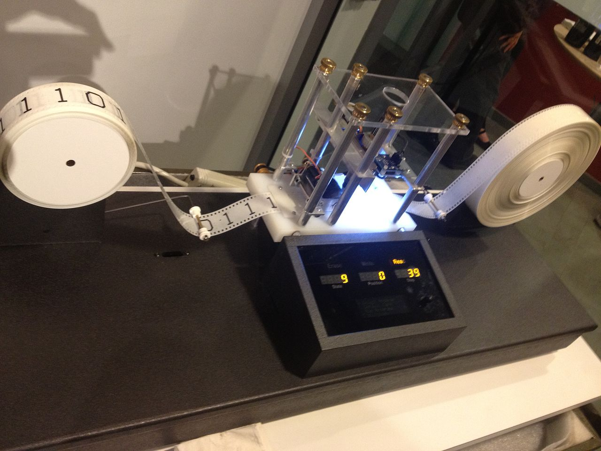

*********************
Models of Computation
*********************

* As we have progressed through the course, we have gained an intuition of how everything works
* Everything we have done up until this point is *Computer Science*

* However, at the end of the day, how much thought has been given to

    * *What is computation?*
    * *What is a computer?*
    * *What enables a computer to do what it does?*
    * *What can a computer compute?*

* These ideas are also a very big part of what computer science is
* Due to the requisite knowledge required to really get into these ideas, this topic presents a high-level introduction of the underlying ideas

Finite State Machines/Automata (FSM/FSA)
========================================

* We can define a very very very very simple computer in terms of 
    * Input 
    * Output
    * States
    
* With this, we can spend time thinking about what exactly a simple little computer like this can do

    * What types of problems this computer can solve

* FSMs are **VERY** simple computers
* But, just because they're simple, doesn't mean we can't use them
* In fact, these extraordinarily simple computers are used to solve many problems we deal with every day

    * Vending Machines
    * Traffic Lights
    * Elevators
    * Locks/Safe
    * Regular Expressions 

* Let's say we want a lock that has the combination **7, 7, 3**
* Below is a representation of a FSM for that lock

* The FSM receives input, and depending on the input the FSM's state may change
* If the FSM receives input such that the machine halts on the accepting state (double circled state), then, in this context, the lock would open
* For example, if the machine receives the input **7, 7, 3**, the final state would be the accepting state

* The above lock example started with what the correct sequence is, and then a FSM was designed for it
* But we can also start from a FSM and ask, *what kinds of inputs does this machine accept?*

.. admonition:: Activity
    :class: activity

    Consider how the lock example hits the accepting state after seeing **7, 7, 3**.

    What input strings can this machine accept? What I mean is, what strings will get this machine to it's final state?

* Think of how simple this computational system is, while also considering how powerful it is in terms of the problems it could solve
* Computer Scientists like to think about *what else can a computer this powerful do?*
    

Pushdown Automata (PDA) and Context-Free Grammars 
=================================================

* FSMs, although powerful, are very limited in the types of problems they can be used for
* If we want to solve more *complex* problems, we need a more powerful machine

    * But what exactly is a more complex problem?

* Pushdown Automatas (PDAs) are strictly more powerful when compared to FSMs

    * They can solve more problems than FSMs
    * Anything a FSM can do, a PDA can do
    * But there are many things a PDA can do that a FSM cannot

* PDAs have a mechanism for memory, which is what gives them an edge over FSMs

    * A pushdown is an old name for a stack
    * The memory is the informatioon stored in the stack

* Getting into the theoretical construction of a PDA is beyond what we will consider here, but we can discuss what we can do with them
* PDAs recognize what we call Context-Free Grammars
* Here's an example of doing the same thing as the 2nd FSM

    :math:`S \rightarrow aA`

    :math:`S \rightarrow bB`

    :math:`A \rightarrow aA`

    :math:`A \rightarrow b`

    :math:`B \rightarrow bB`

    :math:`B \rightarrow a`

* Here, the upper case letters are special symbols that mean you can replace them in a string with whatever is on the right hand side
* The lower case letters are just letters

* Start with S

    * String: :math:`S`

* We have two options, let's go with the first

    * String: :math:`aA`

* We now have an A, so let's go with the first options

    * String: :math:`aaA`

* Let's do it again

    * String: :math:`aaaA`

* Let's do it 4 more times

    * String: :math:`aaaaaaaA`

* Now let's go with the second option

    * String: :math:`aaaaaaab`

* No more upper case letters, so we're done.

    * String: :math:`aaaaaaab`

    
* Here's another one

    :math:`S \rightarrow aSa`
    
    :math:`S \rightarrow bSb`
    
    :math:`S \rightarrow \epsilon`
    
    (:math:`\epsilon` means empty string)

.. admonition:: Activity
    :class: activity
   
    What strings can this system create? Try to generate a few strings and see if you can generalize and see the big
    picture of what it's doing exactly.

* Another one   

    :math:`S \rightarrow SS`
    
    :math:`S \rightarrow (S)`

    :math:`S \rightarrow ()`

    :math:`S \rightarrow \epsilon`

.. admonition:: Activity
    :class: activity
   
    What strings can this system create? Try to generate a few strings and see if you can generalize and see the big
    picture of what it's doing exactly.

Context-Sensitive Grammars
==========================

* If we have context matter, we can get more interesting resulting strings than we could with CFGs
* With CFGs, the rule (left hand side) can only be applied if the correct *context* exists

    * For example, in the below set of rules, the :math:`Ab` rule can only be applied if the string contains :math:`Ab`

    :math:`S \rightarrow abc`
    
    :math:`S \rightarrow aAbc`
    
    :math:`Ab \rightarrow bA`
    
    :math:`Ac \rightarrow Bbcc`
    
    :math:`bB \rightarrow Bb`
    
    :math:`aB \rightarrow aa`
    
    :math:`aB \rightarrow aaA`

.. admonition:: Activity
    :class: activity

    What strings can this system create? Try to generate a few strings and see if you can generalize and see the big
    picture of what it's doing exactly.

    
Turing Machines 
===============

* Turing Machines are even more powerful models of computation
* The computers we use today are computationally equivalent to  these

    * They're not built like these, but they are as powerful
    * Can solve the same problems

* Given the relative complexity of Turing Machines, it is difficult to cover them here

    * Don't worry, you will learn all about them later in your computer science degree

* Turing machines are made up of

    * An infinitely long (sufficiently long) linear *tape* that can have symbols written to it --- the tape is memory
    * A *read/write head* that can more left and right, and read symbols from and write symbols to the tape
    * A *state register* to keep track of some internal state
    * A finite *table of instructions* that instructs how to operate the read/write head given the current state --- the table is a program

* Although Turing Machines are more complex than the other models of computation, the takeaway is that these still remarkably simple models of computation are sufficient for implementing any computer program
* Computers we use today, although built differently, are computationally equivalent to Turing Machines

* The point is, Turing Machines were formalized in 1936
* Everything we do on a computer is built upon these simple ideas
* Every program you have written so far is built on these ideas
* Fortunately, we were able to program our computers with Python at a much higher level of abstraction
* But ultimately, all that is possible because of the levels of abstraction that came before Python

For Next Class
==============

* `Read Chapter 18 <http://openbookproject.net/thinkcs/python/english3e/recursion.html>`_

