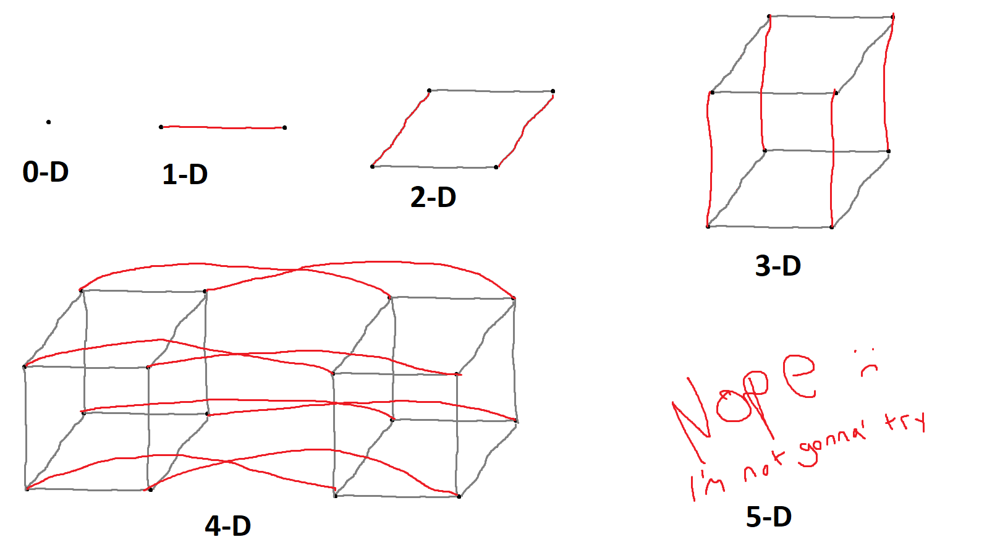

***************************************
Topic #9 -- More Lists and Numpy Arrays
***************************************

Higher Dimensions
=================

.. admonition:: Activity

    Let's say we have a list:

    >>> a = ['a','b','c']

    **Questions:**

        * What is the length of this list?
        * What is the type of the things in this list?
        * What do I type to get ``'a'`` printed out?

   Answer these, and then test it in code. 

.. admonition:: Activity
   
    OK cool, what if I do this:

    >>> a = ['a','b','c']
    >>> b = [a]

    **Questions:**

        * What is the length of this list?
        * What is the type of the things in this list?
        * What do I type to get ``'a'`` printed out?

    Answer these, and then test it in code. 	  
   
.. admonition:: Activity

    What if I do this:

    >>> a = ['a','b','c']
    >>> b = [a, ['d', 'e', 'f']]

    **Questions:**

        * What is the length of this list?
        * What is the type of the things in this list?
        * What do I type to get ``'a'`` printed out? Can you think of how you could do it two ways?
	  
    Answer these, and then test it in code. 

.. admonition:: Activity

    Here's a weird one:

    >>> a = ['a','b','c']
    >>> b = [a, a]

    **Questions:**

        * What is the length of this list?
        * What is the type of the things in this list?
        * What do I type to get ``'a'`` printed out?
        * What happens if I write this ``b[0][0] = 'Z'``?
	  
    Answer these, and then test it in code. 

.. admonition:: Activity

    Last one, I swear:

    >>> a = ['a','b','c']
    >>> b = [a, ['d', 'e', 'f']]
    >>> c = [b, ['g', 'h', 'i']]

    **Questions:**

        * What is the length of this list?
        * What is the type of the things in this list?
        * What do I type to get ``'a'`` printed out?
	  
    Answer these, and then test it in code.
 
Numpy *Arrays*
==============

.. warning::

    Numpy *arrays* are a little different than classic arrays. Nothing too much to worry about, but just be aware. 

* The *list* was our first data structure. 
* Now we're going to meet a similar, but slightly different, one: the numpy *array*
* Let's get started:

    >>> import numpy
    >>> a = numpy.array([5,4,2])
    >>> print(a)
    [5 4 2]

* Looks a lot like a list, doesn't it?
* Can we manipulate it like a list?

    >>> print(a[0])
    5
    
    >>> print(a[1])
    4

* We can definitely *index* it, the same as a list.
* I wonder if arrays are *mutable*?

    >>> a[1] = 7
    >>> print(a)
    [5 7 2]

* Yes, arrays are *mutable*.
* With lists, I could mix types in a single list. Like this:

    >>> l = [5,4,3]
    >>> l[2] = 'walrus'
    >>> print(l)
    [5, 4, 'walrus']

* Can I do that with arrays?

    >>> a = numpy.array([5,4,2])
    >>> a[2] = 'walrus'
    ValueError: invalid literal for long() with base 10: 'walrus'   

* Ah ha! We found a way in which arrays are different.
* Lists are just collections of stuff. Any old stuff. Each element can be of a different type.
* In an array, *every element must have the same type*! 
   
.. admonition:: Activity

    Create two arrays of integers, each having the same number of elements.
   
    What mathematical operations can you do on the arrays? (``+,-,*,/``).

    What happens if you try to perform the operations on arrays of different sizes? 

    How does ``+`` work differently on arrays than lists?

Numpy array object attributes and methods
=========================================

* Remember how I showed you how objects, like strings, had some *methods* attached to them?
* Objects can also have *attributes*
* We can ask numpy arrays what type the items in an array have like this:

   >>> a.dtype
   dtype('int32')   
   
* If you want to see all the attributes and methods your array has you can type ``a.`` (a dot) and then press the [Tab] key.
    * Ones with parentheses are *methods*
    * Ones with no parentheses are *attributes*

* That's a lot of methods and attributes!

* Some of those are things like ``dtype`` that store information about the state of the object (attributes).
  
* Some are special functions (methods) that can only be applied to that object
  
   >>> a = numpy.array([5, 4, 2])
   >>> print(a.sum())
   11
   
   >>> print(a.max())
   5
   
   >>> print(a.mean())
   3.6666666666666665
   

* When a function (method) appears after a ``.`` , that function is automatically applied to the object appearing before the ``.``
    * These special functions built in to objects can also take parameters.
  
* For example, we can change the types of the elements of our array:

    >>> b = a.astype(float)
    >>> print(b)
    [ 5.,  4.,  2.]

  .. raw:: html

	<iframe width="560" height="315" src="https://www.youtube.com/embed/-Igy3MSCJNs" frameborder="0" allowfullscreen></iframe>
   
   
   
Making numpy arrays bigger
==========================
* With lists, we could always append items to make them bigger

    >>> a = [1, 2, 3]
    >>> a.append(5)
    >>> print(a)
    [1, 2, 3, 5]

* Or even concatenate two lists together like this

    >>> a = [1,2,3] + [5]
    >>> print(a)
    [1, 2, 3, 5]
   
* Arrays are meant to have *fixed* size.
* **Why do you think this is?**
* If you really, really, want to make an array bigger... you can't.
* You *can* however, make a *new* array that is bigger using ``numpy.append()``:

    >>> a = numpy.array([1,2,3,4])
    >>> print(a)
    [1, 2, 3, 4]
    
    >>> b = numpy.append(a,5)
    >>> print(a)
    [1, 2, 3, 4]
   
    >>> print(b)
    [1, 2, 3, 4, 5]   
   
* Note that ``.append(...)`` here is a **FUNCTION**, not a method. 
    * What is the input parameters and types here?
    * What does this function return?

* **Note** carefully that ``numpy.append()`` did *not* change *a*. It created a **new** array, *b*.   
   
* This is also kinda' like strings. Remember, we had to make copies of the string to make any changes?
   
.. admonition:: Activity

    Create an array of 4 integers. 
   
    Create a new, bigger, array by appending the integer ``7`` on to your array. 

    Create another new array by appending the string ``'walrus'``. 

    Did that last one work? What happened?   
   
Flexibility vs Power
====================

* Arrays are less flexible than lists:
    * We can't change their size
    * They can only store data of a single type
   
* But... it is this very lack of flexibility that lets us do all sorts of cool stuff (eg. ``.sum()``)

.. admonition:: Activity

    How would you implement ``.sum()`` for a list?  
   
   
Higher dimensions
=================

* Like lists, numpy arrays generalize to higher dimensions.
* Let's create a 2D array:

    >>> a=numpy.array([[1,2,3],[4,5,6],[7,8,9]])
    >>> print(a)
    [[1 2 3]
     [4 5 6]
     [7 8 9]]

* Note the format in our call to ``numpy.array``. A list of lists.
* Each row of the array gets its own list.
* As long as two 2D arrays have the same *shape*, you can do arithmetic on them, just like 1D arrays.
* How do we check the *shape* of an array?
    * ``.shape`` attribute

    >>> print(a.shape)
    (3, 3)

.. admonition:: Activity

    Create a 4x4 array. Verify that it has ``shape`` ``(4,4)``. 
   
    You've changed your mind. The array should actually be 2x8. ``reshape`` your 4x4 array in to a 2x8 array without recreating it from scratch. 

    Verify that the reshaped array is ``(2,8)``. 

    Finally ``flatten`` your 2D array into a 1D array.
   
Starting points
===============
* Sometimes you want an array of shape ``(n,m)`` that contains all zeros:

    >>> # The extra parentheses are important
    >>> a = numpy.zeros((n,m))
   
* Guess what ``numpy.ones()`` does? 
* How about ``numpy.eye()``?
  
Slicing
=======
* We've already seen that you can index arrays like lists (and strings)
* Likewise, you can use Python's powerful *slicing* on arrays

.. admonition:: Activity

    Create an array ``arr = numpy.array([0,1,2,3,4,5,6,7])``. Using a single command
        1. Print the first 3 elements
        2. Print the last 3 elements
        3. Print the even elements of ``arr``

* Slicing works for higher dimensional arrays, too. For example:

    >>> a = numpy.arange(25).reshape(5,5)
    >>> print(a)
    [[ 0  1  2  3  4]
     [ 5  6  7  8  9]
     [10 11 12 13 14]
     [15 16 17 18 19]
     [20 21 22 23 24]]
     
    >>> print(a[0:2,1:4])
    [[1 2 3]
     [6 7 8]]

* Note the use of ``numpy.arange`` which works like ``range`` but returns an array.

* If you want a whole column/row/etc, you can use a plain ``:`` as the index. For example, if I wanted to pull out every row of the first two columns:

    >>> print a[:,0:2]
    [[ 0  1]
     [ 5  6]
     [10 11]
     [15 16]
     [20 21]]

.. admonition:: Activity

    Modify the previous command to print all of the columns of the first two *rows*.   
   
   
For loops
=========

* If ``for`` loops work for lists, do you think they'll work for arrays?

.. admonition:: Activity

    Write a function ``printeach(arr)`` that uses a ``for`` loop to print each element of an array that is passed in as a parameter. 

    Test it on a 1D array. 

    Now try a 2D array. 

    If you're feeling bold, how about a 3D array?

     .. raw:: html

	<iframe width="560" height="315" src="https://www.youtube.com/embed/5wf9gS9jbZM" frameborder="0" allowfullscreen></iframe>   
   
   
For next class
==============
   
* Read `chapter 9 of the text <http://openbookproject.net/thinkcs/python/english3e/tuples.html>`_   
* Read `chapter 20 of the text <http://openbookproject.net/thinkcs/python/english3e/dictionaries.html>`_   