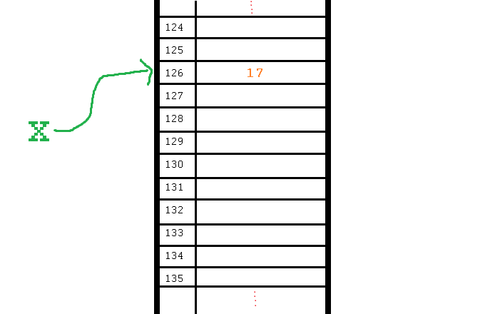

**********
References
**********

Pointers (THIS IS ACTUALLY A BIG DEAL)
======================================

* Here is an idealized view of RAM inside a computer

.. image:: RAM.png

.. warning::

    We actually typically think of RAM addresses in *hexadecimal* (we use symbols 0-F). I'm just using decimal numbers here for simplicity. 
   
    Check this out though. We can sometimes see where things are stored in RAM. 
   
    Note that the ``0x`` means that the number is in hexadecimal

    .. image:: functionLocation.png

Fixed Size Arrays
-----------------
   
* Let's hit pause on lists for a sec and go back in time
* In many programming languages, lists aren't *free* like they are in Python
* Instead, we have *arrays*: Fixed size collections of data 
    * Like a list, but fixed size, and no fancy methods
        * BTW, the following is basically the same for lists too, but slightly easier to explain if we talk about arrays
 
.. image:: array_1.png
 
 
* Above is an array with length **8**
    * No making fun of my *Microsoft Paint* skills
* The contents are labeled *a -- h*, but let's pretend they're numbers

Primitive Types in Memory (RAM)
-------------------------------

* Let's say we have a single integer called ``x`` (so, not an array anymore)
    * I know it's an ``x``, but let's pretend it's some value of type *int*
* An integer is a primitive type

.. warning::

    Unlike many languages, ints are actually *objects* in Python, but we're still ignoring this for now to learn an important concept from the olden days that still applies to Python due to conventions 
   
* We know how big an integer can be inside the computer (how much RAM an int takes up)
    * And why do we know how big it is? 
        * Because some engineer said so
    * Let's say an int can be *32-bits*
    * That's 32 0s and 1s
    * Ex: 00101010010010110101110100010100
        * That's 709,582,100 if anyone cares

* If we know how much RAM an int takes up, I can easily shove ints into nicely divvied up chunks of RAM, assuming each spot has 32 bits. 

* Let's say I type

>>> x = 17

* Something like this will happen. 
    * The value 17 will go into one of the open divvied up chunks of RAM
    * We create a label for the value called ``x``
   
* If I say something like

>>> y = x

.. image:: copy_int_in_RAM.png

* Something like this will happen. 
    * Copy the contents in the location that the ``x`` refers to some other location
    * Create a label for the copied value called ``y``
   
* **I COPY OVER THE CONTENTS OF X AND PUT IT INTO Y**

* So far this is fine and dandy
* But, what happens if we try to shove an array into one of those nicely divvied up chunks of RAM?
    * The RAM is divvied up to accept single ints
    * But we have an array of 8 ints...
    * PROBLEM!

* Wait, there's actually a simple solution. What if we block off chunks of RAM to be the array?
* So if I have the array ``[a, b, c, d, e, f, g, h]``, we get this...

.. image:: array_in_RAM.png

* We're just putting each element into it's own RAM location
* We just need to know that our array starts at memory address 677 and goes to 684.

* ... but... how do we keep track of this?

Pointers
--------

* Let's see what happens when we say this (people always say how complicated this is, but it's really not when you understand the intuition): 

>>> z = [a, b, c, d, e, f, g, h]

.. image:: array_pointer.png

* ``z`` gets us to a memory location whose contents is another memory address (pointer)
    * It effectively *points* to another chunk of RAM

.. admonition:: Activity
    :class: activity

    Take 1 min and look at this picture and see if you can explain why we start counting at 0 when indexing lists/arrays.
   

* Earlier we saw that lists work a little differently when saying something like

>>> my_list = [1,2,3]
>>> another_list = my_list
>>> another_list[1] = 99
>>> print(my_list)
[1, 99, 3]
 
* We called this aliasing and took note that it's weird
* However... actually... the way we copy over ``my_list`` to ``another_list`` works THE SAME WAY AS PRIMITIVE TYPES
    * But... You just said.. and you clearly showed us that it's totally different!!!!!!!!

* Strap yourselves in, because I'm about to blow your mind

* Let's say I write

>>> w = z

.. image:: array_pointer_copy.png

* Just follow the rules we followed for primitive types
   * Copy over the contents of z to an open memory location
   * Give it the label ``w``
   
* How many pointers do I now have that get me to the same memory location?

* Now let's look at what happens if I do this

>>> w[4] = P

.. image:: array_pointer_copy_change.png

* Did I change the contents at the memory location ``w``?
   * No, I changed something that the pointer in the memory location ``w`` was pointing to!!

* Memory (typically) works like this for non-primitive types (objects)
   * Arrays
   * Lists
   * etc. 
   
 
Lists and loops 
===============
* ``for`` loops can be used to execute a block of code for every element in a list::

    for element in some_list:
        do_something(element)

* Just like the loop we did with Strings last class!
* This is incredibly useful. In fact, you've already seen it in assignment 1. Let's try it::

    def like_food(food_list):
        for food in food_list:
            if food not in ['McDonalds','Burger King']:
                print('I like ' + food)
            else:
                print('I dont like ' + food + ' so much.')

* And now we'll run our function:

    >>> like_food(['curry','sushi','McDonalds','bison'])
    I like curry
    I like sushi
    I dont like McDonalds so much.
    I like bison

.. admonition:: Activity
    :class: activity

    Write a function ``beer_on_wall`` that will print out "n bottles of beer on the wall" for all n from 99 down to 1.
   
    Remember: ``range`` returns a list (kinda)... and a ``for`` loop can *iterate* over every element of a list.

     .. raw:: html

	<iframe width="560" height="315" src="https://www.youtube.com/embed/0AuMKIMiPMo" frameborder="0" allowfullscreen></iframe>

* Suppose I want to print out a list of strings, in order, with each element preceded by number indicating it's position in the list::

    >>> list=['a','b','c','d']
   
    >>> for index in range(len(list)):
            print(index, list[index])
   
    0 a
    1 b
    2 c
    3 d

* What is going on in ``range(len(list))``? Break it down one step at a time.
* This pattern is so common that Python has given us a built in function ``enumerate`` to enumerate lists in a loop::

    for index, item in enumerate(list):
        print(index, item)
      
* Most of our ``for`` loops have only a single *loop variable*...
* ... but.. notice how instead of a single loop variable, we now have *two* (``index`` *and* ``item``). They iterate together in lockstep. 
  
    * ``index`` gets the index of the item in the list
    * ``item`` gets the actual item itself
	 
* This is a special feature of the ``enumerate`` function.

Mind the rotating knives
========================

* Remember how assigning lists wasn't really *copying* them, but just creating a new name?
* I wonder what happens when you pass a list to a function as an argument?
    * Does the function get it's own copy?
    * ... or does the function just get an alias to the same list?
   
.. admonition:: Activity
    :class: activity

    Figure out the answer to this question empirically. Write a function that will prove to you which of the two options above is correct. 
  
Side effects
============

* Consider the code::

    def add_to_list(my_list):
        my_list.append('appended')

* Now consider the code::

    def add_to_list_2(my_list):
        return my_list + ['appended']
  
.. admonition:: Activity
    :class: activity

    What happens when you do this?
      
        >>> a = [1,2,3,4]
        >>> add_to_list(a)
        >>> print(a)
      
   How about this:
   
        >>> a = [1,2,3,4]
        >>> add_to_list_2(a)
        >>> print(a)

   Finally, how about this:
   
        >>> a = [1,2,3,4]
        >>> b = add_to_list_2(a)
        >>> print(a)
        >>> print(b)

* The function ``add_to_list`` *modified* the parameter you passed in.
* The function ``add_to_list_2`` kept a respectful distance from your parameter and, instead, created a *new* list and *returned* that as the answer.
* If a function modifies a parameter it is said to have *side effects*.
    * The term "side effect" comes from our mathematical expectation of a "function". A function maps some parameters on to a value. If I give you the function `f(x,y,z)=x+y-z` and ask you to evaluate `f(1,2,3)`, you don't expect the values of `x`, `y` and `z` to change!

Pure functions
==============
* If a function has no side effects, we call it a *pure function*.
* Some programming languages allow *only* pure functions (e.g., `Haskell <http://www.haskell.org/haskellwiki/Haskell>`_).
    * There are some nice theoretical, and practical benefits to this.
* As you might guess from the ameliorative term "pure"... functions with side effects are considered... "not pure"... even downright dirty, by some folks.

.. admonition:: Activity
    :class: activity

    Think of three potential advantages to pure functions over functions with side effects.
  

Who wants to be pure?
=====================
* Anything you can possibly do with a computer *can* be done with pure functions...
* ... but... some stuff is just plain easier to do with side effects. 
* This is a course for working scientists, so let's be pragmatic:
    * Write pure functions when practical to do so. The advantages make it worthwhile.
    * If it really is a lot easier to do the job with side effects... just do it and don't lose sleep over it.
   
  
	  
	  	  
For next class
==============
* Read `chapter 14 of the text <http://openbookproject.net/thinkcs/python/english3e/list_algorithms.html>`_
* Read `chapter 15 of the text (only lightly though) <http://openbookproject.net/thinkcs/python/english3e/classes_and_objects_I.html>`_

