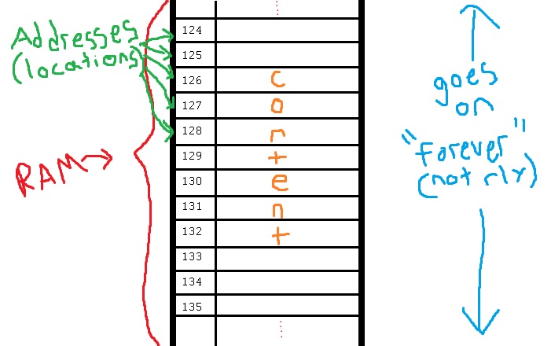

**********
References
**********

* It is important for us to have an idea of what exactly is stored in our variables

.. warning::

    The ideas below are presented at a very high level and are not quite entirely correct for Python and other similar
    programming languages. The differences come up in the nuances, but the following is sufficient to cover the
    important ideas that you need to know. In fact, where there are differences between the following and how Python
    actually works is not overly important for us, especially in introductory computer science.

.. note::

    We typically use *hexadecimal* (0, 1, 2, 3, 4, 5, 6, 7, 8, 9, A, B, C, D, E, F) when referring to memory addresses,
    but for simplicity, we will use decimal numbers throughout this topic.

* Here is an idealized view of memory inside a computer

Primitive Types in Memory
=========================

* Let's say we have a single integer called ``x``
* An integer is a primitive type
* In many programming languages integers take up **32 bits** worth of memory

    * That means 32 ``0``\s and ``1``\s
    * E.g. ``00101010010010110101110100010100``, which is the number ``709582100``

* Since we know how much memory an integer takes up, we can easily put integers into nicely divvied up chunks of memory

* If we divided memory into blocks of 32 bits
* And we create an integer variable ``x = 17``
* Something like this will happen

    * The value ``17`` gets assigned to one of the 32 bit sections of memory
    * A label ``x`` is created for that location

.. image:: int_in_RAM.png

* If we wanted to copy the value of ``x`` into another variable, I could write something like ``y = x``
* When this happens

    * Copy the contents from the location with the label ``x``
    * Place the copied value into another 32 bit section of memory
    * Create a label ``y`` for the copied value's location

* **The contents of** ``x`` **are copied to** ``y``

.. image:: copy_int_in_RAM.png

* This strategy works great for types that have a nicely defined sizes
* But what happens when we do not know beforehand how much memory something needs in order to store it?

Lists in Memory
===============

.. image:: array_1.png

* Above is a list with length ``8``
* The contents are labeled ``a`` -- ``h``, but these are arbitrary labels and we can think of them as integers

* In the examples so far, memory was divided into chunks of 32 bits which is perfect for integers
* Unfortunately, we need to store a whole list that contains 8 integers

    * This needs 256 bits

* Fortunately we have a solution
* Store each of the elements within the list in their own memory location

    * Similar to how the integer ``17`` was stored above

* Section off a large block of memory for the list to hold *references* to each of the elements of the list

    * For simplicity, instead of storing references within the list, we will pretend that the contents of the list are stored within the block of memory sectioned off for the list

* For example, the following image shows how we can think of storing the list ``[a, b, c, d, e, f, g, h]``

* Just put each integer into its own memory location

    * Again, in reality we actually store a reference to the integers, but we are ignoring this for now

* Keep track of the fact that our list starts at memory address 677 and goes to 684
* The trick is in how this is managed

References
----------

.. code-block:: python
    :linenos:

    z = [a, b, c, d, e, f, g, h]

* Given the above list creation, the computer finds a contiguous block of memory to store the contents of the list

    * Each element in the list fits nicely into the divvied up sections

* Then, the information needed to find and access the list contents is stored in a piece of memory labelled with the variable ``z``

    * The list is **not** stored in ``z``\; the *location* of the list in memory is stored in ``z``

.. image:: array_pointer.png

.. admonition:: Activity
    :class: activity

    Take a moment to look at this image and see if you can explain why we start counting at 0 when indexing lists.
   

* Earlier we saw that lists work a little differently when saying something like

>>> my_list = [1,2,3]
>>> another_list = my_list
>>> another_list[1] = 99
>>> print(my_list)
[1, 99, 3]
 
* We called this aliasing and took note that it's weird
* However... actually... the way we copy over ``my_list`` to ``another_list`` works THE SAME WAY AS PRIMITIVE TYPES
    * But... You just said.. and you clearly showed us that it's totally different!!!!!!!!

* Strap yourselves in, because I'm about to blow your mind

* Let's say I write

>>> w = z

.. image:: array_pointer_copy.png

* Just follow the rules we followed for primitive types
   * Copy over the contents of z to an open memory location
   * Give it the label ``w``
   
* How many references do I now have that get me to the same memory location?

* Now let's look at what happens if I do this

>>> w[4] = P

* Did I change the contents at the memory location ``w``?
   * No, I changed something that the reference in the memory location ``w`` was pointing to!!

* Memory (typically) works like this for non-primitive types (objects)
   * Arrays
   * Lists
   * etc. 

	  	  
For Next Class
==============

* If you have not already, read `Chapter 14 of the text <http://openbookproject.net/thinkcs/python/english3e/list_algorithms.html>`_
* If you have not already, read `Chapter 15 of the text (only lightly though) <http://openbookproject.net/thinkcs/python/english3e/classes_and_objects_I.html>`_

