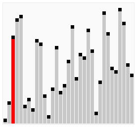

******************
Sorting Algorithms
******************

.. Warning::

    At this stage of the course we are starting to see nontrivial algorithms. Although you may have been able to quickly
    understand the previous algorithms, going forward you should not expect to observe an algorithm and immediately
    understand how it works.

    Although you are all equipped with the requisite skills to understand these algorithms, they require *careful study*
    to understand. The best strategy for approaching these algorithms is to carefully trace through their operation,
    step by step, making no assumptions of the code.

* Similar to searching, sorting is a problem you are all familiar with
* Unlike searching, we have not investigated any sorting algorithms
* Believe it or not, there are many ways one could sort a list

    * Some are better than others
    * Some are better than others under certain conditions
    * Some are just plain terrible

.. admonition:: Activity
    :class: activity

    #. Have you ever sorted things in your life?
    #. Take a moment to talk amongst yourselves about *how* you you sorted things.

        * What was the step-by-step *algorithm*?

    You can keep your discussion high-level, but try to explain it such that the person you are explaining it to could
    follow your instructions to sort things.

.. note::

    Each of the following algorithms have many possible implementations. What makes the algorithm the *algorithm* is the
    high-level idea, not the actual, literal implementations. This idea will be emphasized as we discuss the individual
    sorting algorithms below.

Selection Sort
==============

.. image:: selection_sort.gif
   :height: 333 px
   :align: center
   :target: https://en.wikipedia.org/wiki/Selection_sort

* Selection sort is fairly accessible, and chances are you have sorted things in real life using this algorithm
* Selection sort works by repeatedly selecting the smallest element from the collection
* The high-level algorithm is as follows

    * Start with the unsorted list and an empty list for the sorted elements
    * For each element in the collection

        * Perform a linear search on the unsorted list for the current smallest element
        * Remove the current smallest element from the unsorted list and append it to the sorted list

* To reason about how and it works, consider

    * The first time the linear search finds the smallest element, that element must be the first element in the sorted collection
    * Every other subsequent linear search finds the remaining smallest element and appends it to the sorted collection

        * It cannot come *before* anything in the sorted collection since we know it must be greater than (or equal to) all elements in the sorted collection

.. admonition:: Activity
    :class: activity

    Perform a insertion sort, with pencil and paper, on the list ``[3,7,4,1,5,2]``. Keep track of both the unsorted list
    and sorted list at each step of the algorithm.

* Now that we know a little bit about how to analyze algorithms, let's figure out how much work this algorithm needs in order to solve the problem

    * Selection sort requires a linear search to find the current smallest element in the collection

        * We know that linear search takes :math:`n` amount of work for a list of size :math:`n`

    * But, selection sort needs to perform a linear search for each element in the collection

        * If our unsorted list is of size :math:`n`, that means the linear search must be run :math:`n` times

    * If we put it together, we need to run linear search, which takes :math:`n` amount of work, a total of :math:`n` times

        * We need to do :math:`n` work :math:`n` times
        * This would be a total of :math:`n^{2}` work for an unsorted list of size :math:`n`

.. code-block:: python
    :linenos:

    def selection_sort(collection):
        sorted_collection = []
        for _ in range(len(collection)):
            current_smallest = collection[0]
            for element in collection:
                if element < current_smallest:
                    current_smallest = element
            collection.remove(current_smallest)
            sorted_collection.append(current_smallest)
        return sorted_collection

.. raw:: html

    <iframe width="560" height="315" src="https://www.youtube.com/embed/ADD6jsSS9HI" frameborder="0" allowfullscreen></iframe>

Insertion Sort
==============

.. image:: insertion_sort.gif
   :height: 333 px
   :align: center
   :target: https://en.wikipedia.org/wiki/Insertion_sort

* Insertion sort works by repeatedly inserting elements into their proper location within a collection
* The high-level algorithm is as follows

    * Start with the unsorted list and an empty list for the sorted elements
    * For each element in the collection

        * Remove the element from the unsorted list
        * Perform a linear search on the sorted list to find the index where the new element should be inserted
        * Insert the new element into the sorted list at the index where it belongs

* To reason about how and it works, consider

    * Elements are inserted into their proper relative location to the elements already within the sorted collection
    * Any subsequent insertion cannot disrupt the ordering of the whole list if it is being inserted in its proper location

        * For example, consider the list `[1, 4, 7, 9]`
        * If we need to insert the number `6`, it obviously goes between the `4` and `7` since ``4 < 6 < 7`` --- `[1, 4, 6, 7, 9]`
        * The order of the elements ``1`` and ``4`` remain unchanged, and similarly with ``7`` and ``9``

.. admonition:: Activity
    :class: activity

    Perform a selection sort, with pencil and paper, on the list ``[3,7,4,1,5,2]``. Keep track of both the unsorted list
    and sorted list at each step of the algorithm.

* The analysis of the algorithm is very similar to that of selection sort

    * We need to perform a linear search for each of the :math:`n` elements in the unsorted list
    * We know linear search takes :math:`n` amount of work for a list of size :math:`n`
    * Therefore, we need to do :math:`n` work :math:`n` times --- a total of :math:`n^{2}` work for an unsorted list of size :math:`n`

.. code-block:: python
    :linenos:

    def insertion_sort(collection):
        sorted_collection = []
        for element in collection:
            i = 0
            # Scan sorted collection to find insertion spot
            while i < len(sorted_collection) and sorted_collection[i] < element:
                i += 1
            sorted_collection.insert(i, element)
        return sorted_collection

.. raw:: html

    <iframe width="560" height="315" src="https://www.youtube.com/embed/ofZ5ygghj9g" frameborder="0" allowfullscreen></iframe>

Bubble Sort
===========

* Bubble sort works a little differently than selection or insertion sort
* The general idea is to perform multiple scans of the unsorted list comparing each adjacent pair of elements

    * If the elements are out of order, swap them, otherwise, leave them alone
    * Move to the next adjacent pair of elements
    * Repeat

* Consider the below unsorted list

    :math:`4, 3, 2, 1` --- Four is greater than three, so they swap

    :math:`3, 4, 2, 1` --- Four is greater than two, so they swap

    :math:`3, 2, 4, 1` --- Four is greater than one, so they swap

    :math:`3, 2, 1, 4` --- There are two important things to notice at the end of the first pass

    * A single pass is not enough to guarantee the list is sorted
    * After the first pass, the largest element in the unsorted list will be in its correct location

        * The largest element will always *win* the swap
        * If that element wins the swap, it will be considered in the next comparison of adjacent elements

* If we repeat this process by doing another pass

    :math:`3, 2, 1, 4` --- Three is greater than two, so they swap

    :math:`2, 3, 1, 4` --- Three is greater than 1, so they swap

    :math:`2, 1, 3, 4` ---  Three is less than four, so they do not swap

    :math:`2, 1, 3, 4`

* Notice that the second largest element in the unsorted list is now in its correct location

* To generalize this idea
* If after the :math:`i^{th}` pass the :math:`i^{th}` largest element is in its correct location, how many passes do we need?

    * Assuming an unsorted list of size :math:`n`, we need :math:`n` passes to guarantee the list is sorted
    * First pass has the largest in its correct location
    * Second has the second largest in its correct location
    * Third has the third largest in the correct location
    * ...
    * :math:`n^{th}` pass has the :math:`n^{th}` largest in its correct location

* The high-level algorithm is as follows

    * Repeat the following `n` times

        * Perform a scan on the unsorted list comparing each adjacent pair of elements

            * If the elements are out of order, swap them
            * Move to the next adjacent pair of elements
            * Repeat

.. admonition:: Activity
    :class: activity

    Perform a bubble sort, with pencil and paper, on the list ``[3,7,4,1,5,2]``. Keep track of both the unsorted list
    and sorted list at each step of the algorithm.

* The analysis of the algorithm should feel familiar at this point

    * We need to do a scan of :math:`n` elements a total of :math:`n` times
    * therefore, we need to do :math:`n` work :math:`n` times --- a total of :math:`n^{2}` work for an unsorted list of size :math:`n`

.. code-block:: python
    :linenos:

    def bubble_sort(collection):
        collection = collection[:]
        for j in range(len(collection)):
            for i in range(len(collection) - 1 - j):
                if collection[i] > collection[i + 1]:
                    collection[i], collection[i + 1] = collection[i + 1], collection[i]
        return collection

* We could improve the algorithm slightly
* Consider being asked to sort an already sorted list with bubble sort
* It would be rather silly doing :math:`n` passes on the list to sort it if we know it's already sorted
* Instead, we can repeatedly do passes on the list until we complete a full scan without any swaps

    * If there was no swaps, it means nothing was out of order, which means the list is sorted

.. code-block:: python
    :linenos:

    def bubble_sort_improved(collection):
        collection = collection[:]
        has_swapped = True
        complete_cells = 0
        while has_swapped:
            has_swapped = False
            for i in range(len(collection) - 1 - complete_cells):
                if collection[i] > collection[i + 1]:
                    collection[i], collection[i + 1] = collection[i + 1], collection[i]
                    has_swapped = True
            complete_cells += 1
        return collection

.. raw:: html

    <iframe width="560" height="315" src="https://www.youtube.com/embed/NfmAFOlM5Jw" frameborder="0" allowfullscreen></iframe>
	

For Next Class
==============

* `Check out these visualizations of sorting algorithms being compared to one another <http://www.sorting-algorithms.com/>`_
* Read `Chapter 18 of the text <http://openbookproject.net/thinkcs/python/english3e/recursion.html>`_

