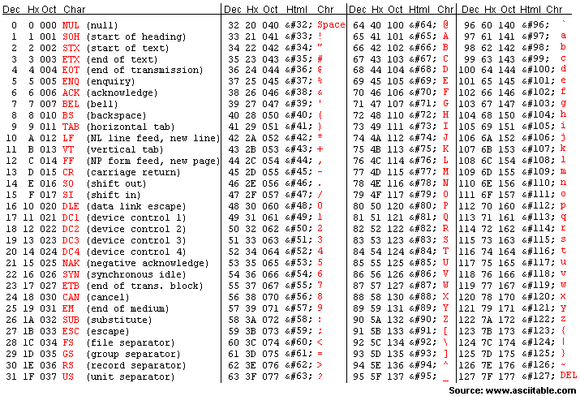

*****************
Strings & Objects
*****************

* Strings are a little different when compared to the other types we have seen (``int``, ``float``, ``bool``)
* Classically speaking, a string is a collection of individual characters
* In fact, we can *index* the string to access individual characters from it

.. code-block:: python
    :linenos:

    some_string = "Hello, world!"
    print(some_string[0])   # prints out 'H'
    print(some_string[4])   # prints out 'o'

.. note::

    In Python, and many other programming languages, the index for the beginning is actually ``0``, not ``1``. There are
    some historical and engineering reasons for this, and there are plenty of programming languages that start at ``1``
    too. This can feel tedious for new programmers, but it will become natural to you.

.. admonition:: Activity
    :class: activity

    #. Write a single line command to print the first 4 characters of some string.
    #. How about the 2nd to 7th characters?
    #. Get the last three characters? **Hint:** what does a *negative* index do?
    #. `Get the length of a string. <https://www.google.com/search?q=get+the+length+of+a+string+python>`_
    #. What does ``print(a[0:4])`` do?

    .. raw:: html

        <iframe width="560" height="315" src="https://www.youtube.com/embed/cxppFPrjcow" frameborder="0" allowfullscreen></iframe>

For loops
=========

* We can find the length of a given string with ``len(some_string)``
* And we know we can index individual characters from a string
* Let's write a function ``vertical_print_while`` that prints a string vertically (one character per line)

.. code-block:: python
    :linenos:

    def vertical_print_while(a_string: str):
        """
        Print out a string vertically. In other words, print out a single character on each line.

        :param a_string: Some string to print out
        :type a_string String
        """
        character_index = 0
        while character_index < len(a_string):
            print(a_string[character_index])
            character_index += 1

.. admonition:: Activity
    :class: activity

    Write the ``vertical_print_while`` function yourself. Try not to just copy/paste the provided solution. Call the
    function on a few different strings to see if it behaves the way you expect.

     .. raw:: html

        <iframe width="560" height="315" src="https://www.youtube.com/embed/YS2TVVTIaPQ" frameborder="0" allowfullscreen></iframe>

* The ``while`` loop worked perfectly fine
* But there is another type of loop called a ``for`` loop that may feel a little nicer to use in this scenario
* These ``for`` loops are great for when we have a collection of *things* and we want to do something for each of those *things*

.. code-block:: python
    :linenos:

    def vertical_print_for(a_string: str):
        """
        Print out a string vertically. In other words, print out a single character on each line.

        :param a_string: Some string to print out
        :type a_string String
        """
        for char in a_string:
            print(char)

* The ``while`` loop will continue to run ``while`` the condition is ``True``
* The ``for`` loop will run for each *thing*
* In this example, the ``for`` loop will run for each character in the string

* If we were to call ``vertical_print_for("Hello")``

    * The first time through the loop ``char`` would have the value ``"H"``
    * The second time ``char`` would have the value ``"e"``
    * The third time ``char`` would be ``"l"``
    * Fourth time ``char`` is ``"l"`` again
    * The fifth time ``char`` is ``"o"``
    * The loop ends as there are no more characters in the string

* Both the``while`` and ``for`` loops are perfectly fine for this situation

    * But you may find the ``for`` loop has a little nicer syntax

.. note::

    In the ``vertical_print_for`` example, the use of the variable name ``char`` in the ``for`` loop is arbitrary. It is
    just a variable name and is not required to be ``char`` because the things in the string are characters. I chose
    ``char`` since it is an appropriate name for the variable. For example, the following code would work:

    .. code-block:: python
        :linenos:

        for terrible_variable_name in a_string:
            print(terrible_variable_name)

Immutability
============

* Although we can access individual characters at a specified index

    * ``some_string[an_index]``

* We cannot *change* the value at a specified index

    * ``some_string[an_index] = "X"``
    * If you try this, you will get ``TypeError: 'str' object does not support item assignment``

* This is because strings are **not** mutable

    * They're immutable
    * Fancy way of saying, once they exist you cannot change them

* However, there is nothing stopping us from making a new string based on the old

.. code-block:: python
    :linenos:

    a_string = "Hello, world!"
    b_string = a_string[:5] + "!" + a_string[6:]

Linear Search
=============

* Searching through some collection of elements to see if something exists within it is a very common problem
* This is something you have done in real life many times
* However, when writing the algorithm to perform a linear search, many new programmers rush through it and make some common mistakes

.. admonition:: Activity
    :class: activity

    Write a function ``character_is_in(needle: str, haystack: str) -> bool`` that searches for a specific character
    ``needle`` within a string ``haystack``. If it exists within the string, return ``True`` and ``False`` otherwise.

    When you finish writing your function, be sure to test it with the following assertions:

    .. code-block:: python
        :linenos:

        # character_is_in tests
        assert False == character_is_in("a", "")
        assert False == character_is_in("", "hello")
        assert False == character_is_in("a", "hello")
        assert True == character_is_in("h", "hello")
        assert True == character_is_in("o", "hello")

     .. raw:: html

        <iframe width="560" height="315" src="https://www.youtube.com/embed/sokPQLkrXjw" frameborder="0" allowfullscreen></iframe>
   

.. admonition:: Activity
    :class: activity

    What's wrong with the following function? Trace through the logic on each of tests cases for ``character_is_in``
    above to help you find the issue.

    .. code-block:: python
        :linenos:

        def broken_character_is_in(char, string):
            count = 0
            while count < len(string):
                if string[count] == char:
                    return True
                else:
                    return False
                count = count + 1

Underlying Idea
---------------

* Generalizing beyond strings, we can do a linear search on many other things

    * For example, a stack of exams, a lineup of people

* It's important to note that, we can confirm that a given thing exists within a collection as soon as we find it
* If I am looking for :math:`x` in a sequence, I can confirm its existence as soon as I see it
* For example, consider looking for :math:`x`  in the following sequence of unknown elements

    :math:`[?, ?, ?, ?, ?, ...]`

* When starting, we do not know any of the values in the sequence until we look at them
* If I look at the beginning of this sequence and see that the value is :math:`x`, I am done

    * It's there --- no need to keep looking

    :math:`[x, ?, ?, ?, ?, ...]`

* However, if I was looking for some other value, like :math:`y`, I cannot confirm that it is or is not there just by looking at the beginning element and finding an :math:`x`

    * I would need to keep going

* I can only confirm that something is **not** in the sequence until I have looked at all elements in the sequence
* If I had a sequence of length :math:`10`, I would need to look at all :math:`10` before I can guarantee that something is or is not within it
* If it was length :math:`20`, I would need to look at all :math:`20`
* If it was length :math:`n`, I would need to look at all :math:`n`

.. admonition:: Activity
    :class: activity

    Write a function ``character_is_at(needle: str, haystack: str) -> int`` that returns the *index* of the first
    occurrence of the character ``needle`` within the string ``haystack``. If the character does not exist within the
    string, return ``-1``.

    Test your function with the following assertions:

    .. code-block:: python
        :linenos:

        # character_is_at tests
        assert -1 == character_is_at("a", "")
        assert -1 == character_is_at("", "hello")
        assert -1 == character_is_at("a", "hello")
        assert 0 == character_is_at("h", "hello")
        assert 4 == character_is_at("o", "hello")
        assert 2 == character_is_at("l", "hello")

String Trivia
=============

* ``'`` or ``"`` will work for the quotes needed for strings

    .. code-block:: python
        :linenos:

        a = "This is a string"
        b = 'this is also a string'

* We can concatenate strings with ``+``

    .. code-block:: python
        :linenos:

        a = "CSCI" + " " + "161"
        print(a)    # results in "CSCI 161"

   
* We can make a string repeat with ``*``

    .. code-block:: python
        :linenos:

        a = "CSCI" * 3
        print(a)    # results in "CSCICSCICSCI"

   
* We can convert an ``int`` to a ``str``

    .. code-block:: python
        :linenos:

        print(type(1))      # <class 'int'>
        print(type(str(1))) # <class 'str'>

* The string ``""`` is a string, but it's *empty*

    .. code-block:: python
        :linenos:

        a = ""
        print(len(a))   # results in 0
        print(type(a))  # results in <class 'str'>

* We have some special *characters* that we have no keys for on the keyboard, like a newline or an indent tab

    * ``'\n'``
    * ``'\t'``
    * There are many

    .. code-block:: python
        :linenos:

        a = 'hello\nWorld\tFUN\\!'
        print(a)
        # hello
        # World   FUN\!

* ASCII Table
    * Every *character* is a *number*

    .. code-block:: python
        :linenos:

        wut = ord('a')	# get the num of "a"
        print(wut)      # results in 97

        wut = chr(65)	# convert num to char
        print(wut)      # results in "A"

   
f-Strings
=========

* There are a number of ways to format strings in Python, but we will focus on f-Strings due to their simplicity and popularity

.. code-block:: python
    :linenos:

    name = "John Doe"
    course_code = "CSCI 161"
    to_print = f"My name is {name} and I love {course_code}."
    print(to_print)    # My name is John Doe and I love CSCI 161.

* In the previous example, all the variables were of type string, but they don't have to be
* We can even format the output of a floating point number to a specified decimal place

.. code-block:: python
    :linenos:

    some_integer = 123
    some_float = 456.789
    to_print = f"The following is an integer {some_integer}, and this is a float to 2 decimal places {some_float:.2f}."
    print(to_print)    # The following is an integer 123, and this is a float to 2 decimal places 456.79.

* You can even specify align output nicely with f-Strings
* For example, if you wanted to format some output of something like a bill and you wrote the following, it wouldn't look too nice

.. code-block:: python
    :linenos:

    # Ugly
    print(10.95)
    print(1.10)
    print(123.45)

    # Output
    # 10.95
    # 1.1
    # 123.45

* Notice how the decimal place does not align well
* If instead we used f-Strings like this, it would look much better

.. code-block:: python
    :linenos:

    # Pretty
    print(f"{10.95:8.2f}")
    print(f"{1.10:8.2f}")
    print(f"{123.45:8.2f}")

    # Output
    #   10.95
    #    1.10
    #  123.45

* Literal values were included in the above example, but this would also work with variables

.. warning::

    This only scratches the surface of what you can do with f-Strings. Further, much of the same functionality can be
    done without f-Strings, but f-Strings are very popular and simple.

    If you are wondering "how am I supposed to remember all this?", don't worry --- you're not supposed to. All that you
    really need to remember is that f-Strings are a thing and if you need to use them in the future, just do a quick
    search on `Google <https://www.google.com/search?q=python+f+string>`_.

Objects
=======

.. warning::

    Much of the following is going to be kept at a very high level and not quite accurate for Python. That said, the
    underlying ideas being presented below are important. Additionally, more details on Objects are presented later in
    the course.

* We have seen a few types so far
* Most of these are what we call *primitive types*

    * Integers
    * Floats
    * Booleans

* But we have also seen Strings and how they are a little different
* Strings are *objects* and work a little different

Methods
-------

* We've seen built in functions

    * ``print('this is a function')``

* We've written our own functions

    * ``character_is_in('a','bleh')``

* However, there is also something called a *method* that is very similar to a function, but acts on a specific instance of an object

.. admonition:: Activity
    :class: activity

    In Colab:
        #. Assign a string to some variable and print it out
        #. After running the code, type the name of the variable
        #. Press ``.`` (period)
        #. Wait (or press space, or tab, or ctrl-space

    You should see a menu pop up that looks like the following:

    .. image:: methods2.png

* The menu that popped up contains methods that can be run on a string
* Other objects that we will see later in the course will have methods associated with them too

.. admonition:: Activity
    :class: activity

    #. Assign some string to a variable called ``a_string``
    #. Add the line of code ``a_string.upper()`` and then ``print`` out ``a_string``
    #. Try some of the other methods and see what they do

-------------------

* Why do we have to do it with a method

    * ``a_string.upper()``

* Instead of a function like this?

    * ``upper(a_string)``

* In reality, there is nothing stopping us from writing the function ``upper(a_string)``
* But with the string, the sequence of characters that make up the string are stored in the object

    * The method ``a_string.upper()`` is modifying the data within the object
    * The functionality that modifies the data in that object will belong to that object

How to Remember What's What
---------------------------

* Don't
* Things will stick once you get enough practice
* `In the meantime, just look up what you need <https://www.google.com/search?q=make+a+string+uppercase+python>`_

Heavy lifting with strings
==========================
* If the program you are writing needs to do a lot of string manipulation, you probably want to
    >>> import string
* ... and `read about all the nifty stuff it does <http://docs.python.org/library/string.html>`_ 

For next class
==============

* Read `chapter 11 of the text <http://openbookproject.net/thinkcs/python/english3e/lists.html>`_

