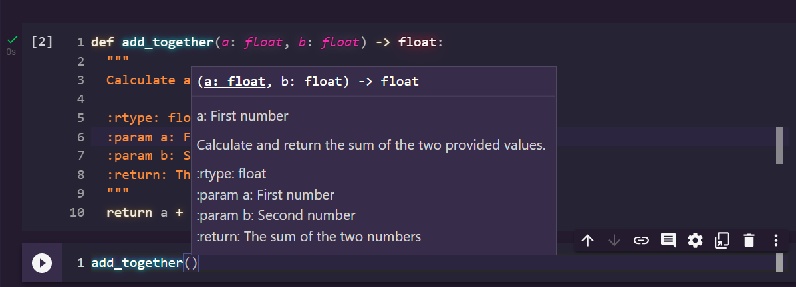

********************************
Testing Your Code and Type Hints
********************************

* Writing code is a big part of your job when programming
* But testing and debugging your code is a bigger part

Testing
=======

* Once you write a function, you need to ensure that it is actually correct

    * Once a function is written we often call it a few times to check that it is doing what we expect
    * But we want to be a little more systematic and thorough in our tests

* We end up writing small snippets of code designed to test our code
* In addition to ensure correctness, writing tests for our code also helps us *think* about our code more

    * What is correct/incorrect
    * Different cases that your function needs to deal with
    * If there are any *edge cases*

Writing Tests
-------------

* For simplicity, we will keep our testing strategy to assertions about the data
* Let's say we want to test the absolute value function ``abs``

    * This function is provided to you by Python, so there is no actual need to test it here

* If we are to consider how we could test the ``abs`` function, we want to check that the function output (returns) matches what it should be based on the input (arguments)
* There is not too much to check with ``abs``

    * Check that the absolute value of a positive number is itself
    * Check that the absolute value of a negative number is the positive version of itself
    * Check that the absolute value of zero is zero

* Checking zero is perhaps not necessary, but it is somewhat of a peculiar case since zero doesn't have a sign, so it is good to test it

.. code-block:: python
    :linenos:

    assert 5 == abs(5)
    assert 5 == abs(-5)
    assert 0 == abs(0)

* If we run the above example, we should expect the program to produce no output since the assertions were all correct
* For the sake of demonstrating what would happen if an assertion failed, here is a broken absolute value function

.. code-block:: python
    :linenos:

    # Broken
    def broken_abs(x):
        return x

    assert 5 == broken_abs(5)
    assert 5 == broken_abs(-5)  # Should Fail
    assert 0 == broken_abs(0)

* The above ``broken_abs`` is clearly not correct as it just returns whatever ``x`` is, regardless of the sign
* If we run this code, we would see an error message like this

.. code-block:: python

        assert 5 == broken_abs(-5)
    AssertionError

* This is Python telling us that the assertion failed
* More precisely, it failed on the input of ``-5``
* This now informs us that the function is not correct, and under which condition it is not correct

Square of Sums Example Tests
^^^^^^^^^^^^^^^^^^^^^^^^^^^^

 .. code-block:: python
    :linenos:

    def square_of_sum(a, b):
        """
        Calculate the square of the sum of the two provided numbers.
        E.g.
            square_if_sum(2, 3) -> 25

        :param a: First number
        :param b: Second number
        :return: The square of the sum of a and b
        """
        c = a + b
        d = c * c
        return d

    # Tests for square_of_sum function
    assert 0 == square_of_sum(0, 0)
    assert 0 == square_of_sum(1, -1)
    assert 100 == square_of_sum(5, 5)
    assert 100 == square_of_sum(-5, -5)
    # To address precision issues, we can look for a sufficiently small difference between the expected and actual
    assert 0.001 > abs(square_of_sum(2.2, 2.2) - 19.36)

* In the above example, the ``square_of_sum`` function is tested a number of times under different input cases
* Take care to notice that the cases are not just testing different arbitrary input values, but the input values are trying to capture broader cases

    * What happens when the input is zero?
    * The input has a positive and negative?
    * There are two positives?
    * The input is all negative?
    * What happens when we have floating point numbers?

* We look to capture the broad cases as it is not reasonable to test all possible inputs
* Further, it's not necessary to test all possible cases

    * If we test ``square_of_sum(5, 5)``, it's reasonable to assume that ``square_of_sum(6, 6)`` would also be fine

.. note::

    Notice how the last test looks a little different --- ``assert 0.001 > abs(square_of_sum(2.2, 2.2) - 19.36)``.

    This will be discussed in more detail a little later in the course, but briefly, computers are not great with
    floating point numbers.

        * What comes after the integer :math:`1`? That's easy, it's :math:`2`.
        * What comes after the floating point number :math`1.0`? Is it :math`1.1`? Or :math`1.01`? Maybe :math`1.00001`?

    If I run ``square_of_sum(2.2, 2.2)``, the correct answer is ``19.36``, but Python will say ``19.360000000000003``
    due to the floating point number issue.

    The simple way to address this issue is to check that the *absolute difference* between the expected answer and
    the function's result is less than some threshold. In the above example, the absolute difference between the
    correct answer and what Python says is ``0.000000000000003``, which is a tiny difference; the numbers are nearly
    identical. I chose a threshold of ``0.001``, so if the absolute difference between the expected and actual result is
    less than that threshold, I will consider that a passed test.

    The choice of the threshold will depend on the situation. Above I could have picked a much smaller number and the
    test would have passed. But imagine you are a chemist using instruments that can measure to the nearest milliliter.
    There would be no sense testing beyond a difference of ``0.001`` liters since you cannot get beyond that precision
    in real life with those instruments.

    Long story short, it you want to check equality between floating point numbers --- don't. Simply check that their
    difference is less than some reasonable threshold.

* The above tests do a good job at catching the different scenarios
* But you may be wondering why I didn't test some other case like when the inputs are both positive, but different values

    * Something like ``square_of_sum(5, 6)``

* Or why didn't we test when the first argument was negative and the second was positive

    * ``square_of_sum(-1, 1)``

* Including these tests is not unreasonable, so maybe they should have been included
* If you had included these cases in your tests, and perhaps some others, you would not be wrong
* Testing can feel a lot more like an art than a science

Celsius to Fahrenheit Example Tests
^^^^^^^^^^^^^^^^^^^^^^^^^^^^^^^^^^^

 .. code-block:: python
    :linenos:

    def celsius_to_fahrenheit(temp_in_celsius: float) -> float:
        """
        Convert a temperature from Celsius units to Fahrenheit units.

        :rtype: float
        :param temp_in_celsius: The temperature in Celsius to be converted.
        :return: The temperature in Fahrenheit.
        """
        partial_conversion = temp_in_celsius * 9 / 5
        temp_in_fahrenheit = partial_conversion + 32
        return temp_in_fahrenheit

    # Tests for celsius_to_fahrenheit function
    assert 32 == celsius_to_fahrenheit(0)
    assert -40 == celsius_to_fahrenheit(-40)
    assert 23 == celsius_to_fahrenheit(-5)
    assert 86 == celsius_to_fahrenheit(30)
    assert 89.6 == celsius_to_fahrenheit(32)
    # To address precision issues, we can look for a sufficiently small difference between the expected and actual
    assert 0.001 > abs(celsius_to_fahrenheit(37.7777) - 100)

* Above is a series of assertion tests for the ``celsius_to_fahrenheit`` function
* Notice the key, broad tests

    * Input of zero
    * Input when Celsius and Fahrenheit are equal
    * Negative input
    * Positive input
    * Input is a float
    * Output is a float

* If you were writing tests for this function and ended up having a few more tests that are arguably unnecessary, that's OK

.. note::

    It needs to be re-emphasized how important testing is. Writing code is only a small part of programming, and if your
    code isn't even correct, then you haven't solved the problem.

    There is an argument for thinking about your tests *before* actually writing the function. This gets you to really
    think about the problem to better prepare yourself for writing the code.

    Further, if you find you have a function that is particularly difficult to write tests for, perhaps the function you
    wrote is also too difficult to use? By thinking about testing first, you can hedge against this problem.

Automated Testing
-----------------

* Many programming languages have systems for automating tests with extra helpful functionality
* In Python, there are two very popular modules to facilitate this

    * ``unittest`` --- The standard Python testing framework
    * ``pytest`` --- Another popular framework

* These require quite a bit of programming knowledge to use effectively, so we will not cover them here

    * But ``unittest`` will be discussed later in the course once the requisite knowledge has been covered

* Regardless, at this stage these frameworks are overkill and the assertions we are using are more than sufficient

Type Hints
==========

Setting Type Hints
------------------

What You Get
------------

* Now, whenever some reads the description of the function they will know what the types are intended to be
* In Colab, you will also see a popup when trying to call the function with the details of the function. including the types

What You Don't Get
------------------

* Unfortunately, Python will not actually stop you from using the wrong types

    * They're more for documentation and other programmers

* In other words, the inclusion of type hints would not actually address the original problem

 .. code-block:: python
    :linenos:

    def add_together(a: float, b: float) -> float:
      """
      Calculate and return the sum of the two provided values.

      :rtype:
      :param a: First number
      :param b: Second number
      :return: The sum of the two numbers
      """
      return a + b

    x = input("First number: ")
    y = input("Second number: ")
    result = add_together(x, y)
    print(result)

* In the above example, despite type hints being included, it would behave the same way as it did without type hints

	
For Next Class
==============

* If you have not yet, read `Chapter 5 of the text <http://openbookproject.net/thinkcs/python/english3e/conditionals.html>`_
