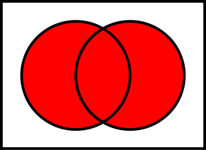
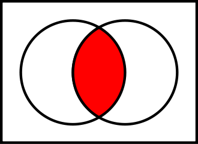
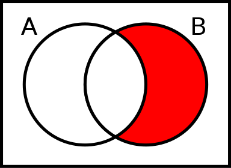

******************************
Tuples, Dictionaries, and Sets
******************************

* Lists are not the only collection type in Python
* Tuples, dictionaries, and sets each fit a slightly different job

Tuples
======

* A tuple is an ordered collection, similar to a list
* Tuples use parentheses ``(``\, ``)``

.. code-block:: python
    :linenos:

    some_tuple = (10, 11)
    print(some_tuple)   # Results in (10, 11)

* Tuples can be indexed just like lists

.. code-block:: python
    :linenos:

    some_tuple = (10, 11)
    print(some_tuple[0])   # Results in 10

* The main difference is that tuples are immutable

    * After a tuple is created, its contents do not change

* Tuples are a nice fit when a few values belong together

    * For example, a tuple would be great for storing cartesian coordinate ``(x, y)``
    * Tuples were also used in the Starbucks assignment to store the latitude and longitude pairs

.. code-block:: python
    :linenos:

    for row in starbucks_file_reader:
        location_tuple = (float(row[0]), float(row[1]))
        starbucks_locations.append(location_tuple)

Dictionaries
============

* Dictionaries are a powerful data structure that are a little more complex than lists and tuples under the hood
* They are like lists that you can index with *strings*, or various other types, instead of just integers
* Consider the following example of storing grades for students

.. code-block:: python
    :linenos:

    # Create a new, empty dictionary
    some_dictionary = {}

    # Add a few things to the dictionary
    some_dictionary["Billy"] = 74
    some_dictionary["Sally"] = 88
    some_dictionary["Jimmy-Bob"] = 99

    # Print out the dictionary
    print(some_dictionary)      # Results in {'Billy': 74, 'Sally': 88, 'Jimmy-Bob': 99}

* Values are associated with unique *keys*

    * The keys must be unique, but the values do not need to be

* The keys in the example are ``"Billy"``, ``"Sally"``, and ``"Jimmy-Bob"``
* Each of the keys have an associated value --- ``74``, ``88``, and ``99`` respectively

* Accessing a value from a specific key from the dictionary is done with indexing

.. code-block:: python
    :linenos:

    print(some_dictionary["Jimmy-Bob"])     # Results in 99
    print(some_dictionary["Sally"])         # Results in 88

* And updating a value associated with a key is done just like the original assignment

    * Keys are unique, so using an existing key would overwrite the value and not make a new entry

.. code-block:: python
    :linenos:

    some_dictionary["Sally"] = 90
    print(some_dictionary["Sally"])         # Results in 90

Why Use One?
------------

* Instead of using a dictionary to store the grades, imagine using a 2D list

.. code-block:: python
    :linenos:

    my_grades = []
    my_grades.append(["Billy", 74])
    my_grades.append(["Sally", 88])
    my_grades.append(["Jimmy-Bob", 99])
    print(my_grades)                        # Results in [['Billy', 74], ['Sally', 88], ['Jimmy-Bob', 99]]

* To find a specific student's grade here, I would first need to search for the student's name

    .. code-block:: python
        :linenos:

        the_student = linear_search(my_grades, "Sally")
        grade = the_student[1]
        print(grade)                        # Results in 88

* With a dictionary, I can go straight to the value by using the student's name as the key

    .. code-block:: python
        :linenos:

        grade = some_dictionary["Sally"]
        print(grade)                        # Results in 88

* In addition to being simpler syntax, the dictionary eliminates the need for the linear search

    * Remember, the amount of work needed for a linear search grows as the number in the collection grows
    * If we don't need to do the linear search, we eliminate all that extra work

.. note::

    Remember how the ``sum`` function still requires the computer to look at each value in a list, but that
    functionality was hidden from us. Dictionaries are **not** simply hiding the linear search from us; its actual
    underlying functionality does not need to do a linear search (although, there are some exceptions to this).

    We will not be going into more details on how dictionaries work in this course, but that does not stop us from
    using and taking advantage of the dictionary's benefits.

Sets
====

* Another common data structure is a set

    * You may already be familiar with the idea of sets from math

* When comparing to lists, sets are a little different

    * Elements in the set are unique, but lists can have multiple copies of the same value
    * Sets have no intrinsic ordering, but lists do (starting at index ``0``)
    * Sets are not indexed

* Consider the following example of students in a course

.. code-block:: python
    :linenos:

    csci_161 = {"Greg", "Anna", "Sally", "Frank", "Frank"}
    print(csci_161)                     # Results in {'Frank', 'Sally', 'Greg', 'Anna'}

* Notice that, although ``"Frank"`` was included twice, it only appears once in the set
* Also notice that the order of the elements may not match the order they were written

* Here is another example, this time adding a name after the set is created

.. code-block:: python
    :linenos:

    math_106 = {"Frank", "Ryan", "Sally", "Francis", "Xavier", "Linda"}
    math_106.add("Lynn")
    print(math_106)                     # Results in {'Ryan', 'Xavier', 'Frank', 'Sally', 'Francis', 'Lynn', 'Linda'}

* You can check if a given thing exists within a set with the ``in`` operator
* Like a dictionary, checking if something is ``in`` the set does not require a linear search

.. code-block:: python
    :linenos:

    print("Ryan" in csci_161)           # Results in False
    print("Ryan" in math_106)           # Results in True

* Some other things you can do with a set are

    * Iterating over the contents with a ``for`` loop
    * Remove elements from the set
    * Check if sets are equal
    * Check if something is a subset of another set
    * Turn the set into a list (and turn a list into a set)

* Three operations of note for sets are *union*, *intersection*, and *difference*

* Union allows us to combine all elements from two sets into one set
* For example, getting all the students from two courses

.. code-block:: python
    :linenos:

    all_students = csci_161.union(math_106)
    print(all_students)     # Results in {'Ryan', 'Greg', 'Frank', 'Sally', 'Anna', 'Linda', 'Xavier', 'Francis', 'Lynn'}

* Intersection allows us to find elements that are common to both sets
* For example, which students are in both CSCI 161 and MATH 106

.. code-block:: python
    :linenos:

    taking_both_courses = csci_161.intersection(math_106)
    print(taking_both_courses)  # Results in {'Frank', 'Sally'}

* Set difference allows us to ask which elements are in one set but not in the other
* For example, which students are taking CSCI 161 and not taking MATH 106

.. code-block:: python
    :linenos:

    only_taking_csci = csci_161.difference(math_106)
    print(only_taking_csci)     # Results in {'Greg', 'Anna'}

* Unlike union and intersection, the order of the operands matters for set difference

.. code-block:: python
    :linenos:

    only_taking_math = math_106.difference(csci_161)
    print(only_taking_math)     # Results in {'Ryan', 'Linda', 'Xavier', 'Francis', 'Lynn'}

.. admonition:: Activity
    :class: activity

    #. If you loaded the text from a book into Python, how could you count the unique words?
    #. If you loaded a second book, how could you find the words they have in common?
    #. How could you find all unique words across both books?
    #. How could you find the words in one book but not the other?

For Next Topic
==============

* Read `Appendix A of the text <https://openbookproject.net/thinkcs/python/english3e/app_a.html>`_
