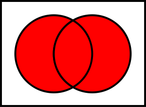

******************************
Tuples, Dictionaries, and Sets
******************************

* In addition to lists, there are a few other noteworthy datastructures we will look at in this course
* Although they will not be used as much as lists, it's important to be aware of the tools you have at your disposal

Tuples
======

* A tuple looks and behaves similar to a list, but has slightly different syntax

    * Tuples use parentheses ``(``\, ``)``

    .. code-block:: python
        :linenos:

        some_tuple = (10, 11)
        print(some_tuple)   # Results in (10, 11)

* They are both ordered sequences of data
* They can be indexed like lists

    .. code-block:: python
        :linenos:

        some_tuple = (10, 11)
        print(some_tuple[0])   # Results in 10

* But unlike lists, tuples are immutable

    * Once they are created, we cannot change them

* They're ideal for when we need to pack some data together

    * For example, a tuple would be great for storing cartesian coordinate ``(x, y)``
    * Tuples were also used in the Starbucks assignment to store the latitude and longitude pairs

    .. code-block:: python
        :linenos:

        for row in starbucks_file_reader:
            location_tuple = (float(row[0]), float(row[1]))
            starbucks_locations.append(location_tuple)

Dictionaries
============

* Dictionaries are amazing data structures that are a little more complex than lists and tuples

    * Much of their complexity is hidden from us so we will not worry about it here

* Simply, they are like list that you could index with *strings*, or various other types, instead of just integers
* Consider the following example of storing grades for students

.. code-block:: python
    :linenos:

    # Create a new, empty dictionary
    some_dictionary = {}

    # Add a few things to the dictionary
    some_dictionary["Billy"] = 74
    some_dictionary["Sally"] = 88
    some_dictionary["Jimmy-Bob"] = 99

    # Print out the dictionary
    print(some_dictionary)      # Results in {'Billy': 74, 'Sally': 88, 'Jimmy-Bob': 99}

* In the example, a dictionary was created and three values were added to the dictionary
* But values are associated with unique *keys*

    * The keys must be unique, but the values do not need to be

* The keys in the example are ``"Billy"``, ``"Sally"``, and ``"Jimmy-Bob"``
* Each of the keys have an associated value --- ``74``, ``88``, and ``99`` respectively

* Accessing a value from a specific key from the dictionary is done with indexing

.. code-block:: python
    :linenos:

    print(some_dictionary["Jimmy-Bob"])     # Results in 99
    print(some_dictionary["Sally"])         # Results in 88

* And updating a value associated with a key is done just like the original assignment

    * Keys are unique, so using an existing key would overwrite the value and not make a new entry

.. code-block:: python
    :linenos:

    some_dictionary["Sally"] = 90
    print(some_dictionary["Sally"])         # Results in 90

Why They Are Great
------------------

* Instead of using a dictionary to store the grades, imagine using a 2D list

.. code-block:: python
    :linenos:

    my_grades = []
    my_grades.append(["Billy", 74])
    my_grades.append(["Sally", 88])
    my_grades.append(["Jimmy-Bob", 99])
    print(my_grades)                        # Results in [['Billy', 74], ['Sally', 88], ['Jimmy-Bob', 99]]

* How would I obtain the grade for a specific student?

    * I would need to do a linear search for the student's name before I could access the grade
    * Assuming I have some ``linear_search`` function

    .. code-block:: python
        :linenos:

        the_student = linear_search(my_grades, "Sally")
        grade = the_student[1]
        print(grade)                        # Results in 88

* Alternatively, with a dictionary, it's much simpler --- just index the dictionary on the student's name

    * Assuming ``my_grades`` was a dictionary like ``some_dictionary`` instead of a list of lists

        .. code-block:: python
        :linenos:

        grade = my_grades["Sally"]
        print(grade)                        # Results in 88

* In addition to being simpler syntax, the dictionary eliminates the need for the linear search

    * Remember, the amount of work needed for a linear search grows as the number in the collection grows
    * If we don't need to do the linear search, we eliminate all that extra work

.. note::

    Remember how the ``sum`` function still requires the computer to look at each value in a list, but that
    functionality was hidden from us. Dictionaries are **not** simply hiding the linear search from us; its actual
    underlying functionality does not need to do a linear search (although, there are some exceptions to this).

    We will not be going into more details on how dictionaries work in this course, but that does not stop us from
    using and taking advantage of the dictionary's benefits.

Sets
====

* Another common data structure is sets

    * You may already be familiar with the idea of sets from math

* When comparing to lists, sets are a little different

    * Elements in the set are unique, but lists can have multiple copies of the same value
    * Sets have no intrinsic ordering, but lists do (starting at index ``0``)

* Consider the below example of students in a course

.. code-block:: python
    :linenos:

    csci_161 = set({"Greg", "Anna", "Sally", "Frank", "Frank"})
    print(csci_161)                     # Results in {'Frank', 'Sally', 'Greg', 'Anna'}

* Notice that, although ``"Frank"`` was included twice, it only exists once in the set
* Also notice that the order of the elements is not the order they appear when the set was created

* Below is another example of a set, but this time an additional name was added to the set after creation

.. code-block:: python
    :linenos:

    math_106 = set({"Frank", "Ryan", "Sally", "Francis", "Xavier", "Linda"})
    math_106.add("Lynn")
    print(math_106)                     # Results in {'Ryan', 'Xavier', 'Frank', 'Sally', 'Francis', 'Lynn', 'Linda'}

* One can check if a given thing exists within a set with the ``in`` operator
* Like a dictionary, checking if something is ``in`` the set does not require a linear search

.. code-block:: python
    :linenos:

    print("Ryan" in csci_161)           # Results in False
    print("Ryan" in math_106)           # Results in True

* There are many other things you could do with a set, such as

    * Iterating over the contents with a ``for`` loop
    * Remove elements from the set
    * Check is sets are equal
    * Check if something is a subset of another set
    * Turn the set into a list (and you can turn a list into a set)
    * ...

* Three operations of note for sets are *union*, *intersection*, and *difference*

* Union allows us to combine all elements from two sets into one set
* For example, getting all the students from two courses

.. code-block:: python
    :linenos:

    all_students = csci_161.union(math_106)
    print(all_students)     # Results in {'Ryan', 'Greg', 'Frank', 'Sally', 'Anna', 'Linda', 'Xavier', 'Francis', 'Lynn'}

.. image:: intersection.png
   :width: 333 px
   :align: center
   :target: https://en.wikipedia.org/wiki/Intersection_(set_theory)

* Intersection allows us to find elements that are common to both sets
* For example, which students are in both CSCI 161 and MATH 106

.. code-block:: python
    :linenos:

    taking_both_courses = csci_161.intersection(math_106)
    print(taking_both_courses)  # Results in {'Frank', 'Sally'}

* Set difference allows us to ask which elements are in one set but not in the other
* For example, which students are taking CSCI 161 and not taking MATH 106

.. code-block:: python
    :linenos:

    only_taking_csci = csci_161.difference(math_106)
    print(only_taking_csci)     # Results in {'Greg', 'Anna'}

* Unlike union and intersection, the order of the operands matter

.. code-block:: python
    :linenos:

    only_taking_math = math_106.difference(csci_161)
    print(only_taking_math)     # Results in {'Ryan', 'Linda', 'Xavier', 'Francis', 'Lynn'}

.. admonition:: Activity
    :class: activity

    #. Imagine I gave you the text from a book that you could load up into Python. What's the easiest way to count the number of unique words?
    #. What would you do if I gave you another book and asked you which words do they have in common?
    #. What if I wanted to know the number of unique words that exist between the two books?
    #. What If I wanted to know which words were in one book, but not the other?

For Next Class
==============

* Read `Appendix A of the text <http://openbookproject.net/thinkcs/python/english3e/app_a.html>`_
