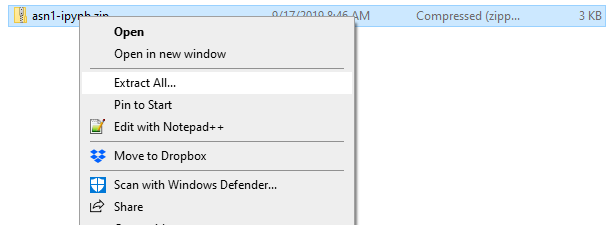
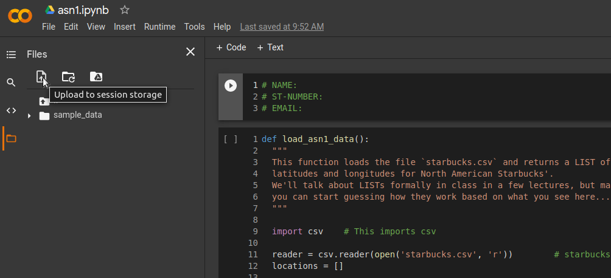
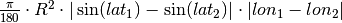

***********************************
Assignment #1: Density of Starbucks
***********************************

* **Worth**: 10%
* **DUE**: October 13th at 11:55pm; submitted on MOODLE. (Later date than expected due to weird year). 

.. image:: ../img/starbucks_escher.jpeg

Learning objectives:

* Write some code
* Solving a *real* problem/question
* Thinking abstractly
* Work with existing code
* Understand existing code
* Variables
* Using functions
* Boolean operators
* Conditionals
* Comments
* Using your code to answer questions

.. NOTE::

	This assignment may be done with other students. Feel free to collaborate all you want (in fact, I encourage it). Every student must submit their own work. The only rule I have here is that your code/functions must not be more or less identical to other students'. If your code is, you will be investigated for academic misconduct. Also, if your code/functions are identical to those that you *obtained* from somewhere, we're going to have a problem (I have copies of past years assignment submissions to check your work against). 

.. warning::
   
	You should **not** expect to be able to sit down and just start coding a solution. Computer science does not work this way. Expect this assignment to take hours. Expect to get things wrong, then, expect to get things wrong more. 
    

In this assignment, you will use a real dataset containing the locations of all North American Starbucks Coffee houses (as of a few years ago) to compute the *density* of Starbucks on a given patch of the Earth's surface.

To make life easier for the first assignment, you don't have to start from scratch. I've already started a file for you to use as a template. This is also somewhat realistic for programmers; you don't always start completely from scratch... Sometimes you're trying to modify someone else's code that you downloaded or inherited. Also, Learning how to work with existing code is a huge way to learn. 

.. warning::
   
	Some students have reported their browsers (seems to only be chrome that's being difficult) complaining about possible security issues. There isn't any; this is just because the files are scripts and scripts CAN be problematic if they are intended to be troublesome (these are not). To get around this, tell the browser to download it anyways. There are a few ways to do this: (a) Click the arrow next to the download at the bottom of the page and say "Keep". (b) Navigate to your browser's download screen and select "Keep".
 
    .. image:: ../img/security.png
        :width: 200
        :align: center

Download the `asn1.ipynp <http://people.stfx.ca/jhughes/cs161/data/asn1-ipynb.zip>`_ notebook, unzip it (see image below), and upload it to Colab to get started. See below image. **WARNING:** You should be sure to save a COPY of this to your Google drive and then work with that one. You don't have to, but you will have to re-upload the project every time you want to work on it. 

(^^^^^^^ Extract All... means unzip in this situation ^^^^^^^)

.. image:: ../img/uploadColab.png

Alternatively, download `asn1.py <http://people.stfx.ca/jhughes/cs161/data/asn1-py.zip>`_ to get started if you want to not use Colab. Do whichever you want. It's the same as the notebook file, just missing the notebook stuff. 

The steps you need to do are laid out, in detail (and suggested order) below.

.. warning::
	Do not alter the function details in the .ipynb/.py files:
   
		* Do not change the name of the functions
		* Do not remove the function description
		* Do not remove or add to the parameters
	  
	You should also **NOT** be using the ``input()`` function in this assignment. 

You will also need the data file `starbucks.csv <http://people.stfx.ca/jhughes/cs161/data/starbucks.csv>`_. Download this to your computer and upload it to your Colab files (see below image). Unfortunately, every time you open your colab project, you will need to re-upload. Not a big deal, but something you will need to remember. 

If you would like to *not* use Colab and work from your own computer, then just be sure to save this file in the **same directory** that you are saving your assignment in. 

Complete Latitude/Longitude Conversion Function
===============================================

Humans like to express `latitudes <http://en.wikipedia.org/wiki/Latitude>`_ and  `longitudes <http://en.wikipedia.org/wiki/Longitude>`_ in degrees, minutes, and seconds. You *could* work with those units in Python, but your computations (and, hence, code) will
be much *cleaner* if you convert to the single unit "degrees", using decimals of a degree to represent arcminutes and arcseconds (don't worry, I swear you that this isn't that complicated).

Your first task will be to fill out the code for the function ``convert_to_decimal()``. The parameters are a latitude (or longitude) in degrees, arcminutes, and arcseonds. The function should return the same latitude (or longitude) as a single value in decimal degrees
(a single value of type ``float``). If you're not sure how to compute the conversion, `do some reading <http://en.wikipedia.org/wiki/Arcminute>`_.

Have a peek at the data-loading function
========================================

The function that loads the data is a freebie. It contains some stuff we haven't discussed in class yet, but it's pretty easy to figure out what's going on if you look at it and hack around. So... look at it. Get used to looking at code that isn't yours, using  unfamiliar ideas/idioms/patterns, and trying to figure out what it does. This isn't always easy (sometimes it's **very hard**), but you'll spend a lot of time doing it (whether you want to or not!). 

This data in the .csv file is fortunately already in decimal format so you will not need to  convert it with ``convert_to_decimal()``, however, you still need to do part 1 and make sure  it works properly even though you might not actually use ``convert_to_decimal()`` for the below parts!!!!!!

.. warning::
   
	This .csv file **MUST** be in the same directory as your python script!!!! This means in your Colab project or in the same directory on your computer if you are doing it not on Colab. If it is not, this function will **NOT** work!!! You'll see something like ``No such file or directory: 'starbucks.csv'`` if you don't have the file in the right place. 

Complete the function to compute lat-long rectangle area
========================================================

We want to compute the *density* of Starbucks, not just the raw number of them. A reasonable measure for this is 'Starbucks per square kilometer'. To compute this, we first need to know how to find the area of a lat-long rectangle. The function ``subtended_area()`` takes as parameters the 'bottom left' and 'top right' corners of a lat-long rectangle (or, the left and bottom lines, and then the right and top lines). It should return the area of that lat-long rectangle in square kilometers. 

To save you some solid angle computations: given two lat/long pairs, the formula to compute the subtended area is:

where *R* is the radius of the sphere (Earth in this case: 6378.1 km). 

.. warning::
	Do Python's trig functions (e.g. ``math.sin`` or ``numpy.sin``) expect parameters in *degrees* or *radians*? Be careful!

   
Complete the function that counts the number of Starbucks in a region
=====================================================================

Counting up the number of Starbucks in a given area. The function ``num_starbucks()`` is already set up to *loop* over every Starbucks location in a *list*. All you have to do is remember to pass in the list. Have a look a the loop. Even if we haven't formally discussed this structure in class yet, it should be pretty clear what it's doing.

Fortunately, the data coming in is already in decimal format, so there is no need to actually  convert these values with the ``convert_to_decimal`` function.

Your work is in the body of the loop. Each time through the loop we'll be considering a new Starbucks location. The existing code will put the current location's latitude in ``loc_lat`` and longitude in ``loc_lon``. Your job is to figure out if this location falls in the area between the lat/long pairs defining your region. If this location is within the box defined by the lats and longs then it is in our defined region and we need to count it. 

You need to keep track of how many Starbucks there are in the region and then return that
value.

.. image:: ../img/a1-LatLongSquareCounr.png

If the existing code is scaring you, think about it this way:

* There exists a robot that needs to be programmed
* The robot will receive a new Starbucks location, one after the other, until there are no more locations. **(already coded for us)**
* Robot will take the location, and ``IF`` the location is within the rectangle we care about, we count it, otherwise, ignore it. **(we need to code this bit)**

Finally
=======

Finally, fill in a convenience function ``starbucks_per_kmsq()`` which, given subtending lat/long pairs, returns the density of Starbucks. 

TODO:

* Use ``load_asn1_data()`` to load the locations and store them in a variable.
* Compute the number of Starbucks in the region
* Compute the size (area) of the region
* Divide number of Starbucks by area to get density
* return density

Now try it!
===========

Try your code. Try small regions and big regions. What area has the highest Starbucks density you can find? The lowest? Make sure to print them out. 

What to submit to Moodle
========================

Submit your work on Moodle. 

* Your version of ``asn1.py``. Do **not** submit the .ipynb file. To get the asn1.py file from Colab, see the image below. 

	* Make sure your **NAME** and **STUDENT NUMBER** appear in a comment at the top of the program.
	* List anyone you worked with in the comments, too

* A text file describing the areas you found with the highest, and lowest, Starbucks densities and a short description of how you found them.  
	* Don't worry about finding the HIGHEST or LOWEST density, just try a few and pick your highest and lowest. 

**VERIFY THAT YOUR SUBMISSION TO MOODLE WORKED!**
**IF YOU SUBMIT INCORRECTLY, YOU WILL GET A 0**

.. image:: ../img/downloadPy.png

Some hints
==========

* Work on one function at a time. 
* Get each function *working perfectly* before you go on to the next one. 
* *Test* each function as you write it. 
	* This is a really nice thing about programming: you can call your functions and see what result gets returned. Does it seem correct?
* If you need help, *ask*! Drop by my office hours. 

Some marking details
====================

.. warning::
	Just because your program produces the correct output, that does not necessarily mean that you will get perfect, or even that your program is correct.

Below is a list of both *quantitative* and *qualitative* things we will look for:
 
* Correctness?
* Did you follow instructions?
* Comments?
* Variable Names?
* Style?
* Did you do just weird things that make no sense?

General FAQ:
============

* Does my text file have enough details?
	* Probably. The shorter the better.
* I don't know how to do *X*.
	* OK, go to `google.ca <https://www.google.ca>`_ and type in *X*.
* It’s not working, therefore Python is broken!
	* Probably not; you’re very likely doing something wrong
* My thing keeps telling me ``No such file or directory: 'starbucks.csv'``
	* Then the starbucks file probably isn't where python is looking.
* But density will grow larger the smaller I make the area (aren't I so smart).
	* Congratulations, you understand basic math. 
* Is my area a high/low enough density?
	* I really don't care how high/low it is. Just try a few things and see what you get.    
* But I never used the one function!!!!1!
	* Fine, but write the code anyways and make sure it works.
* But the degrees values don't specify a cardinal direction!
	* Make use of changing +/- if you need to change hemispheres.  
* Wtf do the functions do that you gave me?
	* Read the descriptions. Try figuring it out. This is actually part of the assignment learning objectives. 
* Some of the code in the functions you gave us look like magic.
	* That's because it's magic.
* Do I have enough comments?
	* I don't know, maybe? If you're looking at code and have to ask if you should comment it... just comment it. That said, don't write me a book.
* I know you told me to do it this way, but I did it another way, and I think my way is better.
	* Your way may be better, but I don’t care. Do it the way I told you.
* Can I work with my friend?
	* Yes. In fact, you should!
* If our code/functions are identical, you won't really call this cheating, would you? I mean, you said we could work together!
    * I will absolutely try to nail you for cheating. I am letting you work together. Don't push it. All-in-all, it's going to be hard to *cheat* unless you are deliberately trying to. 
* I know I cheated, I know I know I was cheating, but I’m reeeeaaaaaaaaallllllly sorry [that I got caught]. Can we just ignore it this time?
	* Lol, no
* If I submit it at 11:56pm, you’ll still mark it, right? I mean, commmmon!
	* No. 11:55pm and earlier is on time. Anything after 11:55pm is late. Anything late is not marked. It’s rather simple really.
* Moodle was totally broken, it’s not my fault it’s late.
	* Nice try.
* I accidentally submitted the wrong code. Here is the right code, but it’s late. But you can see that I submitted the wrong code on time! You’ll still accept it, right?
	* Do you think I was born yesterday? No.
* Will I really get 0 if I do the submission wrong? Like, what if I submit the .ipynb instead of the .py?
	* Yes, you'll really get a **ZERO**. 

