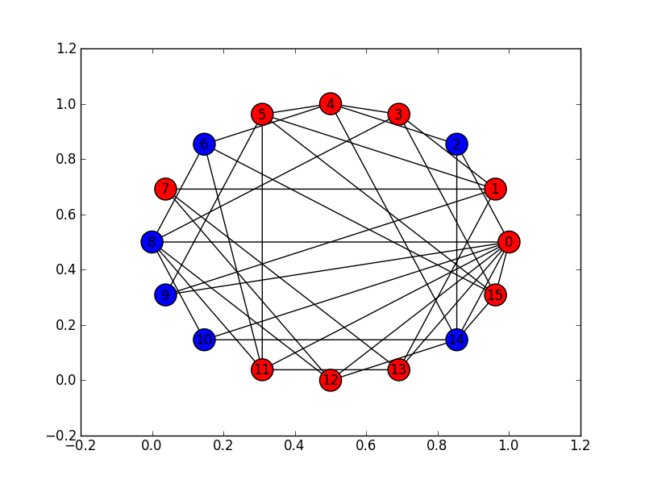

********************************
Assignment #2: Oh crap, Zombies!
********************************

* **Worth**: 10%
* **DUE**: Oct 25, at 11:55pm; submitted on MOODLE.
* Starting point: :download:`asn2.ipynb <../assignments_files/asn2.ipynb>` OR :download:`asn2.py <../assignments_files/asn2.py>`

.. warning::

   For this assignment, you may **not** work with anyone else. You need to work independently. By all means communicate with each other at a high level (that's good), but your code needs to be your own here. 

.. warning::

   For this assignment, you will need to use special Python packages (networkx, numpy, matplotlib). The good news is that if you are using Colab (or you have installed anaconda), you've got them installed already!
   
   You can access these in Colab or PyCharm. If using PyCharm and you create a PyCharm project, make sure to select the **Conda** interpreter. 
   
   .. image:: ../img/pycharmconda.png
   
   
   **IGNORE IF USING COLAB** If for whatever reason PyCharm is being a troublemaker, you can use Spyder still. Just open up Spyder. On Windows, you can just search for it in the start menue. On Mac and Windows, you can also just open up the **Anaconda Navigator**. Then from within the navigator, open up Spyder. 
   
   .. image:: ../img/windowsSpyder.png
   
   .. image:: ../img/anacondanav.png

.. image:: ../img/zombieheader.jpeg
   
If you can simulate something accurately enough, the simulation might have real advantages over actually doing an experiment. For example, if you simulate a protein folding -- and get it right -- you can actually stop, rewind, replay, and even do matrix-style 'bullet time' pans around the protein, as it folds. This allows you to watch interactions on a level of detail that is completely impossible experimentally.

Simulations also let you do things you simply *can't* do in reality. Suppose you're a social geographer who wants to study the social impact of different types of natural disasters on a small fishing village. You'd have difficulty getting ethics  approval to flood an actual village, or bury it in lava, and then collect data. If, however, your 'villagers' exist only in a simulation... there are no constraints on what you can do (except for your own guilt).

For this assignment, you will be simulating the outbreak of a **ZOMBIE APOCALYPSE**. Specifically, you'll be writing code to simulate the spread of zombies through a network of cities. Once your simulation is working, you'll write a bit more code to analyze the data produced by your simulation to determine exciting things like how long it will take for the world to end.

How to approach the assignment
==============================

Once again, you are asked to extend existing code. Extending existing code can actually be more challenging than writing code from scratch, but this is what a lot of real world programming is (don't worry, you will start writing large programs from scratch very soon). 

The first thing you should do is :download:`download the existing notebook <../assignments_files/asn2.ipynb>` (:download:`or download the .py if you want <../assignments_files/asn2.py>`) and take a quick look at it (remember, you'll have to unzip here). Just skim it. Some of  the provided functions call on rather complex Python libraries and may look very confusing to you. That's totally normal. What you really want to look at are the descriptions in the function headers. Right after the ``def`` line, you'll see some text wrapped between """ and """. Read this carefully. This tells you everything you need to know about how to use that function -- without you having to understand how all the details of the function work. That is: you can work *one level of abstraction higher* than the function (just like when you use ``print`` -- I bet you have no clue how ``print`` *actually* works).

So... look at that code. Seriously. Do it. Familiarizing yourself with what's going on in the file is the best possible preparation for doing the assignment. Consider this the first requirement of the assignment.

Data structures you need to know about
======================================

Every city in our simulation is going to be represented by a list ``[name,infected,neighbours]``. The good news is, you've been using lists since week one in the labs. 

* ``name`` is a string with the name of the city. 
* ``infected`` is a ``bool`` . ``True`` if the city has zombies, ``False`` if it doesn't.
* ``neighbours`` is a *list* (so we've nested a list inside a list!) containing the city numbers (indexes) of the cities that can be directly reached from this city.
  
   ex: 
       ``# a city named city0 is NOT infected, and has``
	   
       ``# 3 neighbours; cities indexed by 3, 6, and 7``
	   
       ``a_city = ['city0', False, [3, 6, 7]]``
  
Our *world* is actually made up of multiple cities. How can we store all these cities? In another list, of course! So the world is a list of lists:

   ``world = [city0, city1, city2, ...]``
   
Well, really it will be more like this...

   ``world = [[city0, False, [3, 6, 7]], [city1, False, [0, 6, 8, 9]], [city2, False, [3, 6]], ...]``
   
.. warning::

   Note that the numbers in the list of neighbours will actually be the indexes of the cities, and not the names of the cities. This is pretty convenient actually, because what we could do is something like this. 
   
   .. code-block:: python
   
      world = [[city0, False, [3, 6, 7]], [city1, False, [0, 6, 8, 9]], [city2, False, [3, 6]], ...]
	  
      # This make a_city reference [city1, False, [0, 6, 8, 9]]
      a_city = world[1]
        
      # This will get the index of the 0th neighbour. 
      # a_city[2] is the list of neighbours
      # a_city[2][x] will get us the xth neighbour from the list
      a_neighbour = a_city[2][0]
      
      # This will make the_neighbour reference [city0, False, [3, 6, 7]]
      the_neighbour = world[a_neighbour]
      
      # We can also do this all in one shot like this
      # world is a list of cities
      # world[1] is a specific city (a list)
      # world[1][2] is the list of neighbours in that city
      # world[1][2][0] is the 0th neighbour in that city indexed by 1
      # world[word[1][2][0]] is city that is the 0th neighbour of city 1
      the_neighbour = world[word[1][2][0]]
      # woah!
	  

   
Getting started
===============

To make your life easier, I've provided a function called ``set_up_cities`` that will randomly generate some cities, and connections between those cities, for you. If you call this function, it returns a *list* of cities, detailing the state of your simulated world. You'd use the function like this:

.. code-block:: python
   
   my_world = set_up_cities()
   
.. admonition:: Note

   If you don't like the (boring) default names for the cities, note that there is an optional ``name`` parameter
   for this function. This lets you pass in your own list of city names if you want to (it also allows you to
   create a world with fewer, or more, cities). Apologies for the boring names, but I didn't want use real cities to avoid traumatizing any
   class members who may have lost a loved one to a zombie outbreak in those cities).

You should probably load up the ``asn2.ipynb`` (or ``asn2.py``) file into Colab or your IDE and play around with the ``set_up_cities()`` function to get a feel for it. Have a look at the lists it generates (``print``) and make sure you understand their structure. I'm not being silly here. You should do this. Playing with the code is the best way to learn how it works.   

.. image:: ../img/zahead.jpeg

.. warning::

   You should also **NOT** be using the ``input()`` function in this assignment in any area. 
   
Coding, Part I
==============

Write the following functions:

1. ``zombify(cities, cityno)``. This function takes your list of cities as the parameter ``cities`` and an integer ``cityno`` specifying which city in the list should be infected. So, to infect city 2, you might use the function like this:
   
   .. code-block:: python
   
      my_world = set_up_cities()
      zombify(my_world, 2)
	  
   
   **Hint 1:** Which index held the infected boolean?

   **Hint 2:** If the above hint made no sense to you, you didn't read *Data structures you need to know about* section carefully enough. 
 
2. ``cure(cities, cityno)``. The opposite of ``zombify``. Clear the infection flag for the city.  
   
3. ``sim_step(cities,p_spread,p_cure)``. This is the most important function in the assignment. This function will execute a single *time step* of your simulation. Depending on how fast you want to think of your zombies spreading, that time step could be a day, an hour, a week, whatever. When modelling a real zombie outbreak, you'd determine the size of your time step from the empirical data. Here is some English-language "pseudocode" for function. You'll have to turn it into Python::
   
    for each city in cities:
        if the city is infected and numpy.random.rand() < p_spread:
            choose a victim city (at random -- hint: numpy.random.randint()) from the list of this city's neighbours
            infect the victim city!
        
        if the city is infected and numpy.random.rand() < p_cure:
            cure the city!
         
    Make sure that city 0 *always* has zombies. It can't be cured. 
   
   So, what's going on there? Well, ``numpy.random.rand()`` isn't so much pseudocode as actual Python code. It generates a random number between 0 and 1 every time you call it. Think of it like rolling dice. The parameter ``p_spread`` is the *probability of the zombie plague spreading* and the parameter ``p_cure`` is the probability of the plague being cured. For starters use values of 0.5 for ``p_spread`` and 0.0 for ``p_cure`` while you're getting things working. We'll play with these later. (Note: a value of 0.0 means it will never happen, and a value of 1.0 will mean that it always happens.)   
   
   To help explain the whole *probability* bit better, imagine you had a 10 sided die and a probability to spread of 0.8 (80%). So, think about it this way... we have an 8/10 chance to spread (80%). So if we roll the die and a 2 pops up, we will spread. We roll again, and a 7 pops up, we spread. Roll and a 1 pops up, we spread. Roll and a 9 pops up, we do **not** spread. That's what we're doing here. But instead of a die, we have ``numpy.random.rand()``.   
   
   .. warning::
   
      Imagine we have:
	  
         ``a_city = ['cityX', False, [0, 6, 8, 9]]``
		 
      Let's say we pick a random neighbour from the list of neighbours. Notice that we have 4 neighbours here. So let's take the neighbour in index 2, which is 8. The neighbour is city 8, not 2! Make sure you understand this. This consistently messes people up year over year. 

Once you've done this, you now have a working zombie apocalypse simulator! So spend some time testing it. Something like this: 
   
   .. code-block:: python   
   
      my_world = set_up_cities()
      zombify(my_world,0)
      draw_world(my_world)
      sim_step(my_world, 0.5, 0)
      draw_world(my_world)
      sim_step(my_world, 0.5, 0)
      draw_world(my_world)
      sim_step(my_world, 0.5, 0)
   
The function ``draw_world`` is one that's already written for you. It graphically displays the state of your world. Cities are red circles if they have zombies and blue circles if they're clean. If zombies can travel between two cities, there is a line drawn between the cities. If you update this display after each ``sim_step`` you can watch your zombies spread! It'll look something like this:

If you get tired of typing ``sim_step`` for every single step... you could always automate the process with a function that calls ``sim_step`` in a loop!

Once you're convinced that your zombie simulator works, move on to Part 2. If your simulator isn't working yet **GET IT WORKING BEFORE PROCEEDING**.

Working now? Good. Make sure it's *commented* and has *function headers*. Make sure you've got good variable names too. 

   

Part I --- FAQ:
===============
* My drawing looks different every time!
   * I know, it should, it's random every time.
* My drawing isn't updating for each step!
   * This might be happening because it's running so fast. 
* Do I have enough comments?
   * I don't know, maybe? If you're looking at code and have to ask if you should comment it... just comment it. That said, don't write me a book.  

Coding, Part II
===============

As fun as it is to watch our zombies spread, we'd like to gather some hard data on the results of our
simulations. In particular, top government officials want to know how long it will take for the world
to end in the event of a zombie apocalypse. 

Write the following functions:   
  
4. ``is_end_of_world(cities)``. Loop through all the cities in the list ``cities``. If *all* of them are infected, return ``True`` (it's been nice knowing you). Otherwise, return ``False``.  

5. ``time_to_end_of_world(p_spread,p_cure)``. Run a simulation, for specific values of ``p_spread`` and ``p_cure`` and count how long it takes the world to end (which you can now test with ``is_end_of_world``, of course). Some pseudocode for you::
   
      set up a new list of cities (``world = set_up_cities()``)
      zombify city 0
      
      initialize an end-of-world counter
      while the world hasn't ended:
         sim_step(world,p_spread,p_cure)
         increment the end-of-world counter
    
      return the value of the end-of-world counter

   Now, to run an experiment to see how long it takes the world to end, all we have to do is call ``time_to_end_of_world(0.5,0)``
   
   .. warning::
      Be careful with what values you select for ``p_spread`` and ``p_cure``. This simulation works on probabilities. If you have a high probability to spread, do you think the simulation will take a long time? What if you had a low probability? Will it take longer?. How would the cure probability impact the runtimes?
   
      Long story short. Careful. If you set cure too high and spread too low, you might be twiddling your thumbs for **A LONG** time. 

We've got a problem. Our simulation is *stochastic* (random): we are making use of random numbers to determine outcomes. We can't just run our simulation once and count the number of steps until every city is infected. If you don't believe me, just try it. Call the ``time_to_end_of_world`` function a few times. Do you get different values? Wildly different? Yeah, that's what I thought. WTF do you do now?

We have to run our simulation *many times* to sample the space of possible outcomes. In essence, simulation is a lot like experimentation; we have to do multiple experiments to get some statistical confidence in our answer.

So, write another function:

6. ``end_world_many_times(n,p_spread,p_cure)``. This function should initialize a *list* of results and then use a loop to run ``time_to_end_of_world(p_spread,p_cure)`` a total of ``n`` times. After each simulation, add the time it took for the world to end to the list. Return a list of ``n`` "times to the end of the world". Some pseudocode for you::

    create an empty list
    while we have not done n simulations
        run one simulation of time_to_end_of_world
        append result to the list
	  
    return the list

All set? Make sure it's got good variable names, is *commented*, and has *function headers*. Then go on to the analysis.
  
Analysis
========

Now we get to play with our simulator to answer burning public health questions about zombie outbreaks. Play with the values of ``p_spread`` and ``p_cure``. How does changing those values change the "time to the end of the world"? Answer the following specific questions, and provide evidence from your simulation to support your answer: 

1. Fix the value of ``p_cure`` at zero. How does varying the value of ``p_spread`` affect the time to the end of world?

2. Fix the value of ``p_cure`` at 0.05. How does varying the value of ``p_spread`` affect the time to the end of world?

3. Fix the value of ``p_spread`` at 0.5. How does varying the value of ``p_cure`` affect the time to the end of world?  

4. Pick three pairs of ``p_spread`` , ``p_cure`` values that you think are interesting. Run 500 simulations for them (e.g, `end_world_many_times(500,your_value,your_value)``. What does the *distribution* of times to the end of the world look like? If you've taken a stats course: is it normal (Gaussian)? (If you haven't taken stats, just ignore the Gaussian bit). Call the function I gave you called ``draw_pretty_histogram(times)`` with a list of times to the end of the world. Cool eh!

   Here's a sample histogram of times to the end of the world for ``p_spread = 0.5`` and ``p_cure = 0.0``:

.. image:: ../img/zhist.png

Part II --- FAQ:
================

* It's broken
   * Maybe, or maybe your probabilities are bad and it's just running forever. 
* My histogram looks different from yours!
   * I know, it should, it's stochastic.
* My histogram looks different every time!
   * I know... it should... it's still stochastic...
* Do I have enough comments?
   * I don't know, maybe? If you're looking at code and have to ask if you should comment it... just comment it. That said, don't write me a book.

What to submit
==============

* Your version of ``asn2.py``. Also, please **DO NOT** change the name of this file. Leave it alone. 

  * Make sure your **NAME** and **STUDENT NUMBER** appear in a comment at the top of the program.
  * Make sure it's *commented* and has *function headers*!!
  * Use proper variable names
  
* A text/word file answering the 4 analysis questions and providing *data* to back up your answers. Include images in your submission. 
   
   
General FAQ:
============

* Does my text file have enough details?
   * Probably. The shorter the better. Include pictures with your submission though. 
* I don't know how to do *X*.
   * OK, go to `google.ca <https://www.google.ca>`_ and type in *X*.
* It’s not working, therefore Python is broken!
   * Probably not; you’re very likely doing something wrong   
* Wtf do the functions do that you gave me?
   * Read the descriptions. Try figuring it out. This is actually part of the assignment learning objectives. 
* Some of the code in the functions you gave us look like magic.
   * That's because it's magic.
* Do I have enough comments?
   * I don't know, maybe? If you're looking at code and have to ask if you should comment it... just comment it. That said, don't write me a book.
* I know you told me to do it this way, but I did it another way, and I think my way is better.
   * Your way may be better, but I don’t care. Do it the way I told you.
* Can I work with my friend?
   * No
* I know our code looks the same, but we only worked together at a high level.
   * No you didn’t. If the anti-plagiarism software thinks your code is the same, you didn’t just talk on a high level. I can do simple statistics on how similar everyone’s code looks, and if you’re an outlier, then I know you cheated.
* I know I cheated, I know I know I was cheating, but I’m reeeeaaaaaaaaallllllly sorry [that I got caught]. Can we just ignore it this time?
   * Lol, no
* If I submit it at 11:56pm, you’ll still mark it, right? I mean, commmmon!
   * No. 11:55pm and earlier is on time. Anything after 11:55pm is late. Anything late is not marked. It’s rather simple really.
* Moodle was totally broken, it’s not my fault it’s late.
   * Nice try.
* I accidentally submitted the wrong code. Here is the right code, but it’s late. But you can see that I submitted the wrong code on time! You’ll still accept it, right?
   * Do you think I was born yesterday? No.

