**********************************************************
Assignment #3: I'm only taking CS to make sick video games
**********************************************************

* **Worth**: 10%
* **DUE**: November 15th at 11:55pm; submitted on MOODLE.
* Starting point: Create a new thing called asn3 
* Learning Objectives
   * Starting from scratch 
   * Interpreting requirements correctly
   * Validating input
   * Formatting output
   * Debugging
   * 2D lists
   * Generalizing rules 

.. warning::

    `Remember, List vs. Pointer to a List! <https://people.stfx.ca/jhughes/cs161/class8.html#aliasing>`_
    
    
       

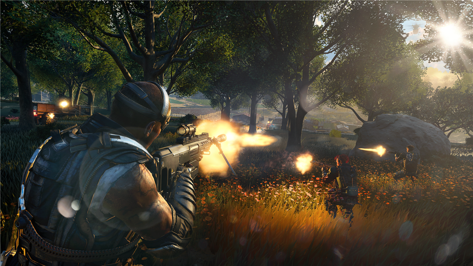

It's time. With the skills we've learned so far, we're going to make one of the most badass video games of all time. Are you ready? We're going to make a... wait for it... X-treme tic-tac-toe game from scratch!

For those of you that don't know what this amazing game is, `check out wikipedia <https://en.wikipedia.org/wiki/Tic-tac-toe>`_. 

This assignment will be a little bit different from the previous two. A1 and A2 were more analytics-ie, and now A3 will be more engineering-ie. Also, unlike the previous assignments, you will be starting from scratch. 

**DO NOT PANIC THOUGH**. 

I will still be guiding you through this assignment. Remember, try not to think about solving the problem all at once. We want to solve the little problems. In fact, most of the time we want to break the little problems into littler problems, and then break them down even more... Then, once we write some code, even if it's 1 or 2 lines, **we always make sure those lines do what we expect!** Being the good programmers like you are, I am certain that you were going to do this already. 

.. warning::

    I'm not playing. Test everything you do in every way you can think to try to break it. This assignment is very constructive. If something early doesn't work then you'll be in trouble. 

Some of the functions I'll have you write at first may seem kinda' scatterbrained, but don't worry, it will all come together in the end. 

.. image:: ../img/a3_programmer.jpg

Now, when I say, *X-treme* tic-tac-toe, I mean **X-treme**. Instead of being stuck with just a boring old 3x3 game, we can do 4x4, 10x10, etc. Basically, any size we want! So we need to: a) ask the players what size the game is; b) make sure all the stuff we program will work for whatever size the game is. 

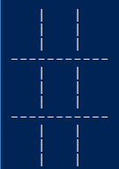

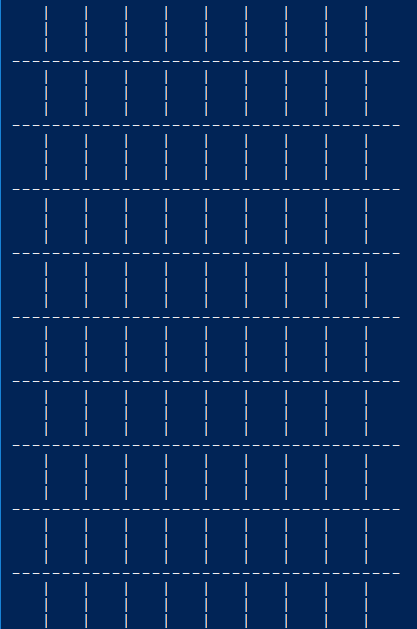

Coding, Part I
==============

1. Write a function ``get_game_size()`` that will simply prompt the players to enter a game size and then the function will ``return`` the inputted value as an integer. They will only enter one integer. For example, if they enter 3, the function would return 3. This value will ultimately mean that the game is 3x3. If they enter 10, it would mean that the game is 10x10. **Once you are done, test the function!**

2. Write a function ``set_up_game(size)`` that takes a game size as parameter and then returns the game board. For example, check out the image below. Here I called it with 3, and it returned a list with 3 lists. Each of the internal lists had 3 strings in it. Each of these strings was a single space character (' '). Eventually we will replace these space characters with either an 'X' or an 'O'. **Once you are done, test the function! Seriously, test it throughly. If these early functions do not work properly, the latter functions are gonna' have a bad time.** Warning, be careful with pointers here!

.. image:: ../img/a3_set_up_game.png

3. Write ``get_move(player)``. This function will: a) prompt a given player for a move; b) read in the move; c) return the move as a *tuple* of integers. The ``player`` parameter will be a string, either 'X' or 'O', to indicate which player's turn it is. Moves are also to be entered like this: 0,0 (zero comma zero) to mean the location (0,0). See the below example image. **Again, once you are done, test the function!**

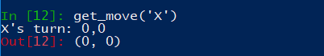

4. Write the function ``make_move(cur, move, player)``. ``cur`` will be the game board, ``move`` will be a tuple containing a move, and ``player`` will be a string of which player's move it is. If you couldn't guess, this function will apply a player's move to the game board. For our purposes, we'll make the move (0,0) mean the top left of the game board. I suspect the following image will explain well enough. In this image, I am telling the function to apply the move (0,0) for player X to our game board (we replace the ' ' in the list of lists with an 'X'). Note that this function does not return anything. Instead, it has a *side effect*. **Once you are done, test the function!**

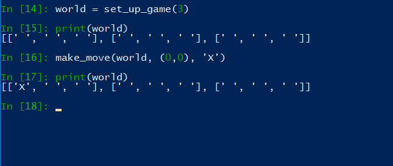

5. The game is gonna' look pretty ugly if we don't format the output nicely. Sure we could just keep printing the game out like the above picture, but gamers these days want awesome graphics. Write a function ``game_print(cur)`` that will print out the current game board ``cur``. Check out the below image to see how I want things formatted. In the below example, it assumes that the whole game board is empty EXCEPT for the position (0,0), which has an 'X' in it. I do want yours to work with any game board passed though (also, be aware that the game board can be any sized square too). I am expecting your output to be formatted to match what I've shown you **exactly**.

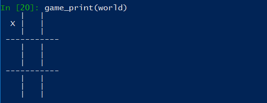

In case you want the actual text, here it is:

   .. code-block:: python
   
         |   |
       X |   |
         |   |
      -----------
         |   |
         |   |
         |   |
      -----------
         |   |
         |   |
         |   |

.. warning::

   ``game_print(cur)`` will be one of the harder functions of the assignment. I'm warning you, it will be painful. Get ready to fiddle with the code in this function A LOT!

6. **IGNORE THIS** Write a function ``game_clear()`` that will clear out the console. Basically, when you call this function, I want all the text on the screen to go away. Chances are you have no idea how to do this, but that's OK, check out *Hanno Behrens'* answer `here <https://www.quora.com/Is-there-a-Clear-screen-function-in-Python>`_. **IGNORE THIS**
 
.. warning::

   Before moving on, are you sure that:

      * All of the functions work properly?
	     * Did you test them throughly?
		    * Seriously?
      * They will work with arbitrarily sized game boards.  

Coding, Part II
===============

The above got a lot of the scaffolding out of the way, but the game is still not playable or smart enough to know if anyone won. Part II will get us closer to our goal. 

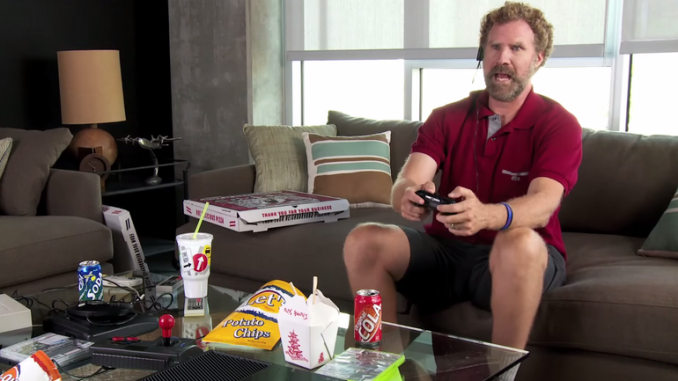

7. Video game players are notoriously annoying when it comes to trying to exploit the coded rules of the game, so to be safe, we need to do some input validation. We won't be going crazy with the validating, but we will do some. Write a function ``is_move_valid(cur, move)`` that will check if the ``move`` is a valid move for the board ``cur``. The function will return a boolean: True if the move is valid, False otherwise. A move will be considered invalid if it is already taken or if it is not on the game board, eg: given a 3x3 board, (-1,-1), and (1123,4) would be invalid. If the move is not invalid, then it is valid. 

.. image:: ../img/a3_is_move_valid.png

**The next 5 functions go together**

We want to have some functions that will check to see if a given player has won. There are a few ways a player can win: a) gets a row; b) gets a column; or c) gets a diagonal. We will write some functions to check these specific cases and then we will write one big function that makes use of the smaller ones. 

8. Write a function ``check_row(cur, row, player)`` that will return True if the ``player`` has won a given ``row``, or return False otherwise. Notice that this function will only check a given row and not all rows. See the below image for an example. 

.. image:: ../img/a3_check_row.png

9. Write a function ``check_column(cur, col, player)`` that, similar to above, checks to see if the ``player`` has won a given ``col``. 

10. Write a function ``check_down_diag(cur, player)`` that will check if the ``player`` has won the diagonal starting in the top left and ending in the bottom right. Note that we do not need to specify a row/col here as a function parameter. 

11. Write another function ``check_up_diag(cur, player)`` that's basically the same as #10, but checks the other diagonal (bottom left to top right). 

12. Write a function ``has_player_won(cur, player)`` that will return True if the ``player`` has won in any way on the board ``cur`` (see above) and False otherwise. This function **must** make use of functions 8 -- 11. 

.. warning::

   Before moving on:

      * Are all of the functions work properly?
      * Are you sure they're working properly?
      * They will work with arbitrarily sized game boards?  
      * By the way, did you verify that your functions are working properly?
	  
	  
Coding, Part III
================

Now it's time to put all of the above together to actually make the game be a game. 

13. Write a function ``tic_tac_toe()`` that will set up the game, and perform the execution of X-treme tic-tac-toe. 

Below is some pseudocode for this function. 

   .. code-block:: python
   
      get game size
      set up the game
	  
      set a game over flag to False
      initialize a move counter

      while the game is not over
         clear the console
         print the current game
         print the move counter
         figure out who the current player is. 
         ask for a move until it's valid. If it's not valid, tell them and ask again. 
         apply the move
         increment move counter
         see if the player won

      clear console     # do not need to do this
      print game	  
      If someone won, print out who won and 'gg'
      If no won won, say no one won. 

To get a feel for how things should work, here are some pictures...
	  
Here is a picture of me entering the game size

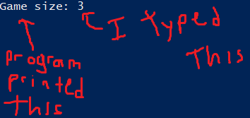

Here are 2 pictures to show a before and after X makes their first move in (1,2)

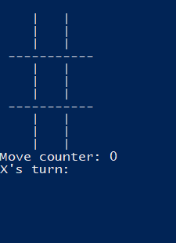

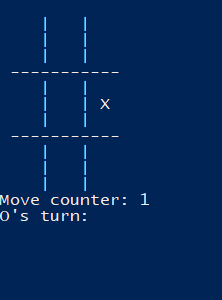
	
Here is a picture of a player entering an invalid move. 	

.. image:: ../img/a3_invalidMove.png	  
	  
	  
	  
Some things to note:
   * X always goes first
   * The game can end in a draw
   * We will probably want a game over flag to know when to stop looping to get inputs
   * X will always win a game that's smaller than 3x3 (think about why that is) 

Below are some more pictures.

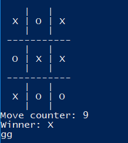

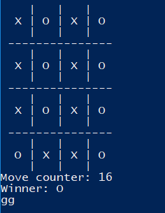

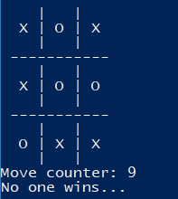

What to submit
==============

* Your version of ``asn3.py``. Also, please **DO NOT** change the name of this file. Leave it alone. 

  * Make sure your **NAME** and **STUDENT NUMBER** appear in a comment at the top of the program.
  * Make sure it's *commented* and has *function headers*!!
  * Use proper variable names
  
General FAQ:
============

* I don't know how to do *X*.
   * OK, go to `google.ca <https://www.google.ca>`_ and type in *X*.
* It’s not working, therefore Python is broken!
   * Probably not; you’re very likely doing something wrong   
* Do I have enough comments?
   * I don't know, maybe? If you're looking at code and have to ask if you should comment it... just comment it. That said, don't write me a book.
* I know you told me to do it this way, but I did it another way, and I think my way is better.
   * Your way may be better, but I don’t care. Do it the way I told you.
* Can I work with my friend?
   * No
* I know our code looks the same, but we only worked together at a high level.
   * No you didn’t. If the anti-plagiarism software thinks your code is the same, you didn’t just talk on a high level. I can do simple statistics on how similar everyone’s code looks, and if you’re an outlier, then I know you cheated.
* I know I cheated, I know I know I was cheating, but I’m reeeeaaaaaaaaallllllly sorry [that I got caught]. Can we just ignore it this time?
   * Lol, no
* If I submit it at 11:56pm, you’ll still mark it, right? I mean, commmmon!
   * No. 11:55pm and earlier is on time. Anything after 11:55pm is late. Anything late is not marked. It’s rather simple really.
* Moodle was totally broken, it’s not my fault it’s late.
   * Nice try.
* I accidentally submitted the wrong code. Here is the right code, but it’s late. But you can see that I submitted the wrong code on time! You’ll still accept it, right?
   * Do you think I was born yesterday? No.

