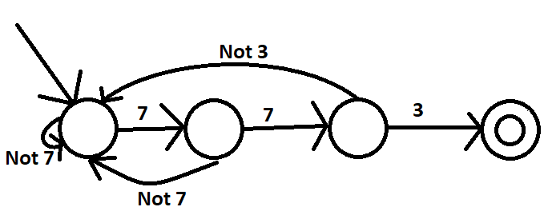
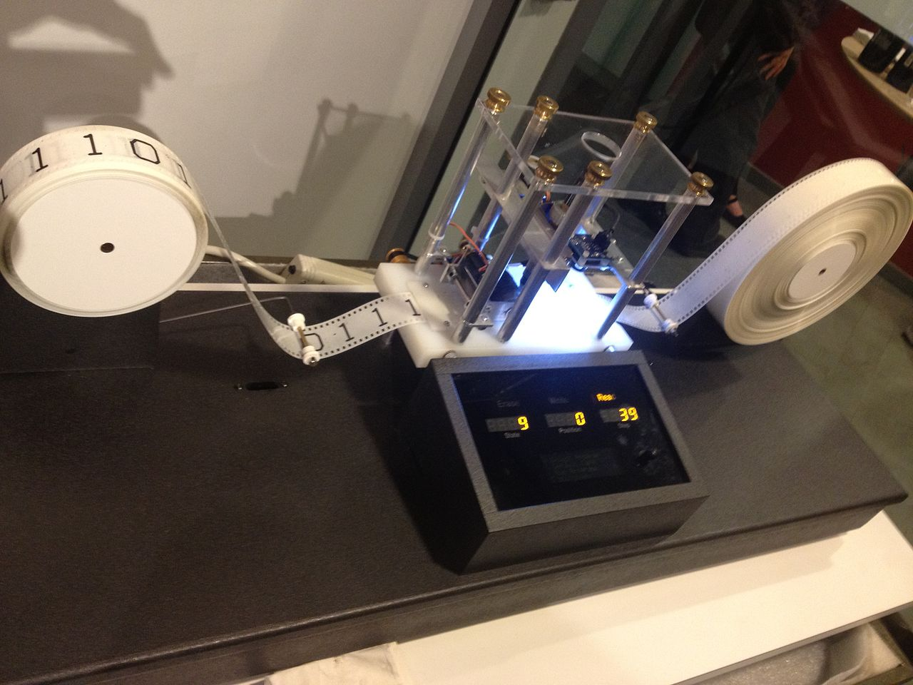

Topic #16 -- Models of Computation
==================================

Finite State Machines/Automata (FSM/FSA)
^^^^^^^^^^^^^^^^^^^^^^^^^^^^^^^^^^^^^^^^

* Simple models of computation. 
* We can define a very very very very simple computer in terms of 
    * Input 
    * Output
    * States
    
* And then we can geek out over how much work this little computer can do
    * Like, what types of problems this computer can solve. 

* FSM's are **VERY** simple computers. 
* But, just because they're simple, doesn't mean we can't use them
* In fact, these little guys are powerful enough to solve A LOT problems we deal with every day. 
    * Vending Machines
    * Traffic Lights
    * Elevators
    * Locks/Safe
    * Regular Expressions 

* Let's say we want a lock that has the combination **7, 7, 3**. 
* Here's a FSM for that lock

* Or, we can go the other way and say, given this machine, what input can it accept. 

.. image:: ../img/FSM_regex.png

.. admonition:: Activity
   
    What input strings can this machine accept? What I mean is, what strings will get this machine to it's final state.  

* Think about it this way. Think of how simple the computational system is that is powerful enough to unlock a lock

* Computer Scientists like to think about *what else can a computer this powerful do?*  
    

Pushdown Automata (PDA) and Context-Free Grammars 
^^^^^^^^^^^^^^^^^^^^^^^^^^^^^^^^^^^^^^^^^^^^^^^^^

* FSM's are cool and all, but they can only solve certain types of problems. If we want to solve more *complex* problems (for lack of a better term), we need a more powerful machine. 

* PDA's are more *powerful* computational models
* They can solve **strictly** more problems than FSMs. 
    * Anything a FSM can do, a PDA can do
    * There are a lot of things a PDA can do, that a FSM cannot
    
* PDA's accept what we call Context-Free Grammars. 

* Here's an example of doing the same thing as the 2nd FSM. 

    S --> aA

    S --> bB

    A --> aA

    A --> b

    B --> bB

    B --> a

* Here, the upper case letters are like special symbols that mean you can replace them in a string with whatever is on the right hand side. 
* The lower case letters are just letters. 

* Start with S
    * String: 'S'
* We have two options, let's go with the first
    * String: 'aA'
* We now have an A, so let's go with the first options
    * String: 'aaA'
* Let's do it again
    * String: 'aaaA'
* Let's do it 4 more times
    * String: 'aaaaaaaA'
* Now let's go with the second option
    * String: 'aaaaaaab'
* No more upper case letters, so we're done. 
    * String: 'aaaaaaab'

    
* Here's another one

    S --> aSa
    
    S --> bSb
    
    S --> *epsilon*/ ''
    
    (*epsilon* means empty string)
    
.. admonition:: Activity
   
    What strings can this system create? Try to generate a few and see if you can see the big picture on what it's doing.   

* Another one   

    S --> SS
    
    S --> (S)

    S --> ()

    S --> *epsilon*/ ''

.. admonition:: Activity
   
    What strings can this system create? Try to generate a few and see if you can see the big picture on what it's doing. 

Context-Sensitive Grammars
^^^^^^^^^^^^^^^^^^^^^^^^^^

* Context matters now

    S --> abc
    
    S --> aAbc
    
    Ab --> bA
    
    Ac --> Bbcc
    
    bB -> Bb
    
    aB --> aa
    
    aB --> aaA

    
Turing Machines 
^^^^^^^^^^^^^^^

* Turing Machines are even more powerful models of computation
* *Basically*, the computers we use today are kinda' like these
    * They're not built like these, but they are as powerful
    * Can solve the same problems. 
    
* Also, we often say that our brains are *at least* as powerful as a Turing Machine. 
    * *At least*?

    
For next class
^^^^^^^^^^^^^^

* `Read Chapter 18 <http://openbookproject.net/thinkcs/python/english3e/recursion.html>`_

