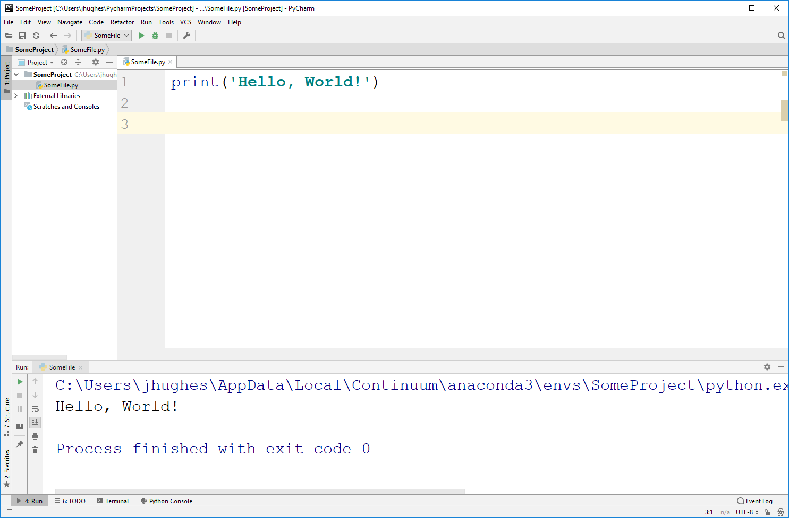

***************************
Getting set up for CSCI 161
***************************

Colab
=====

There are a few ways to get setup to start programming in Python. By far the **easiest** and **recommended** way for CSCI 161 is to use `Google Colab <https://colab.research.google.com/notebooks/welcome.ipynb>`_.

There are a number of reasons this is the best choice for us, including being very easy to setup (I'm betting everyone already has a Google account). Further, it automatically backs everything up for you with Google Drive. Another big reason is this style of programming, called *notebook*, is becoming increasingly popular. 

If you do not have a Google account, then it is easy to make one. If you are uncomfortable making a Google account, then no worries. You may use one of the options below. Do note that there is even a way to use the *notebook* style programming with the interpreter option and something called *Jupyter notebook*.

Interpreter on Your Computer
============================

Colab is awesome, however it does have one major downside... You **must** be connected to the internet for it to work. Although we'll still primarily use Colab, it is **strongly** recommended to also install Python on your computer. You'll pickup how to use both Colab and your local interpreter throught the course. 

Anaconda is my fav python distribution for a billion reasons. One of which is that it's free (MAKE SURE YOU DO NOT PAY FOR ANYTHING). `Long story short, go here and download Python 3 (not 2) and be sure to download the version for your operating system (Windows or macOS). <https://www.anaconda.com/distribution/>`_

**IMPORTANT:** When installing it, there will be an option about setting a PATH variable. The installer recommends against checking the box, but ignore this. YOU **SHOULD** CHECK THIS BOX! See image. 

.. image:: ../img/pathVariable.png

Integrated Development Environment
==================================

If you would like, install an Integrated Development Environment (IDE). IDEs are special programs that can make it easier to write code. **HOWEVER**, I don't actually recommend using this in the course, or at least not at the start. Although IDEs do absolutely make a programmers life easier, at this stage of learning it will very very likely just confuse you and impeded your learning. 

For Windows users, the good news is if you installed Anaconda you already have something called **Spyder** installed. This is an IDE that comes with Anaconda. 

Another popular IDE is **PyCharm**. `If you want it, download the free community edition (DO NOT PAY FOR ANYTHING).
<https://www.jetbrains.com/pycharm/download>`_

Note, I will not be providing IT support for IDEs (or really any IT support in general). 

