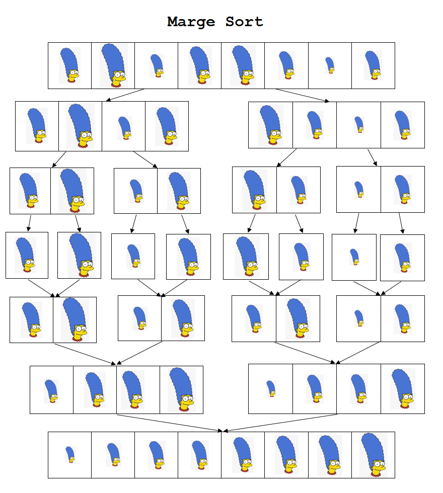
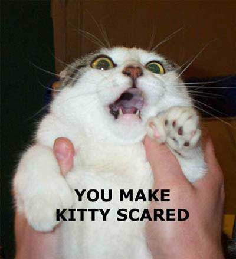

***************************************
Topic #17 -- Recursion and More Sorting
***************************************

Recursion
=========

.. code-block:: python
    :linenos:
    
    def fact(n):
        if n == 1:
            return 1
        else:
            return n * fact(n-1)

    print(fact(5))

    
.. admonition:: Activity
   
    Test this code. What's the answer? Why is that the answer? Trace through this code. 
    
    There is nothing really special happening here; we're following the same rules we always have. 

* `Use this website for a nice visualization! <http://www.pythontutor.com/visualize.html#mode=display>`_
* Or use the debugger. 
     

Don't Panic
===========

* Before talking about the next few things, I want you to be very well aware that these algorithms are outside the scope of this course
* I am showing you clever algorithms
* Probably the most sophisticated we've seen so far
* For now, don't get distracted by all the details, just think about the big picture. 
* The takeaway from this is to get a feel for how neat algorithms can get. 
     

Quicksort
=========

High Level
----------

* An empty list, or a list with one thing in it, is already sorted, right?
* If I take a sorted list of things less than a number *x*, and a sorted list of things greater than a number *x*, then I can just do this:
    ``[less than x] + [x] + [greater than x]``
    
* This will also result in a sorted list, right?

Less high level
---------------

* You give me a list called ``in_list``
* If the list has only one element (or none), just return the list without doing anything
    * because it is a sorted list --- DONE!
* I pick an element from the list, which I'll call the ``pivot``
* I *partition* the list by shuffling the elements around so that:
    * all elements *less than* ``pivot`` are to the left of ``pivot``
    * all elements *greater than* ``pivot`` are to the right of it
* I *recursively call* quicksort on two lists:
    * The list of stuff to the *left* of ``pivot``
    * The list of stuff to the *right* of ``pivot``     

.. code-block:: python
    :linenos:

    def partition(list, l, e, g):
        while list != []:
            head = list.pop(0)
            if head < e[0]:
                l = [head] + l
            elif head > e[0]:
                g = [head] + g
            else:
                e = [head] + e
        return (l, e, g)
    
    def quicksort(list):
        print(list)
        if list == []:
            return []
        else:
            pivot = list[0]
            less, equal, greater = partition(list[1:],[],[pivot],[])
            return quicksort(less) + equal + quicksort(greater)

.. raw:: html

    <iframe width="560" height="315" src="https://www.youtube.com/embed/kqWLdhLxpzs" frameborder="0" allowfullscreen></iframe>

            
Mergesort
=========

High Level
----------

* An empty list, or a list with one thing in it, is already sorted, right?
* We can merge two sorted lists together into a new, bigger sorter list. 

Less high level
---------------

* You give me a list, ``in_list`` with ``n`` elements
* I divide ``in_list`` into ``n`` sublists, each having 1 element.
* The sublists are now already sorted! (Any list with only one element is automatically sorted)
* I now begin *merging* sublists, to produce bigger (but still sorted) sublists:
    * I compare the first element in one sublist to the first in the other
    * Whichever is smaller goes into the merged list
    * I now compare the *second* element in that list to the first element in the other list
    * ... and so on...
* I keep going until there is nothing left to merge (there's only *one* big, sorted, list)

.. code-block:: python
    :linenos:
    
    def merge(left, right):
        merged = []
        l=0
        r=0
        while l < len(left) and r < len(right):
            if left[l] <= right[r]:
                merged.append(left[l])
                l = l + 1
            else:
                merged.append(right[r])
                r = r + 1
            
        if l < len(left):
            merged.extend(left[l:])
        else:
             merged.extend(right[r:])
        return merged
        
    def mergesort(list):
        if len(list) <= 1:
            return list
        else:
            midpoint = int( len(list) / 2 )
            left = mergesort(list[:midpoint])
            right = mergesort(list[midpoint:])
            return merge(left,right)

.. raw:: html

    <iframe width="560" height="315" src="https://www.youtube.com/embed/NJoH6d1uAzk" frameborder="0" allowfullscreen></iframe>

            
            
Self Reference
==============

* Let's say I have the following code:

    .. code-block:: python
        :linenos:
      
        a = [5, 6, 7]
        a.append(a)
      
* What is the length of the list ``a``?
* What is in the list at index 3?
* What's at ``a[3][3]``?
* What's at ``a[3][3][3][3][3][3][3][3][3][3][3][3][3][3][3][3][3][3][3][3][3][3][3][3][3][3][3][3][3][3][3][3][3][3][3][3][3][3][3][3][3][3][3][3][3][3][3][3][3][3][3][3][3][3][3][3][3][3][3][3][3][3][3][3][3][3][3][3][3][3][3][3][3][3]``?

* Remember how things got kinda' interesting when we start dealing with self-references?
  
* Is the following statement True of False? 
    *This statement is False*

* What happens when Pinocchio says 
    *My nose is going to grow now* 

Grelling-Nelson Paradox
=======================
    
* `Autological and Heterological words <https://en.wikipedia.org/wiki/Grelling%E2%80%93Nelson_paradox>`_ 
    * An *autological* word is one that describes itself
        * English
        * unhyphenated
        * pentasyllabic
    * A *heterological* word is one that does **not** describe itself
        * French
        * hyphenated
        * monosyllabic
    
    * If you're lost, just ask yourself: *Is the word English English?* *Is the word unhyphenated unhyphenated?* *Is the word hyphenated hyphenated?*

* Seems reasonable to say that we can clearly categorize all the words as either autological or heterological. 
* Let's put them into ``Set_A`` or ``Set_H``

* Where do we put the word *round*?
    *Is the word round round?*
* Where do we put the word *writable*?
    *Is the word writable writable*?
* Where do we put the word *harmless*?
    *Is the word harmless harmless*?
    
* Where do we put the word *autological*?
    *Is the word autological autological?*
    
    * Hmmmmmm
    * Weird one... 
    * A little different than the previous
    * If it is, it is. 
        * If it's autological, then it is autological and belongs in the set of autological words. 
    * If it's not, it's not...
        * If it's not autological, then it is heteroligical and it belongs in the set of heterological words. 
    
* Where do we put the word *heterological*?
    *Is the word heteroligical heteroligical?*
        
    * Let's start by saying the answer to this question is *yes*. 
        * If it is, then the word is describing itself.
        * Therefore, the word heterological must be heterological
        * What does it mean for a word to be heterological?
        * Well, for a word to be heterological, it must **not** be describing itself. 
        * So if the word heteroligical is heterological, it must not be describing itself, and therefore it isn't autological...
    
        * For the heterological to be autological, it must be heteroligical, which would make it not autological. 
    
    * Is it then heteroligical?
        * So if it does not describe itself, then that means that the word does not describe itself.
        * Wait a min... that's the definition of the word heterological...
        * If the word heterological is heteroligical, it is therefore autological, which would mean that it's not heteroligical...
    
    
    
    
Halting Problem
===============
    
.. admonition:: Activity++++++++++++++++++++++++++++++++++++++++++++++++++++++++++++++++++++++++++++++++++++++++++++++++++++++++++++++++++++++++++++++++++++++++++++++++++++++++++++++++++++++++++++++++++++++++++++++++++++++++++++++++++++++++++++++++++++++++++++++++++++++++++++++++++++++++++++++++++++++++++++++++++++++++++++++++++++++++++++++++++++++++++++++++++++++++++++++++++++++++++++++++++++++++++++++++++++++++++++++++++++++++++++++++++++++++++++++++++++++++++++++++++++++++++++++++++++++++++++++++++++++++++++++++++++++++++++++++++++++++++++++++++++++++++++++++++++++++++++++++++++++++++++++++++++++++++++++++++++++++++++++++++++++++

   Can you write a Python program that will look at a Python function and
   determine if the function might go into an infinite loop (does not *halt*)?

* Let's assume the answer to this activity is "yes" and see where that gets us.
  
.. code-block:: python
    :linenos:  
    
    def halt(f, i):
        if f(i) halts:
            return True
        else:
            return False
           

* Given this, I can easily do this:

.. code-block:: python
    :linenos:  
    
    def problem0(f):
        if halt(f, f) returns True:
            # Go into an infinite loop
            while True:
                pass
        else:
            return False
            
* This may seem weird (it is), but it's totally legal, right?

* What happens if I call ``problem0(problem0)``?

* Let's see what happens:

    ``problem0(problem0)`` --> ``halt(problem0, problem0)`` --> ``problem0(problem0)`` ...
    
* Ok, let's simplify this by asking 2 small questions:
    * What would cause ``problem0(problem0)`` to go into an infinite loop?
        * That would mean that ``halt(problem0, problem0)`` returned ``True``, which means ``halt`` said that the program halted. 
        * Looking into ``halt``, this happens when ``f(i)`` halts. 
        * In our case, ``f`` is ``problem0`` and ``i`` is ``problem0``
        * So, when ``problem0(problem0)`` halts.
    * Wait... ``problem0(problem0)`` goes into an infinite loop when ``problem0(problem0)`` does not go into an infinite loop.
    
    * Ok, we've got a problem here. So let's just ignore this and ask the other question and hope my day isn't ruined. 
    * What would cause ``problem0(problem0)`` to **not** go into an infinite loop?
        * That would mean that ``halt(problem0, problem0)`` returned ``False``
        * This will happen when ``problem0(problem0)`` does not go into an infinite loop
        
    * `I give up. <https://simple.wikipedia.org/wiki/Halting_problem>`_
    

**Why is this interesting?**

* Humans want to be able to ask the question
    *Given these premises, can we get a specific conclusion?*
    
* This shows us that, given our computational model, there are some things that we just can **not** compute. 
