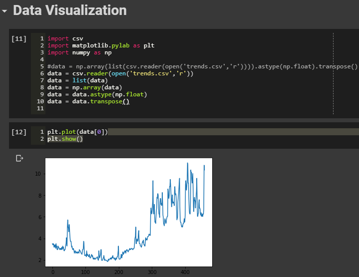
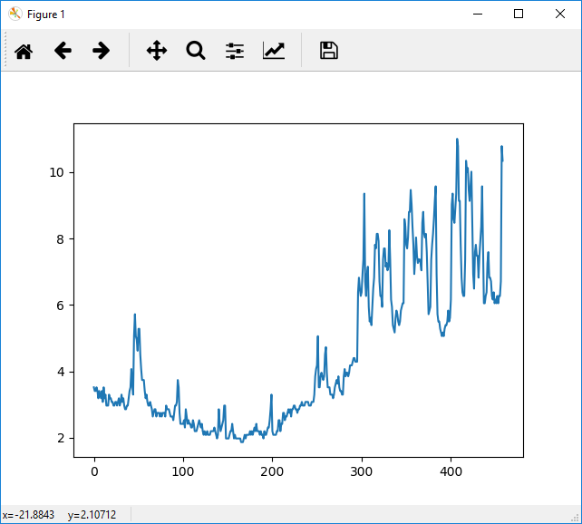

Topic #18 -- Data Visualization
===============================

Plotting with Python
^^^^^^^^^^^^^^^^^^^^^

* Now that you know how to load and manipulate data, we're going to spend some time learning how to *visualize* our data (and the results of processing it).

.. Warning:: 
    It might be safer to use Colab, IPython, or Spyder for this. By all means, try PyCharm, but I've had bad luck with it in the past. 
   
   
* Open up a script and add this to the top of the script: ``import matplotlib.pylab as plt``
    * This just imports the plotting tools (``matplotlib.pylab``) and we give it a simpler name to type (``plt``). 
    

Let's get some data
^^^^^^^^^^^^^^^^^^^^

.. admonition:: Activity

    Download this `Google Trends CSV <http://people.stfx.ca/jhughes/cs161/data/trends.csv>`_ .
    
        * Each row is a week. Starting in 2004, up to the 2012-ish
        * The columns are the search terms 'vampire', 'zombie', 'flu', 'ice cream'
        * The numbers are "search volume index" (normalized to 'flu').

    Now get this data into Python!
   
        * Open a ``csv.reader`` (look at the File IO class.)
        * Read each row into a list

    You should now have a 'list of lists'. Convert it to a NumPy array of floats, and switch
   rows for columns. e.g., if it's in the variable 'data', do this:
   
        >>> data = numpy.array(data).astype(numpy.float).transpose()

    Make sure you understand how that line works!
    
    
Simple plots
^^^^^^^^^^^^

* We can do a simple line plot of 1D data with the ``plt.plot()`` command.
* Try this:

    ``plt.plot(data[0])``

* Then do this:

    ``plt.show()``
  

.. admonition:: Activity

    What did we just plot? How could you do a similar plot for the popularity of the search term 'zombie'? 

    Can you plot both the search volumes for 'vampire' and 'zombie' on the same graph?
   
.. admonition:: Activity

    Experiment with the following commands. What do they do to your plot?
   
        * ``plt.grid()``
        * ``plt.xlabel('This is a label!')``
        * ``plt.ylabel('Another label!')``
        * ``plt.title('My title')``
        * ``plt.axvline(100)``   
        * There are a bajillion options. 

* There are a `crazy number of options <http://matplotlib.org/api/pyplot_api.html#matplotlib.pyplot.plot>`_ that you can pass to ``plot()``. Like these:

.. code-block:: python

    plt.plot(data[0],':')
    plt.plot(data[1],'--')
    plt.plot(data[2],'r--')     
        
.. admonition:: Activity

    Plot search volume for 'flu' ( ``data[2]`` ) against 'ice cream' ( ``data[3]`` ).
    

    Use different line types for the two plots. Use the 'zoom tool' to magnify the portion of the graph below ``y==20``. 

    See any trends worth noting? Visual inspection is a power tool for data analysis.
    
    
* I wonder if any of our keywords have search volumes that are linearly related to each other?

* `Pearson Correlation <http://en.wikipedia.org/wiki/Pearson_product-moment_correlation_coefficient>`_ is a good way to check this.

* We could compute r-values, for each pair, like this:

    >>> import scipy.stats
    >>> scipy.stats.pearsonr(data[1],data[0])
    (0.7604487911797595, 1.0173257365818087e-87)
   ...
   
* Or we could be lazy, and complete the full correlation matrix with one command:

   >>> cor = numpy.corrcoef(data)

    .. raw:: html

        <iframe width="560" height="315" src="https://www.youtube.com/embed/SeXfuBXMoCc" frameborder="0" allowfullscreen></iframe>

   
.. admonition:: Activity

    Build the correlation matrix for ``data``. Look at it. What does it tell you?
    
    
2D Plots
^^^^^^^^^

* Let's look at our correlation matrix visually.

    >>> plt.matshow(cor)
    
* Each square is one entry in the 2D array. Pretty intuitive.

* And, if the axis labels are annoying us, or we need a colour scale:

    >>> plt.axis('off')
    >>> plt.colorbar()
    
.. admonition:: Activity

   Start with a bigger array: ``r = numpy.random.rand(50,50)``. Plot this array,
   using ``matshow`` with a colour bar and no axis labels. 
   
    .. raw:: html

        <iframe width="560" height="315" src="https://www.youtube.com/embed/3FmNl8Q5UYA" frameborder="0" allowfullscreen></iframe>   
        
Histograms
^^^^^^^^^^

* Sometimes you want to see the *distribution* of the values your data, rather than the values themselves.
* Consider these data:

.. code-block:: python

    u = numpy.random.rand(1000)
    g = numpy.random.normal(size=1000)

* If I just plot them, what intuitions do I get? (Assume I don't know where it came from!)

.. code-block:: python

    plt.plot(u)
    plt.plot(g)
    plt.show()
    
* What about if I plot the *distributions* of values in ``u`` and ``d``?

.. code-block:: python

    plt.hist(u)
    plt.hist(g)
    plt.show()
    
* As usual, ``hist()`` has `a lot of options <http://matplotlib.org/api/pyplot_api.html#matplotlib.pyplot.hist>`_ . 

Scatter plots
^^^^^^^^^^^^^^
* Let's create 3 fake sets of experimental data:

.. code-block:: python

    d1 = numpy.random.normal(0,10,size=1000)
    d2 = numpy.random.normal(5,10,size=1000)
    d3 = numpy.random.poisson(size=1000)

* Earlier, we used Pearson correlation to investigate relationships in time series data.
* A more visual way to investigate this is with a *scatter plot*:

.. code-block:: python

    plt.scatter(d1,d2)  
    plt.scatter(d1,d3) 

* For every pair of datapoints (d1,d2)... we just plot them as if they were the (x,y) co-ordinates of a point.
* Let's fake some correlated data:

    >>> d4 = d2 + 1.0 + numpy.random.normal(1,2,size=1000)

    * d4 = d2 + a constant offset + some noise    
    
    
.. admonition:: Activity

    Scatterplot ``d2`` against ``d1``. 

    Now scatterplot ``d2`` against ``d4``. 

    What conclusions can you draw? Back up your conclusions with ``scipy.stats.pearsonr()`` on both pairs.
   
.. raw:: html
	
    <iframe width="560" height="315" src="https://www.youtube.com/embed/W1j31chPVqw" frameborder="0" allowfullscreen></iframe>
    
    
Onward
^^^^^^^

* We've barely even scratched the surface of what's available with Python.
* The types of plots that are of interest to you will depend heavily on what your needs are.
* You've now got the fundamentals to go forth and *steal examples wholesale from the internet*.
* Yes, I'm advocating this methodology for practical visualization:
    * Find an existing visualization in Python that looks close to what you want
    * Get the code
    * Spend some time figuring out how it works
    * Modify it to suit your purposes
    * PROFIT!!!
* This kleptoprogramming approach is enabled nicely by the Python community's strong tradition of publishing source.
* Good places to steal ideas (and code) from:
    * `Matplotlib gallery <http://matplotlib.org/gallery.html>`_ (click the picture to get the code!)
    * `Matplotlib cookbook <http://www.scipy.org/Cookbook/Matplotlib>`_
    * `Mayavi gallery <http://docs.enthought.com/mayavi/mayavi/auto/examples.html>`_
    * `Scipy cookbook <http://www.scipy.org/Cookbook>`_ (look under "Graphics")

.. admonition:: Activity

    Pick an attractive looking plot from one of the galleries above. 

    Get the code for the plot working on your machine (100% cut and paste). 

    Now modify the code to visualize one of the variables we worked with in class today.
    
    
    