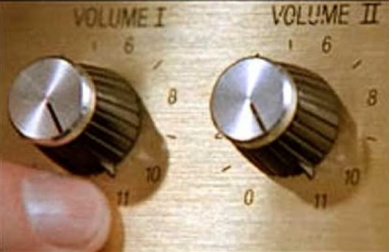

Topic #19 -- Machine Learning (Actually)
========================================

How did...
^^^^^^^^^^^
* ... `Nate Silver predict the results of the 2012 US Presidential election? <http://www.guardian.co.uk/science/grrlscientist/2012/nov/08/nate-sliver-predict-us-election>`_
* ... `Amazon know what products heavy computer gamers like to purchase? <http://ca.kotaku.com/5588532/amazon-as-market-research-for-the-lonely-gamer>`_ **(NSFW)**
* ... `Target know that this girl was pregnant before her parents did? <http://www.forbes.com/sites/kashmirhill/2012/02/16/how-target-figured-out-a-teen-girl-was-pregnant-before-her-father-did/>`_
* ... `Google build a machine capable of teaching itself to recognize cats on YouTube? <http://www.slate.com/blogs/future_tense/2012/06/27/google_computers_learn_to_identify_cats_on_youtube_in_artificial_intelligence_study.html>`_
* ... `Jack Gallant's lab use an MRI to watch dreams? <http://newscenter.berkeley.edu/2011/09/22/brain-movies/>`_
* ... `Google engineers make a program beat a human at go <https://en.wikipedia.org/wiki/AlphaGo>`_

* This list can go on forever.

.. Warning:: 
    It might be safer to use Colab, IPython, or Spyder for this. By all means, try PyCharm, if it doesn't work there, try Spyder. 
   
   
Machine Learning
^^^^^^^^^^^^^^^^^

* We're about to jump about threeish years ahead in your CS education.
* There is a very rich, very old (by CS standards) field of computer science called `Artificial Intelligence <http://en.wikipedia.org/wiki/Artificial_intelligence>`_
* One small corner of this vast field is an area called `Machine Learning <http://en.wikipedia.org/wiki/Machine_learning>`_
* Normally, you'd learn a whole bunch of basic CS. Both theoretical and applied.
* Then you'd take a couple of general AI course.
* *Then* you'd take a specialized course in machine learning.

If we wanted to do this right, we'd need to learn about:

* AI (of course)
* The theory of computation
* Complexity theory
* Advanced algorithms & Data structures
* Linear Algebra
* Multivariable calculus
* Multivariate statistics (*lots* of stats, actually)
* Even more stats
* Think you've got enough stats? NO! MOAR STATS!
* Signal Processing
* Information Theory
* ...

But that'd take too long, so...

* We're going to skip straight to the last step.

**SRSLY?**

* Yes. Machine learning is now *too important* for me not to show it to you.

What you can expect:

* A *very superficial* introduction to ML
* You'll have some ideas about how to *apply* specific ML techniques and what they can tell you about data.
* You should feel comfortable to begin exploring ``scikit-learn`` after working through this class.
* Everything is pretty much going to be tiny wizards and magic. 
* Hopefully you get excited enough about what these techniques can do to take the time to learn the details properly.
* In order to avoid getting bogged down in detail, I'm going to play fast and loose with some definitions and concepts. Sorry (or not, depending on your perspective).
* You'll be able to turn your life up to an 11!

scikit-learn
^^^^^^^^^^^^^

* Lucky for us, Python has a whole whack of ML libraries (including many specialized for particular fields).
* We're going to use `scikit-learn <http://scikit-learn.org/stable/>`_ as it is relatively full-featured and easy to use.

Requires Supervision
^^^^^^^^^^^^^^^^^^^^^

* *Very* broadly speaking, there are two types of ML (there are more, but we're keeping it simple):
    * **Supervised** learning -- you have a bunch of *labeled* training data and you want to build a program that will learn to *generalize* the training data so that it can *classify* new inputs 
    
    * **Unsupervised** learning -- you have a bunch of *unlabeled* data and you want to answer the question: "Does any of this stuff look like any of the other stuff?". You want a program that will divide your dataset into *clusters* where all of the data items in the same cluster are similar to each other in some way.

* There are many algorithms for both types of learning and new ones being described every day. We're just going to barely scratch the surface here.
      
.. admonition:: Activity

    With your neighbours, come up with some situations in which you think you'd use supervised learning and some more in which you'd use unsupervised learning.
    
    
* To speed things up, we're going to work with a dataset built in to ``scikit-learn``.
    * Toy data to play around with.

* If you want to use your own data, you just load it into a 2D array.
    * Each row is a data point
    * Each column is a feature
        * In ML terminology, a single observation of a property (like petal length) is called a ``feature``  

* This data set records 4 features (sepal and petal length and width) for 150 Irises of three different types (Setosa, Versicolour, and Virginica).

.. code-block:: python

    # Imports
    import numpy
    import sklearn
    import sklearn.datasets
       
    # Loads a *dataset*
    iris = sklearn.datasets.load_iris()
       
    # Get's the recorded observations
    # These are 150 observations of 
    # flowers' sepal and petal 
    # length and width
    X = iris.data
       
    # Print out the shape of the data
    print(X.shape)
        
* The dataset we loaded came with *labels* already classifying the Irises:

.. code-block:: python

    # Gets the labels for the flowers
    # This is like, which classification
    # the observation is
    y = iris.target
    print(y.shape)
    
* So ``X`` now contains feature vectors for 150 irises and ``y`` contains the *known truth* about what type each iris is. 
    * The 0th thing in X corresponds to the 0th label in y
    * The 1st thing in X corresponds to the 1st thing in y
    * ...
    * The nth thing in X corresponds to the nth thing in y
    
* By the way, X and y are common labels:
    * X means independent variables
    * y means dependent variable. 

.. admonition:: Activity+++

    Write a function called ``what_type_is_this(x)`` that will take one observation of a iris (sepal and petal length and width) and it will return which classification of iris it is. 
    
    **Also, don't actually do this**. Just ask yourself how you *would* do it. Imagine the number of ``if`` statements. 
    
* Good effin' luck writing that function. 

* Here's the thing though. **Wouldn't it be awesome if we could have python come up with that function for us?**

Supervised: k-Nearest Neighbours
^^^^^^^^^^^^^^^^^^^^^^^^^^^^^^^^^^

* Imagine we do this:
    * For each row in our training set ``data``, plot the 4 features (lengths) in a 4D space.
    * When we get a new iris, we also plot it in the 4D space.
    * Find the ``k`` closest points to the new point we just plotted.
    * Whatever iris type the majority of those points came from... that's our guess for the new iris.

* Let's go through it on the board, with a 2D feature space.

* Now let's automate this with scikit, where we aren't limited to 2D (and by our own growing boredom at plotting points).

.. code-block:: python
    
    # Import the thing we need  
    # to make a Knn classifier 
    import sklearn.neighbors
    
    # Make the Knn OBJECT
    knn = sklearn.neighbors.KNeighborsClassifier()
    
* We're all set to *train* this KNN classifier on our data with the labels we have. 
    * We're going to basically say:
        *Hey, algo, look at this data and learn what the rules are to correctly identify all these things*
        
.. code-block:: python
  
    # This trains the knn on the
    # data (X) and labels (y)
    knn.fit(X, y)
    
* That's literally it. That's how easy ``scikit-learn`` makes ML for you. ``knn`` is now a k-nearest neighbours classifier for irises.   

* Let's try it. When we get a new iris for which we want to *predict* the class, we use:
  
.. code-block:: python
    
    # new_iris_matrix will be like a 
    # list of things we want to predict.
    # So, ultimately like a list of lists
    knn.predict(new_iris_matrix)
    
    
.. admonition:: Activity

    Pick some random irises from your ``data`` set and attempt to classify them.
   
    Check the answer using your known labels in ``y``. 
    
    For example:
    
    .. code-block:: python
    
        # We need to wrap our one 
        # question (X[50]) into a list
        # because predict wants a list 
        # of lists to predict
        pred = knn.predict([X[50]])

    Are they the same? 

    .. code-block:: python
    
        pred[0] == y[50]
        
* What if we don't want just a classification. What if we want to quantify how accurate our model is?

.. code-block:: python
   
    # This will see what percent 
    # accuracy the model gets 
    # with known data X and labels y
    acc = knn.score(X,y)
    print(acc)
        
* Hey, that's pretty good! Or maybe not. 

* What **atrocity** have we committed in our analysis of the classifier?     
    
    
.. code-block:: python
        
    import sklearn.model_selection   

    # Split the X and y into a 
    # training and testing set
    X_train, X_test, y_train, y_test = sklearn.model_selection.train_test_split(X, y, test_size=0.25) 
    
* Let's try again, the *right* way

.. code-block:: python
 
    knn = sklearn.neighbors.KNeighborsClassifier()
    knn.fit(X_train, y_train)
    acc = knn.score(X_test, y_test)
    print(acc)
    
       
* Although simple, kNN is a pretty decent estimator... for datasets with *small* feature vectors. 
* In general, as the size of your feature vector grows linearly, the size of the training set required to make a good estimator grows *exponentially*.

     * Intuitively, is it easier to "fill in": `a line, a plane, or a cube? <http://en.wikipedia.org/wiki/Curse_of_dimensionality>`_ .

.. raw:: html

    <iframe width="560" height="315" src="https://www.youtube.com/embed/ymM0iNOqib0" frameborder="0" allowfullscreen></iframe>
    
    
Supervised: Support Vector Machines (SVM)
^^^^^^^^^^^^^^^^^^^^^^^^^^^^^^^^^^^^^^^^^

* Let's go back and look at a simple plotting of our data (reduced to 2D for convenience).
* Maybe I could do this:
    * draw *lines* that separate regions of the plane that all contain the same type of iris.
    * treat those lines as absolute partitions of the plane.
    * when I get a new iris, plot it on the plane, and label it according to whatever partition it falls in.
    
* Let's try on the board again.
* (In general, of course, our feature vectors will be higher-dimensional... in which case just substitute the word 'line' with 'hyperplane'. The idea is exactly the same: *partition* the space).
* This idea leads to the *Linear Support Vector Machine*.
* This is a bit more complex than the kNN classifier but, fortunately for us, it's just as easy to use:  

.. code-block:: python
 
    # Import and make a support vector
    # classifier object
    import sklearn.svm
    svc = sklearn.svm.SVC(kernel='linear')

    # Train it with the training data
    # we already split up
    svc.fit(X_train, y_train)
    
    # test it with the testing data
    acc = svc.score(X_test, y_test)
    print(acc)

* `Sometimes lines are too rigid. We can extend the idea of a linear SVM by using polynomials, radial basis functions or some other non-linear *kernel* to do our partitioning. <http://scikit-learn.org/stable/modules/svm.html>`_

.. raw:: html

    <iframe width="560" height="315" src="https://www.youtube.com/embed/9hwdWBhUQ5c" frameborder="0" allowfullscreen></iframe>

.. admonition:: Activity+

    For fun, go find some of your own data. Like online, or some data from another one of your classes. 
    
    Load it up into Python and see if you can build a classifier for it. 
    
.. admonition:: Activity+

    I showed you 2 types of supervised machine learning for classification. `Go check out the zoo of other methods out there. <https://scikit-learn.org/stable/supervised_learning.html#supervised-learning>`_
    
    Now, see if you can switch out the KNN or SVC classifiers we used for one of these. 
    
    
Unsupervised: K-means clustering
^^^^^^^^^^^^^^^^^^^^^^^^^^^^^^^^

* Supervised machine learning is good and all, but what if you don't really have any labels. 
* We obviously can't make a classifier...
* ... *but* we can still *look for structure* in our data.
* Let's try this. Let's pretend for a min that we have the iris data, but no labels. Pretend we're the first humans to ever come across a field of irises. We record the data. We load it into python. We ask ourselves... *hmmm, I wonder if there's any patterns in this data that might tell me something?*

    * Plot all of our datapoints on the plane.
    * Guess the number of clusters we're looking for. Let's use the fact that we know there are 3 types of iris and pick 3 clusters.
        * This is totally cheating in this case. 
        
    * Randomly place 3 "means" on the plane.
    * Repeat the following until convergence:
        * Associate each data point to the nearest "mean".
        * Compute the centroid of all of the points attached to each "mean".
        * Move the position of the "mean" to this centroid.

* There, that's basically K-means clustering. 

.. code-block:: python
 
    import sklearn.cluster
    k_means = sklearn.cluster.KMeans(3)
    k_means.fit(X)

* We can now ask ``k_means`` what group each data point belongs to. 

.. code-block:: python
 
    labels = k_means.labels_
    print(labels)
    
* Two big questions for you:
    * Do the actual label numbers here matter?
    * Did we break the whole training/testing rule here?
    
    
.. admonition:: Activity+

    Pretending you don't have access to ``labels``, what, if anything, does this result tell you?

    `Try visualizing <http://scikit-learn.org/stable/auto_examples/cluster/plot_cluster_iris.html>`_ your results.
    
.. admonition:: Activity+

    *Quantify* how good of a job k-means clustering did of grouping together irises of the same type. To do this, you'll need to bring in your "ground truth" ``labels``. 
   
   
Cross-Validation
^^^^^^^^^^^^^^^^^
* One of the things you learned above was the importance of proper *cross-validation* of machine learning results.
    * training/testing
* Because this is so important, scikit-learn has *several* built in `cross-validation generators <http://scikit-learn.org/dev/modules/cross_validation.html>`_ that will slice your data into test and training sets for you... and then do the testing and training.
  
.. list-table::

   *

    - :class:`KFold` **(n, k)**
    
    - :class:`StratifiedKFold` **(y, k)**

    - :class:`LeaveOneOut` **(n)**

    - :class:`LeaveOneLabelOut` **(labels)**

   *

    - Split it K folds, train on K-1, test on left-out

    - Make sure that all classes are even across the folds

    - Leave one observation out

    - Takes a label array to group observations

* More generally, there is a whole set of tools to help with `Model Selection <http://scikit-learn.org/dev/model_selection.html>`_ .

The Zoo
^^^^^^^^^

* This has been a (very) meagre taste of ML.
* There is a whole zoo of Supervised and Unsupervised learning methods, with new ones being published every day.
* Although the techniques we just looked at are 'simple', they are by no means insignificant!
* scikit-learn has a pretty decent collection of the major algorithms, and a unified interface that makes it easy to try different options with minimum effort.
* (And, like any good Python package, has `a nice gallery <http://scikit-learn.org/stable/auto_examples/index.html>`_ ).
* It is, however, by no means complete.
* ML is a very powerful tool, especially in an age where we produce more data than is possible to analyze by hand.
* Like any powerful tool, it's also really easy to misuse.
* If you want to use ML in your research, you owe it to yourself to learn more. A couple of pointers to start you off:
    * `Andrew Ng <https://twitter.com/AndrewYNg>`_ offers a `ML course on Coursera. <https://www.coursera.org/course/ml>`_ It's awesome. If you want to use ML, take this course and *do all the assignments*.
    * If you *really* want to learn ML, get `Chris Bishop's Book <http://research.microsoft.com/en-us/um/people/cmbishop/prml/>`_ . It starts from basic probability theory and goes from there. It is comprehensive, it is rigorous... it is *not easy to read*.

.. admonition:: Activity

    Break into small groups. Identify a problem that you think could be solved well with machine learning. Specifically, you should be able to answer:
        1. What is the data source?
        2. What do you hope to learn from the data?
        3. What ML approach(es) will allow you to do so?
        4. How would you gather your data? Store it? Implement the ML step?
        5. What approach would you take to analyzing your results?
        6. What *impact* would your results have?